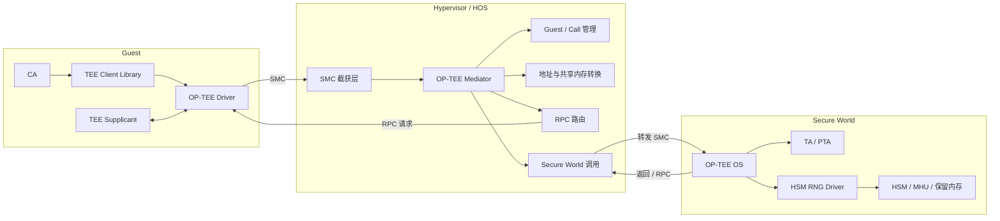
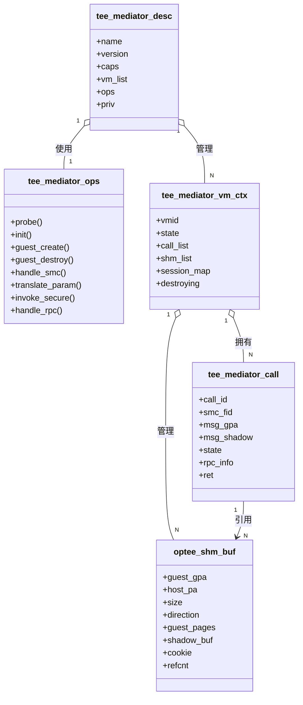
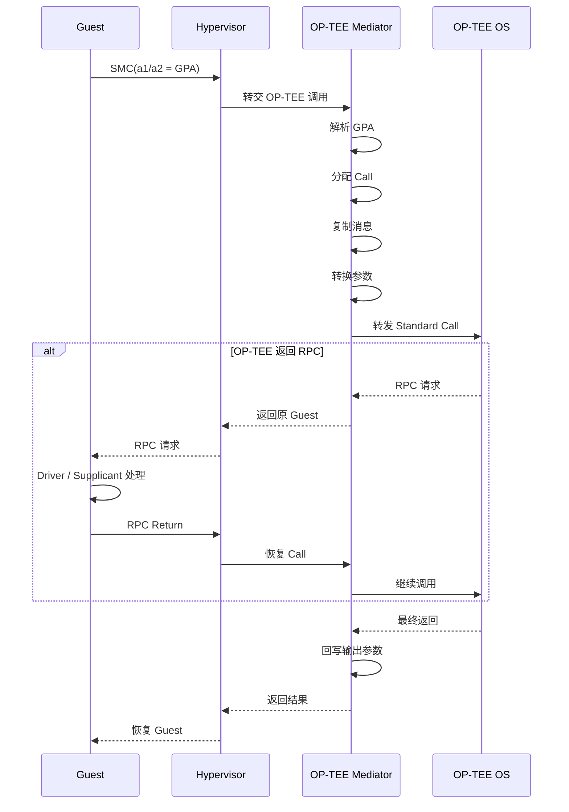
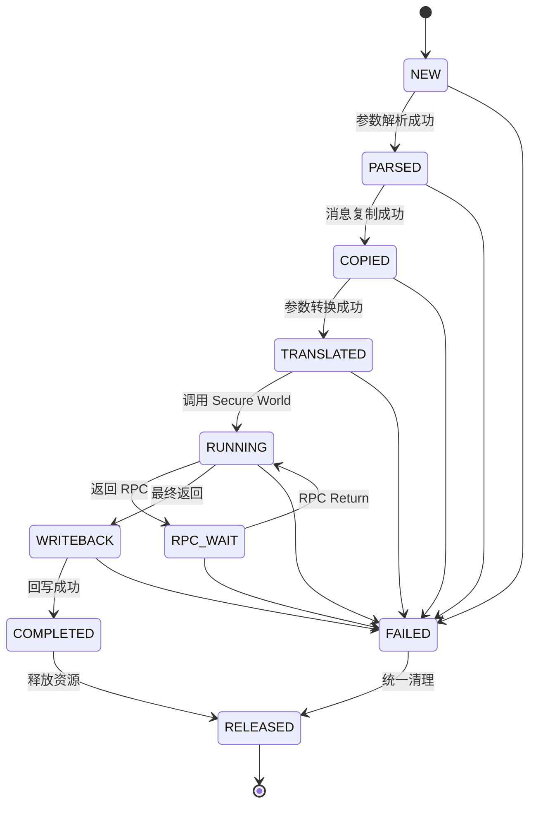

# 第 3 章 方案设计

本章在前述 OP-TEE 原生调用链路和虚拟化问题分析的基础上，给出基于 Xvisor/HOS 的 OP-TEE 虚拟化总体方案。方案在 Hypervisor 中引入 OP-TEE Mediator，由 Mediator 负责识别 Guest 发起的 OP-TEE SMC、维护 Guest 调用上下文、转换 Guest 地址、处理中间 RPC，并将最终结果返回 Guest。

本方案主要面向基于 SMC 的 OP-TEE Message ABI。Guest 侧继续使用原有 CA、TEE Client Library、TEE Supplicant 和 OP-TEE Linux Driver，尽量避免修改 Guest 内现有软件栈。Secure World 继续运行单一 OP-TEE OS 实例，由 Hypervisor 对不同 Guest 的调用进行区分和隔离。

本章属于概要设计，重点说明模块职责、核心数据结构、关键处理流程、内存模型和平台适配方式。具体函数接口、锁实现、错误码映射和源码修改位置将在详细设计中进一步展开。

## 3.1 引入 OP-TEE Mediator 的原因

在非虚拟化环境中，Linux OP-TEE Driver 可以直接向 Secure World 发起 SMC，并将普通世界物理地址传递给 OP-TEE OS。在虚拟化环境中，Guest 操作系统只能看到 Guest Physical Address，即 GPA 或 IPA，而 OP-TEE OS 最终访问的是实际物理地址 PA。OP-TEE OS 自身无法获知 Guest 的二阶段页表，也无法独立完成 Guest IPA 到 Host PA 的转换，因此必须由 Hypervisor 参与地址转换和调用管理。

如果 Hypervisor 对所有 OP-TEE SMC 均采用直接透传方式，将存在以下问题：

1. Guest 传入的地址对 Secure World 不具备直接访问意义；
2. Guest 可以构造越界地址，尝试访问其他 Guest 或 Hypervisor 内存；
3. Standard Call 中不仅包含寄存器参数，还包含内存中的消息结构和共享缓冲区；
4. RPC 会使一次调用在 Guest、Hypervisor 和 OP-TEE OS 之间多次往返；
5. 不同 Guest 的 Session、共享内存和未完成调用需要分别管理；
6. Guest 重启或销毁时，需要清理其尚未完成的 Secure World 调用；
7. HSM、MHU 等全局安全硬件资源需要在多 Guest 场景下进行统一管理。

因此，本方案在 Hypervisor 中增加 OP-TEE Mediator，将其作为 Guest 与 OP-TEE OS 之间的协议代理和隔离边界。

### 3.1.1 设计目标

OP-TEE Mediator 的主要设计目标如下：

| 设计目标 | 说明 |
|---|---|
| Guest 透明 | Guest 继续使用标准 OP-TEE Driver 和 TEE Client 栈 |
| 调用可达 | Guest 发起的 OP-TEE 调用能够正确进入 Secure World |
| 地址可用 | 将 Guest GPA 转换为 Secure World 可访问的实际地址 |
| 内存隔离 | 防止 Guest 请求访问不属于本 Guest 的内存 |
| 状态隔离 | 不同 Guest 的 Call、Session、RPC 和共享内存状态相互独立 |
| 兼容现有功能 | 保留原有平台 SMC 和 DMA SMC 的处理行为 |
| 生命周期完整 | Guest 创建、重启和销毁时能够正确建立和释放资源 |
| 可扩展 | 为后续支持动态共享内存、非连续页和更多 RPC 类型预留接口 |
| 可诊断 | 提供必要的调用日志、状态统计和错误观测能力 |

### 3.1.2 设计原则

本方案遵循以下原则：

- **最小修改原则**：不修改或尽量少修改 Guest 内 CA、libteec、TEE Supplicant 和 OP-TEE Driver。
- **先校验后转发原则**：所有来自 Guest 的地址和长度必须由 Mediator 校验后才能进入 Secure World。
- **Guest 私有状态原则**：与 Guest 相关的 Call、Session、RPC 和共享内存对象必须挂接在对应 Guest 上下文中。
- **全局资源统一管理原则**：OP-TEE OS、HSM、MHU 和固定保留内存属于平台级安全资源，不直接分配给任何 Guest。
- **失败可回收原则**：无论调用在哪一阶段失败，均能够按照统一顺序释放临时映射、消息副本和调用上下文。
- **兼容演进原则**：Fast Call、Standard Call、RPC 和 Guest 生命周期功能分阶段实现，不影响原有非 OP-TEE SMC 路径。

## 3.2 总体架构与职责边界

### 3.2.1 总体架构

OP-TEE 虚拟化方案由 Guest TEEClient 栈、Hypervisor SMC 截获层、OP-TEE Mediator、OP-TEE OS 以及平台安全设备组成。



Guest 发起 SMC 后，首先进入 Hypervisor 的异常处理入口。SMC 截获层根据 Function ID 判断调用类型：

- 原有平台 SMC：继续进入原有处理流程；
- OP-TEE Fast Call：进行必要校验后转发；
- OP-TEE Standard Call：进入 Mediator 完成消息复制和参数转换；
- OP-TEE RPC Return：查找原有 Call 并恢复调用；
- 不支持的 SMC：按照平台策略拒绝或返回不支持。

### 3.2.2 模块职责

#### Guest TEEClient 栈

Guest 侧保留完整的标准 TEEClient 栈，主要负责：

- CA 发起 Open Session、Invoke Command 和 Close Session；
- libteec 将用户参数转换为内核 TEE 接口参数；
- OP-TEE Driver 构造 `optee_msg_arg` 和参数数组；
- TEE Supplicant 处理文件系统、TA 加载、RPMB 或其他普通世界服务；
- 接收 Mediator 回写后的返回码和输出数据。

#### Hypervisor SMC 截获层

SMC 截获层负责：

- 捕获 Guest 执行的 SMC 指令；
- 读取 Guest 寄存器中的 SMC Function ID 和参数；
- 区分 OP-TEE SMC 与原有平台 SMC；
- 将 OP-TEE 调用转交给 Mediator；
- 将最终返回寄存器写回 Guest vCPU 上下文；
- 在调用完成后推进 Guest PC，使 Guest 从 SMC 下一条指令继续执行。

#### OP-TEE Mediator

Mediator 是本方案的核心组件，负责：

- 识别 Fast Call、Standard Call 和 RPC Return；
- 根据 Guest 和 vCPU 建立调用上下文；
- 解析 `a1/a2` 携带的 Guest GPA；
- 复制并校验 Guest 消息结构；
- 翻译消息参数中的 Guest 地址；
- 维护调用、RPC 和共享内存状态；
- 向 Secure World 发起 SMC；
- 将结果回写到 Guest；
- 在 Guest 销毁时回收其全部关联资源。

#### OP-TEE OS

OP-TEE OS 负责：

- 接收 Mediator 转发的 SMC；
- 创建或恢复 Secure World 线程；
- 管理 Session；
- 加载和执行 TA/PTA；
- 处理安全存储、密码学和 HSM 真随机数等安全服务；
- 在需要普通世界服务时发起 RPC；
- 返回最终调用结果。

#### HSM 与 MHU

HSM 和 MHU 属于平台级安全资源：

- MHU MMIO 和中断由 Secure World 或平台安全固件管理；
- HSM 通信保留内存不映射给 Guest；
- Mediator 不直接处理 HSM 固定保留内存；
- Guest 仍通过标准 TA/PTA 调用间接使用 HSM 随机数服务；
- 多 Guest 访问 HSM 时，由 OP-TEE OS 内 HSM 驱动进行串行化或请求调度。

### 3.2.3 信任边界

本方案将 Guest 视为不可信调用方。Mediator 不信任 Guest 提供的以下内容：

- SMC Function ID；
- `a1/a2` 携带的 GPA；
- `optee_msg_arg` 中的命令号；
- 参数数量；
- 参数属性；
- memref 地址、大小和偏移；
- RPC 返回数据；
- Session 标识；
- 共享内存 Cookie。

OP-TEE OS 和 Hypervisor 属于可信计算基。Mediator 只允许 Guest 访问由该 Guest 所属内存区域转换得到的物理页面，禁止使用 Guest 请求引用其他 Guest、Hypervisor、OP-TEE RAM、HSM 保留内存或安全设备 MMIO。

## 3.3 OP-TEE Mediator 功能设计

### 3.3.1 Mediator 初始化与注册

系统启动时，Mediator 由 Hypervisor 初始化流程创建。初始化过程主要包括：

1. 创建全局 `tee_mediator_desc`；
2. 注册 `tee_mediator_ops`；
3. 初始化 Guest 上下文链表和全局锁；
4. 注册 SMC 拦截处理函数；
5. 探测 Secure World 是否支持目标 OP-TEE ABI；
6. 读取 Secure World 能力信息；
7. 初始化调试命令和统计计数；
8. 保留原有平台 SMC 分发入口。

Mediator 初始化失败时，不应影响 Hypervisor 其他基本功能。可根据产品策略选择禁止启动需要 OP-TEE 的 Guest，或者使 Guest 中 OP-TEE Driver 探测失败并降级运行。

### 3.3.2 SMC 识别与分发

Mediator 根据 `a0` 中的 Function ID 对 SMC 进行分类。

| SMC 类型 | 处理策略 |
|---|---|
| 原有平台 SMC | 交由原平台处理函数 |
| 原有 DMA 读写 SMC | 保持原有行为不变 |
| OP-TEE 能力查询类 Fast Call | 校验后直接转发 |
| OP-TEE Standard Call | 进入完整 Mediator 流程 |
| RPC Return | 查找 Call 上下文并恢复 Secure World 调用 |
| VM 创建/销毁通知 | 由 Hypervisor 自身发起 |
| 未识别调用 | 返回不支持或拒绝执行 |

分发层不得只根据 SMC 的 Fast/Standard 位决定是否转发，还需要校验调用所属实体和当前 Guest 状态。例如，尚未完成 OP-TEE Guest 上下文创建的 Guest，不允许发起需要 Guest 上下文的 Standard Call。

### 3.3.3 Guest 上下文管理

每个启用 OP-TEE 的 Guest 对应一个 `tee_mediator_vm_ctx`。该对象由 Guest 创建流程建立，由 Guest 销毁流程释放，主要管理：

- Guest 唯一标识；
- Guest 当前状态；
- 活跃 Call 链表；
- 共享内存对象链表；
- Session 所有权或映射信息；
- RPC pending 状态；
- 调用统计；
- Guest 销毁标志；
- 并发保护锁。

所有 Guest 相关对象必须能够反向定位到所属 `tee_mediator_vm_ctx`，从而保证 RPC 返回、结果回写和资源清理均作用于正确 Guest。

### 3.3.4 Call 上下文管理

Standard Call 可能经历 Secure World 执行、RPC 返回、Guest 处理 RPC、再次进入 Secure World 等多个阶段，不能仅依赖当前寄存器完成处理。因此，每次 Standard Call 均建立一个 `tee_mediator_call`。

Call 上下文主要保存：

- 发起调用的 Guest 和 vCPU；
- 原始 SMC 寄存器；
- Guest 消息 GPA；
- Hypervisor 消息副本；
- 参数转换记录；
- 引用的共享内存对象；
- Secure World 返回状态；
- RPC 类型和 RPC 参数；
- 当前状态；
- 错误码和最终返回值。

Call 上下文从接收到 Standard Call 时创建，在最终结果成功回写或异常清理完成后释放。RPC 期间 Call 必须保持有效，不能提前释放消息副本和共享内存转换信息。

### 3.3.5 参数与共享内存管理

Mediator 对消息中的参数进行分类处理：

- Value 参数：直接复制数值；
- 输入 memref：将 Guest 数据复制到安全的中间缓冲区，或转换为稳定 PA；
- 输出 memref：记录 Guest 原始地址和长度，在返回后执行回写；
- 输入输出 memref：调用前复制输入数据，调用后回写输出数据；
- 已注册共享内存：校验 Cookie、范围和 Guest 所有权；
- 非连续页描述：逐页解析和转换，禁止描述符指向非法页面。

Mediator 应限制单次调用可携带的参数数量、共享缓冲区数量和总大小，防止恶意 Guest 消耗过多 Hypervisor 内存。

### 3.3.6 RPC 路由

OP-TEE OS 在执行 Standard Call 时，可能返回需要普通世界处理的 RPC。此时 Mediator 需要：

1. 识别 Secure World 返回值为 RPC；
2. 保留当前 `tee_mediator_call`；
3. 记录 RPC 类型、参数和所属 Guest；
4. 将 RPC 数据转换为 Guest 可识别的形式；
5. 将控制权返回原 Guest；
6. Guest OP-TEE Driver 和 TEE Supplicant 完成 RPC；
7. Guest 再次通过 SMC 返回 RPC 结果；
8. Mediator 根据 Guest、vCPU 和 RPC 标识查找原 Call；
9. 转换 RPC 返回参数；
10. 继续发起 Secure World 调用。

RPC 必须返回最初发起调用的 Guest，不能转交给其他 Guest 或由当前任意运行中的 Guest 接收。

### 3.3.7 结果回写与资源释放

Secure World 返回最终完成状态后，Mediator 按照以下顺序处理：

1. 检查 Secure World 返回类型；
2. 更新 Hypervisor 消息副本中的返回码；
3. 对 OUT 和 INOUT 参数执行结果回写；
4. 回写 Guest `optee_msg_arg` 中允许修改的字段；
5. 写回 Guest SMC 返回寄存器；
6. 解除临时映射或共享内存引用；
7. 释放 shadow buffer；
8. 从 Guest 活跃 Call 链表移除 Call；
9. 释放 Call 上下文；
10. 恢复 Guest vCPU 执行。

不能以“Hypervisor 已执行 memcpy”作为调用成功的唯一依据。最终成功需要同时满足：

- Secure World 返回成功；
- 输出长度合法；
- Guest 输出地址仍然有效；
- 输出值或输出 buffer 已成功写入 Guest；
- Guest CA 能够读取并校验最终结果。

### 3.3.8 诊断与可观测性

Mediator 建议提供以下统计信息：

- 各 Guest Fast Call 次数；
- 各 Guest Standard Call 次数；
- 当前活跃 Call 数；
- RPC 请求和完成次数；
- GPA 转换失败次数；
- 非法参数拒绝次数；
- 共享内存对象数量；
- 调用超时次数；
- Guest 销毁时强制清理的 Call 数；
- Secure World 返回错误次数；
- HSM 随机数调用次数和失败次数。

调试日志应能够关联以下关键信息：

```text
VMID + vCPU ID + Call ID + SMC FID + Session ID
```

日志中不应输出密钥、随机数完整内容或敏感缓冲区数据。

## 3.4 关键数据结构设计

本方案使用以下五个关键结构体完成 Mediator 的核心抽象。

### 3.4.1 `struct tee_mediator_desc`

`tee_mediator_desc` 是 Mediator 的全局描述符，生命周期与 Hypervisor 中 OP-TEE 虚拟化模块一致。

建议包含的概念字段如下：

| 字段 | 作用 |
|---|---|
| `name` | Mediator 名称 |
| `version` | Mediator 版本 |
| `caps` | 支持能力 |
| `ops` | 操作函数表 |
| `vm_list` | Guest 上下文链表 |
| `lock` | 全局注册和链表保护 |
| `priv` | 平台私有数据 |
| `stats` | 全局统计信息 |

该结构只保存全局配置和对象索引，不直接保存某次 Guest 调用的临时状态。

### 3.4.2 `struct tee_mediator_ops`

`tee_mediator_ops` 是 Mediator 操作函数表，用于将通用框架与平台实现解耦。

建议包含：

| 操作 | 作用 |
|---|---|
| `probe()` | 探测 Secure World OP-TEE 能力 |
| `init()` | 初始化 Mediator |
| `deinit()` | 注销 Mediator |
| `guest_create()` | 建立 Guest TEE 上下文 |
| `guest_destroy()` | 销毁 Guest TEE 上下文 |
| `handle_smc()` | 处理 Guest SMC |
| `translate_param()` | 转换消息参数 |
| `invoke_secure()` | 发起 Secure World 调用 |
| `handle_rpc()` | 处理 RPC 返回和恢复 |
| `release_call()` | 清理 Call 资源 |

概要设计只规定操作职责，不限定最终函数名称和参数形式。

### 3.4.3 `struct tee_mediator_vm_ctx`

`tee_mediator_vm_ctx` 表示一个 Guest 在 Mediator 中的运行上下文。

建议包含：

| 字段 | 作用 |
|---|---|
| `vmid` | Guest 唯一标识 |
| `guest` | Hypervisor Guest 对象 |
| `state` | Guest TEE 状态 |
| `call_list` | 活跃 Call 链表 |
| `shm_list` | 共享内存对象链表 |
| `session_map` | Session 所有权或映射信息 |
| `lock` | Guest 私有状态保护 |
| `destroying` | Guest 是否正在销毁 |
| `stats` | Guest 级统计信息 |

如果 OP-TEE OS 已启用原生多 VM 隔离，`session_map` 可主要用于所有权校验和资源回收；如果 Secure World 后端不区分 Guest，则需要由 Mediator 建立 Guest Session 与 Secure World Session 的显式映射。

### 3.4.4 `struct tee_mediator_call`

`tee_mediator_call` 表示一次 Standard Call 的完整处理上下文。

建议包含：

| 字段 | 作用 |
|---|---|
| `call_id` | Mediator 内部调用标识 |
| `vm_ctx` | 所属 Guest 上下文 |
| `vcpu` | 发起调用的 vCPU |
| `orig_regs` | 原始 SMC 寄存器 |
| `smc_fid` | SMC Function ID |
| `msg_gpa` | Guest 消息地址 |
| `msg_shadow` | Hypervisor 消息副本 |
| `shm_refs` | 本次调用引用的共享内存对象 |
| `state` | Call 当前状态 |
| `rpc_info` | RPC 状态和参数 |
| `ret` | 最终返回值 |
| `error` | Mediator 内部错误 |

### 3.4.5 `struct optee_shm_buf`

`optee_shm_buf` 描述 Guest 与 OP-TEE 之间使用的数据缓冲区。

建议包含：

| 字段 | 作用 |
|---|---|
| `guest_gpa` | Guest 原始地址 |
| `host_pa` | 转换后的实际物理地址 |
| `size` | 缓冲区长度 |
| `offset` | 共享内存内部偏移 |
| `attr` | 参数属性 |
| `direction` | IN、OUT 或 INOUT |
| `guest_pages` | Guest 页面数组 |
| `page_count` | 页面数量 |
| `shadow_buf` | Hypervisor 中间缓冲区 |
| `cookie` | 共享内存标识 |
| `refcnt` | 引用计数 |
| `state` | 注册、使用或释放状态 |

在当前静态内存分割方案中，Guest 物理页面在生命周期内不会被换出、迁移或重新分配，因此可通过固定内存归属约束满足页面稳定性要求；`guest_pages` 主要用于逐页转换、范围校验和后续扩展。未来如果引入动态内存回收、balloon、swap 或页面所有权转移，则需要实现真正的 pin/unpin 机制。

### 3.4.6 类关系图



## 3.5 关键流程设计

### 3.5.1 Fast Call 处理流程

Fast Call 通常用于能力查询、版本查询、共享内存配置查询或其他能够快速完成的调用。本方案对 Fast Call 采用“识别、校验、转发、回写”的简化处理方式：

1. Guest 执行 SMC；
2. Hypervisor 截获并读取 `a0`～`a7`；
3. 判断该调用是否属于允许透传的 OP-TEE Fast Call；
4. 校验调用中是否包含地址参数；
5. 对需要转换的寄存器地址执行 GPA 到 PA 转换；
6. 在启用 OP-TEE 多 VM 模式时设置 Guest VMID；
7. 向 Secure World 发起 SMC；
8. 将 `a0`～`a7` 返回值写回 Guest；
9. 推进 Guest PC 并恢复运行。

Fast Call 不创建长期 `tee_mediator_call`，但仍需要进行 Function ID 白名单检查。包含复杂内存引用或可能等待外部设备的厂商调用，不应仅因其被编码为 Fast Call 就无条件透传。

### 3.5.2 Standard Call 处理流程

OP-TEE SMC Message ABI 主要使用 `struct optee_msg_arg` 传递命令、返回码和参数数组，消息结构由调用方放置在共享内存中，并通过 SMC 寄存器传递其物理地址。

一次 Standard Call 的处理过程如下。

#### 1）解析参数

Mediator 读取 Guest SMC 寄存器，识别调用类型，并从 `a1/a2` 获取或组合 Guest 消息 GPA。随后检查：

- GPA 是否对齐；
- GPA 是否位于本 Guest 合法内存范围；
- 消息头是否完整；
- 参数数量是否合法；
- 计算消息总大小是否发生整数溢出；
- Guest 是否处于允许调用的状态。

#### 2）分配 Call

Mediator 为本次调用创建 `tee_mediator_call`，记录 Guest、vCPU、原始寄存器和消息 GPA，并将其挂入 Guest 活跃 Call 链表。

#### 3）复制请求

Mediator 将 Guest `optee_msg_arg` 和参数描述复制到 Hypervisor 私有内存。之后的命令解析和参数转换均基于该副本执行。

复制请求的目的包括：

- 防止 OP-TEE OS 直接解析不可信 Guest 消息；
- 防止 Guest 在 Mediator 校验后再次修改消息；
- 为 RPC 和异步恢复保存稳定的请求上下文；
- 避免 Secure World 使用 Guest GPA。

#### 4）翻译参数

Mediator 遍历消息参数：

- Value 参数直接复制；
- memref 参数校验地址、偏移和长度；
- 将 Guest GPA 转换为 Host PA；
- 根据 IN、OUT、INOUT 属性决定复制方向；
- 必要时建立 shadow buffer；
- 记录返回阶段所需的回写信息；
- 拒绝指向其他 Guest 或保留区域的参数。

#### 5）整理数据并发起调用

Mediator 将消息副本中的地址替换为 Secure World 可访问地址，设置必要的 VMID 和调用标识，随后向 Secure World 发起 SMC。

#### 6）处理返回

Secure World 返回后分为两种情况：

- 最终返回：进入结果回写流程；
- RPC 返回：保存 Call 并进入 RPC 处理流程。

#### 7）回写结果

Mediator 将 Secure World 返回的 Value、OUT memref、INOUT memref 和消息返回码写回 Guest，确认写回成功后释放本次 Call。

### 3.5.3 Standard Call 时序图



### 3.5.4 RPC 处理与调用恢复流程

RPC 是 Standard Call 的中间返回，不代表原调用已经结束。Mediator 处理 RPC 时应遵循以下原则：

- Call 上下文保持有效；
- 消息副本保持有效；
- 共享内存引用保持有效；
- RPC 与原 Guest、vCPU 和 Call 绑定；
- Guest 处理完成前不得将该 Call 分配给其他 Guest；
- RPC Return 必须恢复原来的 Secure World 调用。

简化流程如下：

```text
OP-TEE OS 返回 RPC
        ↓
Mediator 保存 Call 状态
        ↓
RPC 参数转换
        ↓
返回原 Guest
        ↓
Guest Driver / Supplicant 处理
        ↓
Guest 发起 RPC Return
        ↓
Mediator 查找原 Call
        ↓
转换 RPC 返回参数
        ↓
继续调用 OP-TEE OS
```

对于文件系统、TA 加载等由 Guest TEE Supplicant 处理的 RPC，Mediator 将请求路由至发起调用的 Guest。对于未来可能由 Hypervisor 自身处理的 RPC，可通过操作函数表增加 Hypervisor RPC 后端，但不应在当前基础版本中混合两套处理路径。

### 3.5.5 Guest 创建与销毁流程

#### Guest 创建流程

```text
创建 Guest
   ↓
判断是否启用 OP-TEE
   ↓
分配 tee_mediator_vm_ctx
   ↓
分配唯一 VMID
   ↓
初始化 Call / SHM / Session 链表
   ↓
通知 OP-TEE VM_CREATED
   ↓
标记 Guest TEE Ready
```

若 Secure World 未启用 OP-TEE 多 VM 模式，可以采用单上下文兼容方式，但仍建议在 Mediator 中建立 `tee_mediator_vm_ctx`，以便完成 Guest 资源管理和未来扩展。

#### Guest 销毁流程

```text
标记 Guest 正在销毁
   ↓
禁止接收新的 OP-TEE 调用
   ↓
停止 Guest 相关 vCPU
   ↓
终止或等待未完成 Call
   ↓
清理 RPC pending
   ↓
释放 SHM / shadow buffer
   ↓
清理 Session 所有权
   ↓
通知 OP-TEE VM_DESTROYED
   ↓
释放 tee_mediator_vm_ctx
```

Guest 销毁过程中，必须先阻止新的调用进入，再处理旧调用，避免资源清理与新 Call 创建并发发生。

## 3.6 内存与地址转换设计

### 3.6.1 内存分类

本方案将相关内存划分为以下几类：

| 内存类型 | 所属方 | Mediator 是否转换 | Guest 是否可见 |
|---|---|---:|---:|
| Guest 消息缓冲区 | Guest | 是 | 是 |
| Guest 参数缓冲区 | Guest | 是 | 是 |
| Hypervisor 消息副本 | Hypervisor | 否 | 否 |
| Hypervisor shadow buffer | Hypervisor | 否 | 否 |
| OP-TEE 安全内存 | Secure World | 否 | 否 |
| OP-TEE 普通共享内存 | 平台配置 | 按方案处理 | 条件可见 |
| HSM 固定保留内存 | OP-TEE/HSM | 不进入 Guest 参数转换 | 否 |
| MHU MMIO | Secure World | 否 | 否 |

HSM 保留内存与 Guest OP-TEE 共享内存是两类不同对象。前者用于 OP-TEE OS 与 HSM 固件通信，后者用于 Guest 与 OP-TEE OS 传递消息。HSM 保留内存不得注册为 `optee_shm_buf`，也不得加入任何 Guest 的二阶段映射。

### 3.6.2 地址转换流程

Guest 参数地址转换过程如下：

```text
Guest GPA
   ↓
检查地址与长度
   ↓
确认属于当前 Guest
   ↓
查询 Guest Stage-2 映射
   ↓
得到 Host PA
   ↓
检查 PA 是否位于允许区域
   ↓
建立直接引用或 shadow buffer
   ↓
提供给 Secure World
```

地址检查必须同时考虑起始地址和结束地址。仅检查起始地址位于 Guest 内存范围是不充分的，还需要防止：

```text
gpa + size
```

发生整数溢出或跨越 Guest 内存边界。

### 3.6.3 参数处理策略

| 参数类型 | 调用前处理 | 返回后处理 |
|---|---|---|
| Value IN | 复制数值 | 无 |
| Value OUT | 初始化输出位置 | 回写数值 |
| Value INOUT | 复制输入值 | 回写输出值 |
| Memref IN | 校验并复制或映射 | 无 |
| Memref OUT | 分配或映射输出缓冲区 | 回写实际长度和数据 |
| Memref INOUT | 复制输入数据 | 回写数据和实际长度 |
| 已注册 SHM | 校验 Cookie 和所有权 | 更新引用状态 |
| 非连续页 SHM | 逐页转换 | 按页回写或解除引用 |

当前方案可优先完成连续或静态分割内存的支持，非连续页和动态注册共享内存作为后续扩展能力。

### 3.6.4 Copy 与直接映射策略

Mediator 对消息头采用固定复制策略，对数据缓冲区可采用两种方式。

#### Shadow Copy

```text
Guest Buffer → Hypervisor Buffer → Secure World
```

优点：

- 隔离性强；
- 不受 Guest 调用期间修改影响；
- 便于校验和回滚；
- 不要求 Secure World 直接访问 Guest 页面。

缺点：

- 增加内存复制；
- 大缓冲区调用开销较高。

#### 直接地址转换

```text
Guest GPA → Host PA → Secure World
```

优点：

- 减少数据复制；
- 对大缓冲区性能较好。

缺点：

- 需要严格保证页面稳定性；
- 需要处理缓存一致性；
- Guest 页面所有权管理更复杂；
- 调用期间不能回收、迁移或重新映射页面。

当前阶段建议：

- `optee_msg_arg` 固定使用 Hypervisor 副本；
- 小型临时 memref 优先采用 shadow copy；
- 大型稳定共享内存可在校验后直接映射；
- 后续根据性能测试结果调整阈值。

### 3.6.5 静态内存分割下的页面稳定性

本项目 Guest 内存采用静态分割方式，Guest 物理区间在系统运行期间固定，不支持交换、迁移或转移给其他 Guest。因此，当前实现不需要引入类似通用虚拟化平台中的复杂页面 pin 框架，但必须保证：

- Guest 内存区间不会被 Hypervisor 重新分配；
- 调用期间二阶段映射不会被删除或修改；
- Guest 销毁前必须终止所有未完成调用；
- 共享页面始终归属于原 Guest；
- HSM 保留内存不属于任何 Guest。

这在语义上等价于满足共享页面“PA 保持稳定且所有权不改变”的要求。

### 3.6.6 缓存一致性

Mediator 使用直接物理页向 Secure World 传递数据时，需要根据平台缓存一致性模型执行必要的 cache clean、invalidate 或同步屏障。

对于 HSM 保留内存：

- CPU 写入 HSM 请求后，应在触发 MHU 前完成必要的缓存清理；
- HSM 写回结果后，应在 CPU 读取前完成必要的缓存失效；
- 如果 HSM 与 CPU 硬件一致，则由平台确认是否可以省略软件维护；
- 缓存维护应由 OP-TEE HSM 驱动完成，不由 Guest 或 Mediator 直接处理。

## 3.7 会话与资源生命周期管理

### 3.7.1 资源生命周期

| 资源 | 创建时机 | 释放时机 |
|---|---|---|
| `tee_mediator_desc` | Hypervisor 初始化 | Hypervisor 退出或模块卸载 |
| `tee_mediator_vm_ctx` | Guest 创建 | Guest 销毁 |
| `tee_mediator_call` | Standard Call 进入 | 最终返回或异常终止 |
| `optee_shm_buf` | 参数转换或 SHM 注册 | 引用归零或 Guest 销毁 |
| 消息副本 | Standard Call 解析后 | Call 释放 |
| shadow buffer | 参数转换时 | 回写后或异常清理 |
| Session 记录 | Open Session 成功 | Close Session 或 Guest 销毁 |
| RPC 状态 | Secure World 返回 RPC | RPC 完成或 Call 终止 |

### 3.7.2 Call 状态机

建议将 `tee_mediator_call` 设计为显式状态机：



状态切换必须是单向、可检查的。RPC Return 只允许作用于 `RPC_WAIT` 状态的 Call；已经进入 `RELEASED` 状态的 Call 不得再次访问。

### 3.7.3 Session 管理

Session 管理根据 OP-TEE OS 是否启用虚拟化能力分为两种模式。

#### Secure World 原生隔离模式

Mediator 为每次调用携带 VMID，OP-TEE OS 内部按 VM 隔离 Session。Mediator 主要记录 Session 所有权，用于：

- 检查后续 Invoke/Close 是否来自同一 Guest；
- Guest 销毁时统计和清理关联资源；
- 调试和问题定位。

#### Mediator 显式映射模式

如果 Secure World 不具备多 VM 隔离能力，Mediator 需要维护：

```text
Guest Session ID → Secure World Session ID
```

并在调用前后改写 Session。该模式实现复杂度更高，应仅作为兼容方案使用。

### 3.7.4 异常清理顺序

Call 异常退出时建议按以下顺序清理：

1. 标记 Call 不再接受新的 RPC Return；
2. 从 Guest Call 链表隔离该对象；
3. 取消或终止 pending RPC；
4. 解除共享内存引用；
5. 回收 shadow buffer；
6. 清理消息副本；
7. 恢复或设置 Guest 返回寄存器；
8. 释放 Call。

清理函数应具有幂等性，避免多条异常路径重复释放同一资源。

## 3.8 并发、异常与安全隔离设计

### 3.8.1 并发模型

Mediator 需要支持以下并发来源：

- 同一 Guest 多个 vCPU 同时调用；
- 同一 Guest 多个 CA 线程同时调用；
- 多个 Guest 同时调用；
- Secure World 同时存在多个 trusted thread；
- RPC 与 Guest 重启并发；
- HSM 请求与其他 TA 调用并发。

建议采用分层锁设计：

| 锁范围 | 保护对象 |
|---|---|
| Mediator 全局锁 | Guest 上下文注册和注销 |
| Guest 上下文锁 | Call、SHM、Session 链表 |
| Call 状态锁 | Call 状态和 RPC 状态 |
| SHM 引用锁 | 共享内存引用计数 |
| HSM 全局锁 | HSM 保留内存和 MHU 请求 |

不得在持有 Hypervisor 自旋锁的情况下进入 Secure World 或等待 RPC，因为 Standard Call 和 RPC 可能持续较长时间。进入 Secure World 前应仅保留对象引用和状态标记，释放不必要的自旋锁。

### 3.8.2 多 Guest 隔离

Mediator 需要从以下维度实现隔离：

- 地址隔离：只转换当前 Guest 内存；
- Call 隔离：Call 挂接在唯一 Guest 上下文；
- Session 隔离：Session 必须校验 Guest 所有权；
- SHM 隔离：Cookie 和页面列表不得跨 Guest 使用；
- RPC 隔离：RPC 只能返回原 Guest；
- 生命周期隔离：Guest 销毁只清理自身资源；
- 统计隔离：每个 Guest 单独记录资源使用量；
- 限额隔离：单个 Guest 不能占满全部 Mediator 资源。

### 3.8.3 输入安全检查

在进入 Secure World 前至少完成以下检查：

- Function ID 是否在允许范围；
- Guest 是否启用 OP-TEE；
- VMID 是否有效；
- GPA 是否属于当前 Guest；
- 地址加长度是否溢出；
- 参数数量是否超过上限；
- 参数属性是否合法；
- memref 长度是否超过限制；
- Cookie 是否属于当前 Guest；
- Session 是否属于当前 Guest；
- RPC Return 是否能匹配有效 Call；
- 输出长度是否大于调用前允许的最大长度。

### 3.8.4 TOCTOU 防护

Guest 可能在 Mediator 校验后修改原消息，因此：

- 消息头和参数描述必须复制；
- 后续处理只使用 Hypervisor 副本；
- 对直接映射的数据页，需要保证页面归属和映射稳定；
- 返回时只回写协议允许修改的字段；
- 不重新信任 Guest 在调用期间修改后的参数数量和地址。

### 3.8.5 资源消耗限制

为防止单 Guest 对 Hypervisor 或 OP-TEE OS 形成拒绝服务，建议设置：

- 每 Guest 最大活跃 Call 数；
- 每 Guest 最大 Session 数；
- 每 Call 最大参数数；
- 每 Call 最大共享内存总量；
- 每 Guest 最大 SHM 对象数；
- RPC 最大往返次数；
- Call 最大持续时间或看门狗；
- HSM 请求最大等待时间。

达到上限时，Mediator 应拒绝新请求，不影响其他 Guest 已有调用。

### 3.8.6 Guest 重启和异常恢复

Guest 重启时可能存在以下状态：

- vCPU 正在执行 SMC；
- Secure World 正在执行 Call；
- Call 处于 RPC_WAIT；
- Session 尚未关闭；
- SHM 仍被引用；
- HSM 请求尚未完成。

处理原则为：

1. 设置 Guest destroying 标志；
2. 禁止新调用；
3. 停止 Guest vCPU；
4. 等待可安全完成的 Call；
5. 超时后终止未完成 Call；
6. 清理 RPC、Session 和 SHM；
7. 通知 Secure World 销毁 VM 上下文；
8. 重新启动后创建新的 Guest 上下文。

新 Guest 实例不得复用旧 Guest 尚未清理的 Call ID、Session 映射或 RPC Cookie。

### 3.8.7 HSM 全局资源并发

HSM RNG 驱动需要：

- 对固定通信缓冲区加全局锁；
- 为请求分配序号；
- 校验返回序号；
- 防止多个 Guest 覆盖同一请求；
- 在超时后恢复 MHU 和 pending 状态；
- 在 Guest 重启时避免遗留锁或请求；
- 将全局硬件状态放置在 OP-TEE 全局 nexus 区域，而不是每 Guest 私有状态中。

Mediator 不需要识别随机数内容，只需要保证发起 HSM RNG 调用的 TA/PTA 返回数据能够通过原 Standard Call 路径正确回写 Guest。

## 3.9 平台适配与配置

### 3.9.1 Hypervisor 适配点

| 适配点 | 主要内容 |
|---|---|
| SMC 异常入口 | 将 Guest SMC 转入统一分发函数 |
| OP-TEE 识别 | 按 Function ID 识别 Fast、Standard 和 RPC |
| Mediator 注册 | 注册全局描述符和操作函数表 |
| Guest 生命周期 | 在 Guest 创建/销毁时建立和释放 VM 上下文 |
| 地址转换 | 提供 Guest GPA 到 Host PA 转换接口 |
| Guest 内存访问 | 提供安全的 `copy_from_guest()` 和 `copy_to_guest()` 接口 |
| Secure 调用 | 提供保存/恢复寄存器并执行 SMC 的接口 |
| vCPU 返回 | 将 Secure World 结果写回 Guest 寄存器 |
| 调试命令 | 查询 Guest、Call、RPC 和 SHM 状态 |

现有 DMA SMC 读写路径必须继续保留。建议在统一 SMC 分发层先识别原有厂商 SMC，再将 OP-TEE SMC 交给 Mediator，避免新功能改变旧平台行为。

### 3.9.2 Secure World 配置

Secure World 侧需要根据实际方案确认：

- 是否启用 OP-TEE 多 VM 支持；
- 支持的最大 Guest 数量；
- OP-TEE trusted thread 数量；
- 保留共享内存或动态共享内存配置；
- HSM 保留内存映射；
- MHU MMIO 映射；
- MHU 安全中断路由；
- OP-TEE memory map 条目数量；
- 高地址 MMIO 所需的物理地址位宽；
- HSM 驱动全局状态和并发控制。

新增 HSM/MHU 映射后，需要检查 OP-TEE 静态 memory map 条目是否充足；如果设备物理地址超过当前 PA 位宽，也需要同步调整 OP-TEE 平台配置。具体取值应根据最终物理地址布局确定，而不应在通用 Mediator 中硬编码。

### 3.9.3 设备树与内存布局

建议形成独立的物理内存规划：

```text
Host Physical Memory
├── Hypervisor 内存
├── Guest Linux 内存
├── Guest Android 内存
├── OP-TEE 安全内存
├── OP-TEE 普通共享内存
├── HSM 通信保留内存
└── 其他平台保留内存
```

需要满足：

- HSM 保留内存不属于任何 Guest memory 节点；
- HSM 保留内存不建立 Guest Stage-2 映射；
- MHU 节点不暴露给 Guest；
- Guest DT 只包含 Guest 可访问设备；
- Secure DT 包含 HSM 内存、MHU MMIO 和中断；
- Hypervisor 内存分配器排除所有保留区域；
- OP-TEE 共享内存与 HSM 通信内存不能重叠；
- IO 区域与普通 RAM 映射不能产生属性冲突。

### 3.9.4 构建配置

建议增加独立配置项控制 OP-TEE 虚拟化功能，例如：

```text
CONFIG_TEE_MEDIATOR
CONFIG_TEE_MEDIATOR_OPTEE
CONFIG_TEE_MEDIATOR_RPC
CONFIG_TEE_MEDIATOR_MULTI_GUEST
CONFIG_TEE_MEDIATOR_DEBUG
CONFIG_TEE_MEDIATOR_SHADOW_COPY
```

配置项之间的建议依赖关系如下：

```text
CONFIG_TEE_MEDIATOR_OPTEE
    depends on CONFIG_TEE_MEDIATOR

CONFIG_TEE_MEDIATOR_RPC
    depends on CONFIG_TEE_MEDIATOR_OPTEE

CONFIG_TEE_MEDIATOR_MULTI_GUEST
    depends on CONFIG_TEE_MEDIATOR_OPTEE
```

关闭 Mediator 配置时，原有平台 SMC 和 DMA SMC 功能不受影响。

### 3.9.5 分阶段实现建议

| 阶段 | 实现范围 | 验证目标 |
|---|---|---|
| 第一阶段 | SMC 截获和 Fast Call 转发 | 验证 SMC 入口和寄存器回写 |
| 第二阶段 | Standard Call 消息复制和基础参数转换 | 验证 TA 基础调用 |
| 第三阶段 | OUT/INOUT 数据回写 | 验证 Guest 得到正确返回结果 |
| 第四阶段 | RPC 保存、转发和恢复 | 验证 TA 加载及普通世界服务 |
| 第五阶段 | Guest 创建、销毁和多 Guest 隔离 | 验证 Guest 重启和并发 |
| 第六阶段 | HSM RNG 及共享硬件适配 | 验证 HSM 并发和长期稳定性 |
| 第七阶段 | 性能、压力和耐久优化 | 验证资源回收和时延开销 |

### 3.9.6 兼容性策略

本方案需要兼容以下场景：

- OP-TEE 功能关闭时，Guest 不进入 Mediator；
- 非 OP-TEE Guest 不创建 `tee_mediator_vm_ctx`；
- 原有 DMA SMC 保持现有处理逻辑；
- OP-TEE OS 未启用多 VM 时，可使用单上下文兼容模式；
- HSM 功能关闭时，不影响普通 TA/PTA 调用；
- Mediator 初始化失败时，不影响 Hypervisor 基础启动；
- 调试日志关闭时，不影响正常调用路径。

## 3.10 本章小结

本方案通过在 Hypervisor 中引入 OP-TEE Mediator，在不改变 Guest 标准 TEEClient 栈的前提下，实现 Guest OP-TEE SMC 的识别、地址转换、请求复制、RPC 路由和结果回写。

Mediator 以 `tee_mediator_desc` 为全局入口，以 `tee_mediator_vm_ctx` 隔离不同 Guest，以 `tee_mediator_call` 保存一次 Standard Call 的完整状态，并通过 `optee_shm_buf` 管理 Guest 与 Secure World 之间的数据缓冲区。Fast Call 采用校验后转发策略，Standard Call 采用消息复制和参数转换策略，RPC 则依赖 Call 状态保存与恢复机制。

在内存设计上，Guest 消息缓冲区和共享参数由 Mediator 负责转换；OP-TEE 安全内存、HSM 保留内存和 MHU 设备不向 Guest 暴露。当前静态内存分割方案可以通过固定内存归属满足共享页面稳定性要求，多 Guest 下的 HSM 访问则由 Secure World 驱动进行全局串行化。

通过上述设计，可以建立以下完整调用链路：

```text
Guest CA
   ↓
TEE Client Library
   ↓
Guest OP-TEE Driver
   ↓
Hypervisor SMC Trap
   ↓
OP-TEE Mediator
   ├─ Guest 识别
   ├─ Call 管理
   ├─ GPA/PA 转换
   ├─ 请求复制
   ├─ RPC 路由
   └─ 结果回写
   ↓
OP-TEE OS
   ├─ TA / PTA
   └─ HSM 安全服务
   ↓
返回 Guest
```

该方案为后续详细设计中的接口定义、函数实现、异常处理、锁设计、共享内存优化以及多 Guest 可靠性验证提供了总体架构基础。

## 参考资料

1. [OP-TEE Documentation：Virtualization](https://optee.readthedocs.io/en/latest/architecture/virtualization.html)
2. [OP-TEE Documentation：Core Architecture](https://optee.readthedocs.io/en/latest/architecture/core.html)
