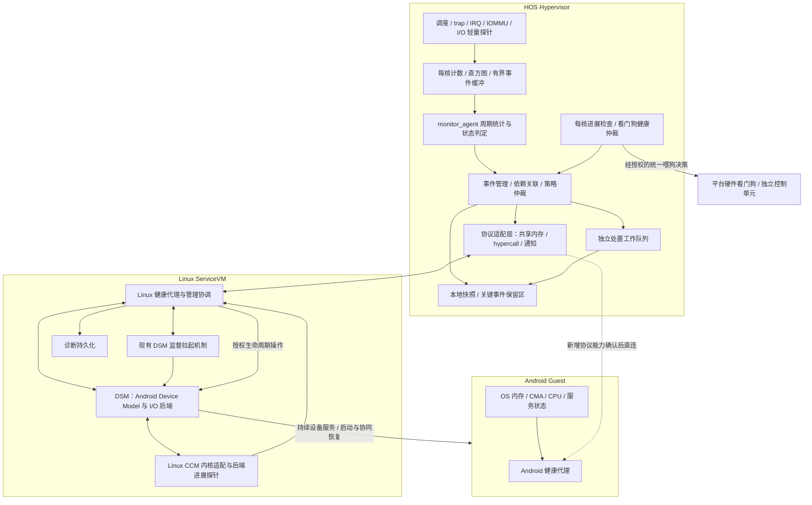
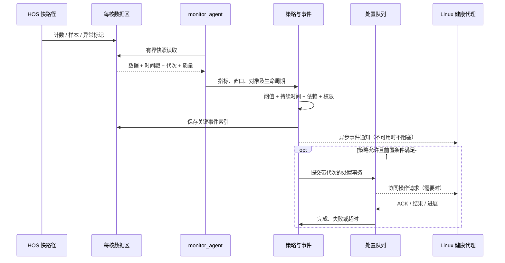
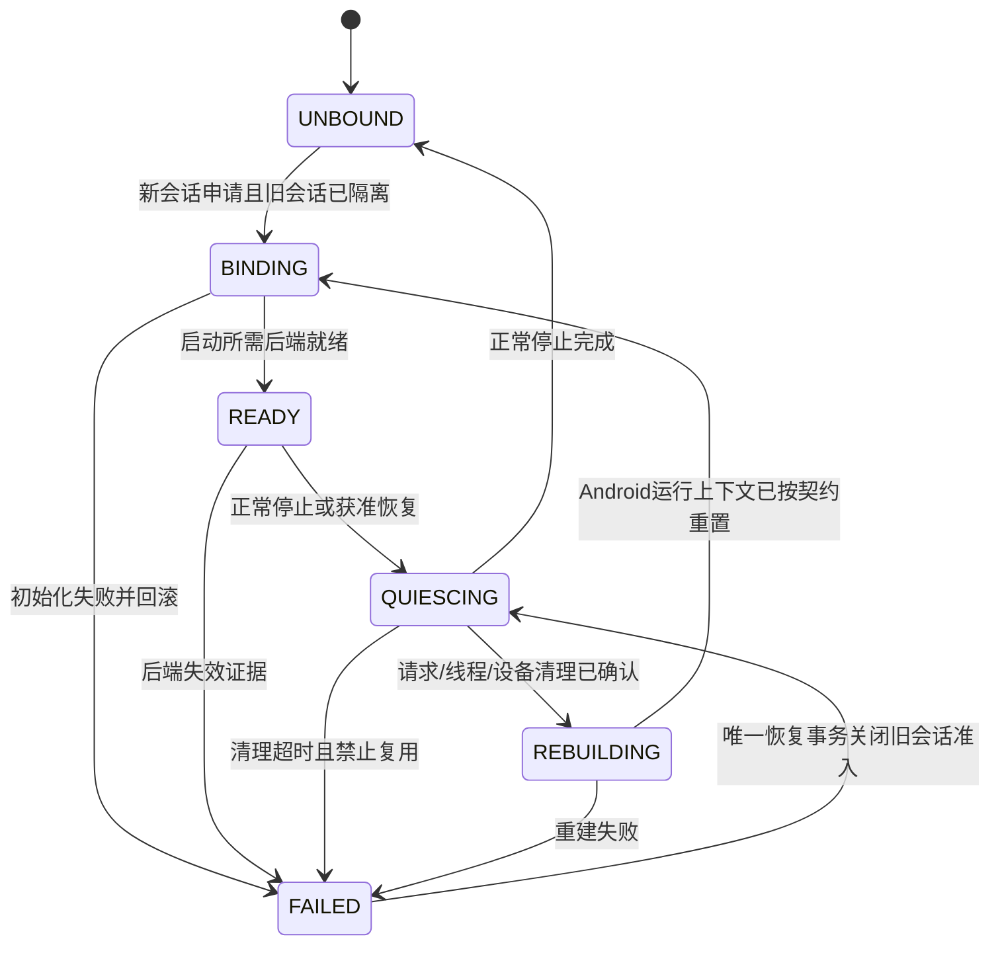
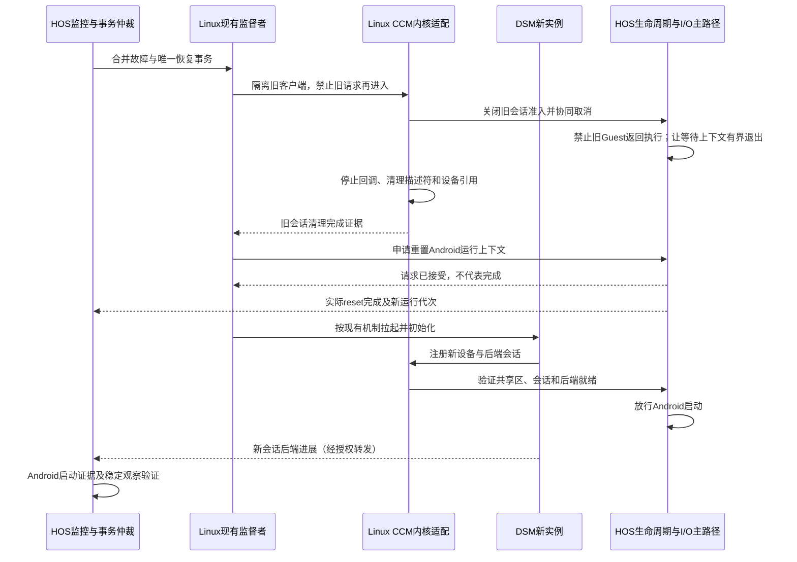

# HOS 健康监控系统概要设计

## ——以 Hypervisor 为核心的 monitor_agent 与双 Guest 协同监控

| 文档属性 | 内容 |
|---|---|
| 文档版本 | v1.1 |
| 编制日期 | 2026-09-14 |
| 文档状态 | 概要设计评审稿；不代表已实现或已验证 |
| 适用架构 | 基于 Xvisor 适配的 HOS；Linux ServiceVM 与 Android Guest 同时运行；Linux 中 DSM 提供 Android Device Model/I/O 后端，与 Android 同生命周期并支持异常重拉起 |
| 主要范围 | HOS 内核侧健康监控、异常判定、故障留痕、受控处置，以及与 ServiceVM/Android 的协同接口 |
| 输入基线 | monitor_agent v0.1 [H1]、概要设计 v1.0、本次四份 HOS 源码附件 [H2—H5]、用户对 DSM 的补充说明 [U1] |
| 阅读约定 | [U1] 为用户确认；[H2—H5] 为附件静态核对；[R*] 为外部参考；“本设计规定/建议”为新增契约；未提交的实现仍标为待核对 |

> 本文是 v1.0 的整合修订版，保留 CPU、内存、中断、自身健康、统计、配置及验证的完整范围，重点按本次 HOS 源码落实 DSM/I/O、通信和恢复设计。此次工作是静态审查与概要设计，不包含目标工程编译、并发复现或板端测试。新增结构、接口、状态和错误语义均为拟议契约，不是可直接编译的补丁。

## v1.1 修订摘要

| 修订项 | 本版处理 |
|---|---|
| DSM 定位 | 确认为 ACRN Device Model 的项目适配，持续提供 Android I/O 后端并与 Android 同生命周期 |
| 生命周期 | 按函数体区分“查找 Guest”“后端登记”“异步 reset 请求”和“对象真实销毁” |
| 故障恢复单元 | Android 运行实例与 DSM 后端会话协同恢复；HOS Guest 对象可保留，不能按接口名推定销毁重建 |
| 监控采集 | 同步 I/O 槽位、异步 sbuf 通知、CCM 通知和后台恢复事务分别建模 |
| 基础正确性 | 将早完成竞态、无界等待、sbuf 验证、失败返回传播和旧会话清理列为自动恢复前置项 |
| 兼容性 | 第一阶段采用 HOS 私有旁路统计，不修改现有共享结构；后续协议扩展显式协商 |
| 已确认与未知 | 四份附件已核对；Linux CCM/HSM release、DSM 监督拉起及 HOS manager/completion 内部仍待补齐 |
| 验证 | 新增针对本次源码的 I/O 竞态、异常退出、重绑定与能力协商测试，全部是待执行测试设计 |


## 目录

1. 项目背景与设计边界
2. 原稿评估与关键修正
3. 需求分解与职责分工
4. 总体架构与部署
5. 对象模型、状态模型与依赖关系
6. 数据采集与统计公共机制
7. CPU、调度与陷入监控
8. 内存与 IOMMU 监控
9. 中断健康监控
10. ServiceVM、DSM 与 Android 协同监控
11. Hypervisor 自身健康与看门狗
12. 告警与故障判定
13. 处置、限流与恢复设计
14. 内部接口与数据结构
15. Guest 通信协议与权限
16. 配置及诊断命令
17. 日志、快照与重启留痕
18. 并发、实时性与资源预算
19. 代码组织及现有代码接入点
20. 测试与验收设计
21. 分阶段实施与交付条件
22. 风险与待补充资料
23. 需求追溯矩阵
24. 参考依据

附录 A. 本次代码静态审查问题清单

附录 B. 同步 I/O 发布与取消的逻辑契约

# 1. 项目背景与设计边界

## 1.1 已确认的系统关系

| 项目 | 事实与证据边界 |
|---|---|
| Hypervisor | HOS 基于 Xvisor 适配，不等同于上游 Xvisor 或 ACRN Hypervisor [U1] |
| Guest | 当前为 Linux ServiceVM 与 Android 两个 Guest；内部表仍按工程上限分配 [U1] |
| DSM | ACRN 项目 Device Model 的适配版本，运行在 Linux，承担 Android 启动及运行期 I/O 后端，与 Android 同生命周期；异常退出后会重拉起 [U1] |
| ServiceVM 角色 | 头文件定义 `SERVERVM_ID=0`；现有 CCM 通知固定面向 ServiceVM，不是任意 Guest 通知接口 [H4:L6—L18；H3:L712—L725、L920—L933] |
| HOS Guest 对象 | 本次 `hcall_create_vm()` 查找已存在的 Guest 并返回信息；本函数不分配新 Guest 对象 [H3:L328—L357] |
| 注销行为 | 本次 `hcall_destroy_vm()` 只注销 I/O 后端，真正的 Guest destroy 代码被禁用；不能视为 Guest 已停止或资源已释放 [H3:L610—L631] |
| 确认范围 | 已能定义 HOS I/O 探针与通信适配；尚不能仅凭四份文件证明 DSM 异常重拉起时的全部清理顺序与恢复正确性 |

“DSM 与 Android 同生命周期”作为产品关系已确认；这不等于“二者每次恢复都必须释放并重新分配 HOS 的 `vmm_guest` 对象”。本设计区分对象寿命、Android 运行代次和 DSM 后端会话。

本文保留代码中的 CCM 称呼；提及 ACRN HSM 时，指 Hypervisor Service Module，即 ServiceVM 内核服务模块，与项目中其他语境的硬件安全模块 HSM 不是同一概念。附件中的 Linux 侧完整驱动未提供，不因其名称相似就假定与上游完全一致。

## 1.2 ACRN 对照范围

采用 ACRN **v3.3** 的 Device Model 设计及代码、Linux **v6.1** 的 ACRN 驱动作固定版本参考。它们用于理解用户态设备模型、ServiceVM 内核适配层和 Hypervisor 的职责分层，不表示用户分支来自这些版本，也不直接移植 x86 的 APIC/EPT、结构布局、错误码或调度原语。[R11—R15]

公开 Device Model 通过 ServiceVM 内核层处理转发的 I/O 请求，并与虚拟设备状态协同。本项目对照重点是所有权、发布/完成顺序、取消和恢复；具体结构及接口语义以附件为准。[R11]

## 1.3 设计目标

健康系统应形成“可观测、可解释、可定位、可受控恢复”的闭环，同时区分高负载、性能退化、服务无进展、隔离违规和 HOS 自身失效。

| 目标 | 要求 |
|---|---|
| 监控主体 | HOS 独立判断其可观测的调度、trap、IRQ、映射、请求进展和自身健康 |
| 依赖关系 | Linux/DSM 不作为普通可随意限流或重启的 Guest 服务处理 |
| 数据准确 | 同步 MMIO 完成、异步通知消费和真实设备业务完成分开统计 |
| 故障隔离 | 不让一个失效后端把 HOS 等待路径或监控线程永久拖住 |
| 恢复闭环 | 对 Android 运行实例与 DSM 会话实施唯一事务所有者、旧会话隔离和完成验证 |
| 故障证据 | Linux 不可用时不依赖其写盘；采用 HOS 本地预分配摘要及平台兜底 |
| 演进 | 先观测和验证底层契约，后逐项授权缓解与恢复，不通过统计线程替代正确的 I/O 协议 |

## 1.4 范围、非目标与约束

HOS 不从 vCPU 计数反推 Linux 进程或 Android 业务健康；Guest 内部 CPU/CMA/内存压力与 DSM 进程状态由 Guest 提供并标明来源。直通设备和绕过本次 ioreq 路径的后端应单独登记覆盖能力。

本概要设计不宣称功能安全认证、不保证所有设备内部故障可见、不把原稿中的接口列举视为全部已验证。pCPU/vCPU 数量、绑核、GIC/SMMU、内存分割方式及看门狗所有权，以项目配置为准。

探针原则上旁路记录，不修改被观测请求的所有权状态。协议校验、权限保护、错误返回和取消属于主路径正确性，不以 monitor_agent 开启为前提。任何自动处置均须满足能力、权限、目标代次、前置清理和结果验证条件。

# 2. 原稿评估与关键修正

原稿已提供 CPU、内存、中断九项需求，以及可复用能力和模块初步划分。本设计保留这些内容，但对以下关键点进行修正。[H1，§1—§4]

| 编号 | 原稿方案或缺口 | 本设计修正 | 原因 |
|---|---|---|---|
| C01 | 对累计 `ready_nsecs` 的周期差值计算调度 P99 | 对每个有效 READY/可运行等待区间记录时延；另保留累计 ready 增量 | 一个周期内的等待总量不是单次等待时延分布 |
| C02 | 将 `ready_max_nsecs` 直接作为当前窗口峰值 | 新建窗口峰值；累计峰值仅用于历史诊断 | 历史最大值可能在故障恢复后长期不变 |
| C03 | 直接周期调用现有统计接口 | 首选被动计数及有界快照；复核接口内部同步 IPI、锁和副作用 | 故障 CPU 不得拖死监控采样 |
| C04 | 将 trap 次数异常称为异常指令周期 | 分别输出陷入频率、处理耗时、可选 PMU 指标 | 次数不能推导单条指令实际执行周期 |
| C05 | 降优先级、缩短时间片等同 CPU quota | 软性优先级调整与硬预算限流分开；quota 由调度器强制执行 | 无其他竞争任务时，低优先级 Guest 仍可能占满 CPU |
| C06 | region/RAM 分配量作为 Guest 实际用量 | 区分已分配、已映射和 Guest 内部可用/使用量 | 固定分给 Guest 的 RAM 不随 Guest 内 malloc/free 同步变化 |
| C07 | 用 HOS DMA heap 替代 Guest CMA | HOS DMA heap 独立监控，Guest CMA 由 Guest 上报 | 两者属于不同分配器、不同地址空间与不同资源池 |
| C08 | IOMMU fault 与重复 map 统一除以 map/unmap 总量 | 映射请求拒绝率与 DMA fault 速率分别统计 | DMA fault 不一定对应一次新映射请求 |
| C09 | IOMMU 超限后延迟或丢弃请求 | 仅在支持背压的请求入口拒绝/限额新请求；不静默丢弃必要 unmap | 会改变 DMA 生命周期与安全语义 |
| C10 | `assert_count - execute_count` 判定丢失中断 | 作为待解释的状态差额；按状态、序列、期限判定疑似或确认丢失 | 中断合并、pending/active 状态及观测点语义可能不同 |
| C11 | 超过 50,000 exits/s 或 IRQ 占比 80% 即 panic/reset | 先生成异常候选，结合成本、进展和错误证据升级；默认不破坏性处置 | 高频不等于故障，比例也不代表绝对负载 |
| C12 | 单一守护线程包办采样、上报、日志和重置 | 快路径采集、周期判定、异步处置、独立兜底分层 | 阻塞动作或故障上报不能阻塞后续检测 |
| C13 | Linux/Android 按 Guest 名识别且对等处理 | 使用 HOS 授权角色、稳定标识及启动代次，建立 ServiceVM 依赖关系 | 重命名、重建与管理域故障都不能引起误归属 |
| C14 | 缺少监控系统自身健康设计 | 增加采样失约、事件丢失、监控线程进展及外部看门狗协同 | “监控没有报告”不能被解释为“系统没有故障” |

公开 Xvisor 的 `vmm_scheduler_stats()` 包含目标 CPU 的同步 IPI，并会同步更新部分状态累计时间；其公开签名也与原稿列出的 HOS 扩展签名不同。因此，本设计明确增加适配层，不直接复制上游接口，也不复用可能被查询更新的 `state_tstamp` 作为新的 READY 样本起点。[R2]

# 3. 需求分解与职责分工

## 3.1 原需求及新增健康需求

| 需求 ID | 需求名称 | HOS 主责 | Guest/平台配合 |
|---|---|---|---|
| CPU-1 | vCPU 调度延迟、就绪等待 | 事件采样、窗口分布、当前等待年龄、归因 | Guest 可辅助上报 OS 内调度压力，不替代 HOS 指标 |
| CPU-2 | 一键诊断异常执行活动 | 陷入分类、频率、耗时、CPU 快照；可选 PMU | Guest 提供进程级上下文；PMU 依赖平台能力 |
| CPU-3 | 域 CPU 使用率及细粒度限流 | vCPU/Guest 运行时间、资源域预算控制 | Guest 负责进程/线程限流，保护 DSM 与关键服务 |
| MEM-1 | 内存用量与连续内存池水位 | HOS 内存池、Guest 分配/映射量 | Linux/Android 上报内部内存与 CMA |
| MEM-2 | 内存及共享内存边界异常 | 权限拒绝、异常映射、接口越界、SMMU fault | Guest 负责其已获授权区域内部的数据结构越界 |
| MEM-3 | IOMMU 异常请求比例及限流 | 请求分类、拒绝率、DMA fault、入口配额 | ServiceVM/DSM 提供代理请求归属与背压处理 |
| IRQ-1 | 物理接收至虚拟注入延迟及可选完整链路 | HOS 可观测段的时间戳与分布 | 硬件触发点、Guest 接收点需要额外可观测支持 |
| IRQ-2 | exit 陷入风暴 | 速率、分类、服务成本、进展联合判定 | Guest 可上报合法压测/启动阶段 |
| IRQ-3 | 异常注入、积压与疑似丢失中断 | 路由合法性、pending 年龄、投递状态和比例 | 确认端到端丢失需设备/Guest 序列支持 |
| HEALTH-1 | Guest 存活性与生命周期 | 启动、停止、挂起、恢复、重建代次和心跳期限 | Guest agent 注册、心跳、启动完成与挂起协商 |
| HEALTH-2 | ServiceVM/DSM 及 I/O 工作进展 | 管理链路、HOS 侧请求积压、动作超时 | Linux 检测 DSM 进程、主循环、设备后端进度 |
| HEALTH-3 | HOS、pCPU、监控线程自身进展 | 每核进展、采样失约、队列健康、IPI 等待异常 | 全 HOS 无法执行时依赖平台看门狗/独立控制单元 |
| HEALTH-4 | 故障闭环和恢复验证 | 事件关联、授权处置、重试抑制、恢复判定 | DSM/Guest 执行被授权操作并提供结果 |
| HEALTH-5 | 故障证据与重启留痕 | 本地有界快照、关键事件、重启原因 | ServiceVM 持久化；平台提供跨复位保留能力 |

## 3.2 边界分工

| 指标/对象 | HOS 直接监控 | Linux/Android 监控 | 说明 |
|---|---|---|---|
| vCPU 获得 pCPU 的等待 | 是 | 否 | 不等于 Guest 某线程的调度延迟 |
| Guest 内部进程 CPU | 否 | 是 | 不能仅由 HOS vCPU 运行时间反推 |
| Guest 分配内存总量 | 是 | 可查询 | 区分独占与共享计数 |
| Guest 内部 MemAvailable/CMA | 不直接推算 | 是 | 上报缺失时状态为未知，不填 0 |
| Stage-2/IOMMU 拒绝事件 | 是，按实际接入路径 | 可配合 | 合法 MMIO 模拟等预期 fault 单独分类 |
| Guest 已授权页内越界 | 通常不可见 | 是 | 不夸大页级隔离的对象级检测能力 |
| DSM 进程存活/主循环进展 | 只能接收报告 | Linux 主责 | 进程存在不等于设备后端正常 |
| HOS 已发布同步 I/O 请求是否完成 | 已确认该路径存在 | DSM 配合 | 不覆盖绕过该路径的直通设备 |
| 整个 EL2 长时间无执行进展 | 无法保证自检 | 平台兜底 | 不以另一个普通 HOS 线程替代独立机制 |

# 4. 总体架构与部署

## 4.1 架构原则

采用“**HOS 本地闭环为根、ServiceVM 管理协同、Android 自身补充、平台独立兜底**”的架构。Linux 正常时承担汇聚和持久化；Linux 异常时，HOS 不等待 Linux 才完成故障记录或执行已获授权的本地隔离动作。

运行链路分为快速采集面、统计判定面、处置控制面和独立兜底面。快速采集面不做复杂统计、文件操作、Guest 上报、同步跨核请求或生命周期重置。



## 4.2 主要组件

| 组件 | 部署位置 | 职责 | 不承担的工作 |
|---|---|---|---|
| Probe | HOS 热路径 | 时间戳、计数、固定大小样本、必要异常标志 | 日志格式化、阻塞上报、重置 |
| Stats | HOS 工作上下文 | 差分、速率、直方图合并、P99、数据质量 | 在全局锁内全量扫描 |
| Policy | HOS | 生命周期过滤、连续判定、迟滞、依赖与权限检查 | 无依据地直接执行破坏性动作 |
| Event | HOS | 去重、关联、限额、审计 | 无限缓存 |
| Action | HOS 独立工作队列 | 预算请求、设备隔离协调、恢复事务 | 持有调度锁等待 Guest |
| Transport | HOS 与 Guest | 注册、报告、事件、ACK、控制请求 | 信任 Guest 自报的身份和权限 |
| Local evidence | HOS | 常驻摘要、关键事件及故障最小快照 | 保证普通 RAM 经断电后保留 |
| Guest agent | Linux/Android | OS 指标、服务状态、协同动作 | 决定自身具有 HOS 管理权限 |
| Watchdog adapter | HOS/平台既有组件 | 基于健康契约协同喂狗 | 因单个性能告警直接停止喂狗 |

## 4.3 主流程



## 4.4 管理面与数据面分离

Linux 侧保留现有 DSM 监督拉起机制，由健康协调模块与其对接；不得再增加一个与现有监督机制竞争的无限重启循环。监督者独立于被监督 DSM 进程，才能报告 DSM 异常退出。

HOS 的监控主线程不进入 `insert_io_request()` 或 `insert_asyncio_request()` 发送健康消息。I/O 数据面失效时，健康信息保存在 HOS 私有缓冲；Linux 可用时通过独立健康通道或有界拉取读取。CCM 只能在增加明确消息分流及重新检查机制后复用为通知提示。

# 5. 对象模型、状态模型与依赖关系

## 5.1 独立标识和代次

| 标识 | 更新边界 | 不能混淆的事件 |
|---|---|---|
| `boot_id` | HOS 一次启动 | 不以 DSM PID 代替 |
| `vm_object_id / object_epoch` | HOS 对象真正创建/销毁 | `HC_CREATE_VM` 只是查找时不递增 |
| `guest_run_epoch` | Android 运行上下文经实际 reset/重新装载进入新一轮运行 | 不因重复 START、统计查询或 DSM 临时注册就递增 |
| `backend_session` | Linux 驱动确认旧客户端隔离后，建立新的 DSM 后端绑定 | 不只使用 VMID；PID 可重用且 HOS 不能直接验证其进程身份 |
| `request_seq` | 同一有效会话下每个新同步槽位请求 | 不把 vCPU id 当请求序号 |
| `stats_epoch / config_version` | 统计清零/配置生效 | 不改变真实 Guest 生命周期 |

以上为拟议逻辑字段，优先置于 HOS 私有监控/控制扩展。现有请求和完成通知不包含这些全部字段，不能仅添加 HOS 私有序号就宣称已经获得线上的防过期完成能力。[H4:L140—L171；H3:L723—L725]

每条证据区分 `reporter`、资源 `owner`、请求 `requester` 和 `affected_object`。Linux 代表 Android 处理 I/O 时，执行主体为 Linux 不等于设备资源属于 Linux；也不能把全部 Linux CPU 消耗都精确归给 Android。

## 5.2 正交状态

| 维度 | 拟议状态 | 用途 |
|---|---|---|
| 运行生命周期 | PREPARED、BOOTING、RUNNING、SUSPENDING、SUSPENDED、RESUMING、STOPPING、STOPPED、RECOVERING | 映射真实 manager/Guest 进展，不替换其原枚举 |
| 后端会话 | UNBOUND、BINDING、READY、QUIESCING、FAILED、REBUILDING | 表示 I/O 服务是否准入，区别于现有单一注册位 |
| 健康结论 | UNKNOWN、HEALTHY、WARNING、DEGRADED、FAILED | 必须关联证据和判断主体 |
| 数据质量 | VALID、WARMUP、STALE、INSUFFICIENT、DROPPED、UNSUPPORTED、ERROR | 不以缺失值 0 冒充健康 |
| 处置事务 | REQUESTED、PRECHECK、FENCING、QUIESCING、RESETTING、REBINDING、VERIFYING、SUCCEEDED、FAILED、TIMED_OUT | 请求接受与执行完成分开 |

`backend_registered=1` 仅作为兼容路径标志采集，不能直接映射为 READY，因为当前 START 在装载/启动之前就置位。[H3:L360—L399]

后端 READY 的拟议条件为：客户端有效、共享区域范围和缓存属性验证通过、同步槽位与异步描述符归属于当前会话、通知路径可用、必需设备已初始化，并且没有冲突恢复事务。实际启动依赖采用阶段门：只有满足启动所需后端条件才放行 Guest；后续服务分别报告启动完成，避免“等待 Guest 启动才能准备后端、又等待后端才启动 Guest”的环形依赖。

## 5.3 恢复域与依赖传播

确定依赖链为：`Linux ServiceVM → Linux CCM/内核适配 → DSM 后端 → Android 相关虚拟设备`，DSM 同时承担 Android 启动管理。[U1]

Android 与 DSM 是关联恢复域，但不意味着任一设备迟缓都触发整个域重启。首先按设备/队列划分影响范围；仅在本地恢复无效或运行状态无法保全且策略许可时，执行成对的运行实例/后端会话重建。

Linux 代理失联、DSM 进程退出、I/O 处理停止、Linux Guest 本身失效分别记录。运行期 I/O 依赖已经确认；仍不能由 Linux 失联推断 Android 所有纯计算或直通设备立即停止。



## 5.4 生命周期过滤和内存寿命

未启动 Android 时不报稳态心跳超时；BOOTING 使用启动期限；挂起必须由 HOS/管理流程确认。重复旧心跳不刷新工作进展。恢复期间保留旧证据，新统计先进入 WARMUP。

Guest 对象保留不代表其中的 I/O 页、completion、DSM fd 描述符、后台线程和 `servervm` 缓存指针自动安全。复用前必须确认旧访问者退出；代次校验用于拒绝旧操作，不能阻止一个仍持有可写映射的旧线程直接写共享页。必要的引用、取消和映射寿命必须由主路径管理。

# 6. 数据采集与统计公共机制

## 6.1 采集类型与周期分层

“事件记录周期”“指标计算窗口”“策略判定周期”“对外上报周期”必须分开。默认不把全部工作放进同一个 1 s 定时回调。

| 层次 | 建议初始设置 | 适用工作 |
|---|---|---|
| 事件探针 | 事件发生时记录；热路径 O(1) 且空间有界 | READY 进入/结束、trap、IRQ、映射拒绝、对象生命周期 |
| 快速健康检查 | 100 ms | 当前等待年龄、请求期限、进展期限、严重事件标志 |
| 常规统计 | 1 s | CPU 使用率、exit 速率、内存池水位、窗口快照 |
| 分布与趋势窗口 | 5 s 主窗口；保留 1 s 分桶 | P99、连续超限、比例、短期趋势 |
| Guest 常规上报 | 1 s；可配置 | OS 内存、CMA、Guest CPU/服务摘要 |
| 外部摘要导出 | 1 s 或更低频 | 非关键指标批量上报 |
| 故障快照 | 事件触发，带冷却和总量限制 | 快照前后片段与关键状态 |

所有数值为工程初值，不是测得性能或安全保证。关键时间预算明显小于 100 ms 的设备不应依赖该轮询周期，应接入既有超时路径或专用期限机制。

若策略的期限为 D，检查周期为 P，允许的最大调度迟到为 J，则仅在 J 有界的条件下，检测上界才能估算为 `D + P + J`。没有调度可执行性保证时，不承诺硬实时发现期限。

## 6.2 时间与差分

HOS 内使用单调时基，内部统一 ns，对外显示可转为 us/ms。初始化时确认跨核时基一致性、频率、计数器宽度及休眠行为。无法保证跨核一致时，不直接相减来自不同时间域的时间戳。

速率按实际窗口长度计算：

```text
rate_per_sec = (counter_now - counter_prev) * 1,000,000,000
               / (timestamp_now_ns - timestamp_prev_ns)
```

实际实现应防止乘法溢出；使用平台安全的乘除助手或经过边界校验的分解计算。计数回退、对象代次变化、统计 epoch 变化、时间不连续时，舍弃该差分并重新建立基线。`delta_t <= 0` 不输出有效速率。

休眠/恢复期间的时间不连续与预期长间隔必须单独处理。不能把包含长时间休眠的平均速率与稳态 1 s 阈值直接比较。

## 6.3 快照而非无条件跨核同步查询

常驻采样优先读取以下数据：在正常执行路径更新的累计计数、定期发布的每核快照、只读对象快照，以及有界重试的序列化数据。对于公开 Xvisor 所示的同步 IPI 统计接口，仅作为受限诊断候选，须复核 HOS 行为后使用。[R2]

有界快照要求：只尝试有限次数；发现版本变化或写入未完成时使用上一个已完成版本并标记 STALE；不得等待失去进展的写者。序列计数器可以用于检测不一致，但无限重试仍可能使读者失去进展，因此本文明确限制重试次数。[R3]

当前正在 RUNNING 的 vCPU 需要补计“最后结算至快照时刻”的运行时间，但不得与已结算片段重复。建议在本核发布时完成补计；跨核读者不应在不了解 HOS 计账语义时自行修改原字段。

## 6.4 直方图、P99 与窗口峰值

对于 N 个单次时延样本，精确 P99 采用排序后第 `ceil(0.99 × N)` 个样本，序号从 1 开始。常驻模式建议固定边界直方图，聚合每个时间桶的计数，定位覆盖该序号的桶并报告其上下界；显示值可以取上界，但必须标注“直方图估计值”。

不得对各 CPU 的 P99 求平均得到整体 P99，应先合并兼容的直方图或原始样本，再计算分位数。不得从“每秒累计等待时间”推导“单次调度等待 P99”。

建议每个分布同时输出 `count、p50、p95、p99、max、window、validity、dropped_count、bucket_resolution`。以 `P99-P50` 定义主要分布抖动指标，以 `max-min` 描述极差，二者分别命名；标准差为可选项，不在热路径计算。

初期将 N≥1,000 作为 P99 趋势判定的经验样本门槛，而非统计置信度保证。低频设备可延长窗口或改用每事件期限、最大值及 pending 年龄，不为凑样本延迟严重异常处置。

若阈值落入 P99 所在直方图桶内，结论记为边界不确定，只告警或启用短时高精度采集；不把量化误差直接放大为破坏性动作。丢失样本可能有偏，不能一概解释为随机抽样。

## 6.5 连续超限、迟滞与恢复

“连续 5 s 超限”定义为 5 个连续、有效、约 1 s 的判定桶均超限，而不是 5 s 内任意时刻超限，也不是简单 5 s 平均值超限。

若发生明显采样失约或缺失桶，连续性证据不足；保留异常候选，单独上报监控迟到，不把一个迟到的 5 s 平均样本当作 5 个连续合格桶。

高水位类规则采用 `T_clear < T_warn < T_critical`。恢复要求连续多个有效周期低于清除阈值，并满足工作进展条件。处置冷却、告警清除及对象恢复成功为不同概念。

## 6.6 采集质量

缺少指标、接口不支持、Guest 未上报、Guest 挂起、队列溢出、快照过期等应使用不同质量状态。指标读不到不能填 0，也不能继承旧数值但仍标记为新鲜。

质量下降时，依赖该指标的自动动作降级为只记录或等待其他独立证据。同步发生的真实安全检查失败仍由原有防护路径即时拒绝，不等待统计质量恢复。

# 7. CPU、调度与陷入监控

## 7.1 CPU-1：监控口径

| 指标 | 定义 | 用途 |
|---|---|---|
| `ready_wait_ns` | vCPU 具备调度资格后，至被选中执行之间的实际等待；显式策略限流时间单独扣分记录 | 衡量调度竞争及调度异常 |
| `ready_wall_ns` | 从本次可运行请求开始至执行的墙钟时间 | 衡量整体服务等待，包含策略造成的等待 |
| `policy_throttled_ns` | 因预算耗尽而无调度资格的时间 | 区分人为限流与调度器无法服务 |
| `wakeup_to_run_ns` | 有明确阻塞唤醒事件时，从该事件至执行 | 衡量唤醒服务时延；不适用于所有抢占重入 |
| `current_ready_age_ns` | 当前未完成、且具有调度资格的等待年龄 | 发现一直得不到执行、尚未进入完成样本分布的 vCPU |
| `dispatch_cost_ns` | 明确两个探针之间的调度/上下文切换开销 | 与就绪等待分开，定位 HOS 内部成本 |
| `ready_time_delta_ns` | 周期内累计 READY 时间增量，保留原有统计语义 | 衡量总体等待负荷，不作为单次样本 |

暂停、停止、正常 WFI 等未具备运行资格的阶段不得被直接当作调度等待。实际 WFI 与唤醒状态转换以 HOS 代码为准。

## 7.2 采集逻辑

在 vCPU 真正开始一个新的等待区间时记录独立的 `ready_enter_ns`、原因和 episode 序号；不得依赖会被其他统计查询更新的时间戳。

vCPU 获得执行时完成一次样本，在本地计数/直方图记录后清理区间。若等待期间发生预算限制，累计其排除时间；若暂停、销毁或重置导致区间取消，则输出取消原因，不把未完成区间误当正常完成样本。

被抢占后重新入队通常开始新等待区间；迁移时，尚未结束的等待区间应保留或明确交接，不能在源核和目标核各计算一次。迁移期间时间不可信的样本标为无效。

## 7.3 推荐初值与处置

| 指标 | 观察级初值 | 严重候选初值 | 默认动作 |
|---|---|---|---|
| 普通 vCPU 的 ready P99 | >1 ms，连续 3 个判定周期 | >5 ms，连续 3 个周期 | 告警、快照、关联 pCPU/IRQ/trap 负荷 |
| 当前可调度等待年龄 | >10 ms | >50 ms | 高优先级事件；检查调度状态，不立即重置 |
| 实时性敏感 vCPU | 使用项目预算，不沿用普通 vCPU 默认值 | 使用项目预算及最大允许服务间隔 | 需单独验证 |

上述初值只是开始采集时的观察配置。启动、压测、后台负载、绑核、共享核和恢复阶段应分别标定。不得依据这些通用初值直接宣布实时性满足要求。

## 7.4 CPU-3：使用率定义

设窗口长 `Δt`，Guest g 各 vCPU 有效运行增量为 `ΔR_i`：

```text
U_core(g) = Σ ΔR_i / Δt                  # 使用了多少个 CPU 核当量
U_one_core_pct(g) = U_core(g) × 100%     # 多核 Guest 可以超过 100%
U_capacity_pct(g) = Σ ΔR_i / C_g × 100% # 相对于明确定义的可执行容量
```

`C_g` 为该窗口内 Guest 可并行使用的核容量积分；固定情况下可取“最大可并行执行 vCPU 数 × 窗口时长”，其中应考虑在线 vCPU 和其允许的 pCPU 集合。复杂亲和性下不能简单把每个 vCPU 的 cpumask 权重相加；也不能把“被分配最大容量”误认为“实际保证得到的调度份额”。拓扑变化时分段积分或将该窗口标为不适合容量归一化。

例如一个 Guest 在 1 s 窗口共执行 2.4 CPU-s，其单核等价占用是 240%；若最多可同时执行 4 个 vCPU，则对应该容量的利用率为 60%。这两个数字都可以成立，必须同时说明口径。

这里的运行占用表示 vCPU 获得 pCPU 服务的时间，不等同于 Guest 内部统计的 CPU busy；Guest idle、WFI 和陷入处理的归类需保持各自口径。

原稿的 `state_running_nsecs` 与 `system_nsecs` 是否重叠、是否包含该 vCPU 关联的 EL2 服务耗时，必须从 HOS 源码确认。复核前分别呈现，不进行未经证明的加减。HOS 后台线程、主机 IRQ 和代理 Android 的 Linux 后端 CPU 消耗也应分别归类，不能将全部成本归给当时运行的 Guest。

建议对容量使用率采用“>90% 持续 10 s”作为高负载提示、“>95% 持续 30 s 且出现服务退化”作为严重候选；高负载本身不触发自动限流。限流须由资源预算超额、其他对象服务受损或已批准的业务策略触发。

## 7.5 CPU 细粒度限流的实现边界

HOS 能直接控制的是 vCPU 或 Guest 的调度资源；Guest 内的某个线程或进程，应由 Guest 使用其本地调度/资源控制机制处理。Linux 的 `cpu.max` 与 `cpu.weight` 就体现了“带宽上限”和“相对权重”的区别，但 Guest 的内核版本、调度类和控制器启用情况须核实，不能把此接口视为所有 Android 线程的通用限流开关。[R4]

本设计采用两级动作：Guest 内优先对已识别的非关键任务限流；必要时由 HOS 施加已批准的资源域预算。DSM、健康代理以及关键设备后端应受到最低服务预算保护，不因 Android 的 I/O 负荷间接增加而被盲目整体压制。

### 7.5.1 预算模型

定义预算周期 P 与周期内允许使用的总执行时间 Q，Q 的单位为 CPU 时间而非墙钟时间。Q 可大于 P，表示 Guest 在多核上累计使用多个核当量。

```text
P = 10 ms，Q = 20 ms
含义：每个周期允许所有 vCPU 累计执行 20 CPU-ms，约等于 2 个核当量。
```

该算例不表示当前 HOS 已有预算调度器，也不表示建议直接应用于 Linux 或 Android。

### 7.5.2 调度器集成要求

预算机制由调度器执行，monitor_agent 只提交策略和查询结果。调度器必须覆盖 RUNNING vCPU 的预算到期、周期补充、抢占、阻塞、唤醒、跨核并行、迁移与 CPU 热插拔。

可选择“受控共享预算池 + 每 vCPU 有界预算片段”的实现：执行前从 Guest 总预算预留一个有上限的片段，并将预算到期纳入本核下一调度期限；阻塞时归还剩余预算。所有核不得各自完整领取一份 Q。剩余片段不可跨预算代次重复归还，旧周期已预留预算不得滚入新周期重复使用。

预算耗尽后，vCPU 暂时失去调度资格，进入预算机制自己的受限队列或资格状态，不应借用 Guest 的暂停/停止语义。补充预算使用绝对周期边界，恢复调度资格后触发必要的重调度。

预算超调上界应根据各核片段、记账误差、调度延后和不可抢占路径分析并实测。若存在无界的不可抢占 EL2/固件路径，则不能声称预算硬上界已经有保证。

降低优先级、缩短 time_slice 可以作为独立的软调节选项，但其界面与事件名称不得标为“已强制达到 Q/P 配额”。

## 7.6 CPU-2/IRQ-2：陷入频率与执行成本

原稿列明 `vmm_trap_stat` 和相关读取接口。本设计以现有计数为候选接入点，先核实每种分类是否互斥、计数在何处递增、是否会被其他诊断命令清零，再建立差分统计。[H1，§2.1、§9]

至少区分 WFI/WFE、SMC、HVC、系统寄存器模拟、取指/数据异常，以及独立的物理 IRQ 类别。不能将相互重叠的 EC 与 IRQ 计数再次求和并称为总 exit。

建议提供：每类次数/s、占比、每次处理耗时分布、EL2 服务时间占比、累计慢处理次数、Top 分类及关联对象。trap 的墙钟处理时延、纯 EL2 CPU 时间和异步请求总完成时延应分别命名；如果中间离开 CPU 或等待安全世界/后端，不把整段墙钟时间都算作 HOS CPU 开销。

“一键诊断异常指令周期”在基础版中落实为“一键分析异常陷入活动与处理耗时”。没有 PMU、有效 PC 采样或对应执行测量时，不输出“某条指令耗费 N 个真实 CPU 周期”的伪精确结论。PMU 作为可选能力，需另行处理 Guest PMU 使用冲突、跨核迁移和可用事件。

### 7.6.1 Exit 风暴判定

保留原稿初始条件：`exit_rate > 50,000 次/s` 连续 5 s，作为风暴候选。进一步按以下证据升级：陷入处理耗时显著占用 pCPU、目标 Guest 无有效进展、非法操作占比上升、其他 Guest 调度或 I/O 时延退化。

候选触发后先限额快照、聚合分类并上报。默认禁用 panic 和单 vCPU reset。正常启动、合法 I/O 压测、频繁 WFI 等场景即便次数较高，也不应仅凭次数被判为死机。

监控自身的 hypercall 应可单独分类并有速率上限，防止“上报增多→exit 告警增多→继续上报”的反馈放大。

# 8. 内存与 IOMMU 监控

## 8.1 MEM-1：HOS 与 Guest 指标分层

| 指标 | 所有者与采集位置 | 定义 |
|---|---|---|
| HOS RAM/heap 剩余量 | HOS | 原有内存管理器可用量、分配失败、最低剩余量 |
| HOS DMA heap 水位 | HOS | HOS 连续内存池的剩余比例；不得命名为 Guest CMA |
| Guest assigned bytes | HOS | 为 Guest 配置/保留的物理内存容量 |
| Guest mapped bytes | HOS | 按 region/映射模型统计的映射容量，与 assigned 区分 |
| Guest private/shared bytes | HOS | 私有与共享映射分别统计；系统汇总对共享物理页去重 |
| Guest MemTotal/MemAvailable | Guest 上报 | OS 所见总可用 RAM 与可用内存估计 |
| Guest CMA total/free | Guest 上报 | Guest CMA 配置与当前空闲值 |
| Guest 内存压力 | Guest 上报 | 按已支持能力提供回收、分配失败、OOM/压力指标 |

Linux `/proc/meminfo` 的 `MemAvailable` 是可用于新应用的估计值，`CmaTotal/CmaFree` 则表示 CMA 保留区及其空闲量；这些字段是否存在与内核配置有关。[R5]

建议把 `MemTotal - MemAvailable` 命名为“基于可用内存估算的占用”，不是“所有应用实际物理页的精确总和”。`CmaFree/CmaTotal` 作为观察性水位，不能单独保证某种大小的连续分配必然成功；实际分配失败与耗时必须另报。

如果 Guest 未启用 CMA 或未提供指标，返回 UNSUPPORTED，而不是 0% 或 100%。不需要为了满足 Guest CMA 监控而在 HOS 新引入一个 CMA 分配器。

## 8.2 采集与初值

HOS 资源池每 1 s 采集；Guest 每 1 s 上报，3 s 未更新标 STALE；相关生命周期允许暂停时另处理。低水位建议预警 <10%，严重候选 <5%，分别持续 5 s/3 s；恢复阈值建议 >15%。这些比例只用于初始观察配置，需同时评估绝对可用量、分配失败和关键请求需求。

分配失败是独立事件：关键 HOS 结构分配失败不等待低水位窗口结束。原有错误处理先执行；monitor_agent 记录池类型、请求大小、调用分类及影响，不在内存紧张时临时申请大快照。

## 8.3 MEM-2：边界异常监控

监控点包括 region 配置与重叠拒绝、共享内存服务接口参数拒绝、Stage-2 访问异常分类、IOMMU/SMMU fault，以及 Guest/DSM 提交描述符的范围和权限校验失败。

必须先分类再计数：合法 MMIO 模拟、预期的按需映射/权限管理路径若存在，不能与未授权访问混为一谈。HOS 自身 bug、Guest 非法地址、设备 DMA 越界、错误映射配置也应有不同事件码。

地址范围校验应使用防溢出写法，例如先验证 `offset <= region_size`，再验证 `length <= region_size - offset`，并检查访问权限、页范围、所有者和有效代次。不能仅依赖 `offset + length <= size` 而忽略整数溢出。

### 8.3.1 检测覆盖限制

`vmm_shmem_read/write/set` 中的检查仅覆盖通过该 API 的访问。Guest CPU 直接读写已映射共享页、设备直接 DMA，以及已获授权页面内部的数据结构越界，不会自动经过这些 helper。

CPU 访问隔离依赖实际 Stage-2 权限；DMA 隔离依赖设备确实接入且启用了相应 IOMMU/SMMU 保护。绕过 SMMU、错误 stream 归属或整片共享授权场景，应在覆盖矩阵中标明盲区，不能宣称“所有边界异常均能检测”。

确认的非法访问由原防护路径即时拒绝。首个事件保留详细证据，后续同类事件做限额聚合。持续违规是否隔离 Guest/设备，依据资源归属与处置权限判断，不因输出日志被限额而放松权限检查。

## 8.4 MEM-3：IOMMU 统计口径

将监控分成两个互不混淆的集合。

| 集合 | 计数及分母 | 规则 |
|---|---|---|
| 管理请求 | 在同一已定义入口被 HOS 实际解析的 map/unmap 等请求；按类型记录合法、拒绝、资源失败 | `invalid_request / received_request`，请求仅计一次 |
| 设备 DMA fault | 按 stream/device/domain 记录 fault 类型、次数、时间和地址摘要 | 默认按 fault/s 和同类突发计数，不除以 map 请求数 |

如果在 `vmm_iommu_map()` 入口和底层 SMMU 驱动同时有探针，两者须分别命名为“管理请求”和“内部驱动操作”，不能累加后当作请求总数。批量 map、失败重试、拆分 unmap、部分完成也要明确定义一次请求的边界。

“重复 map”是否非法取决于现有 API 语义；资源不足、设备暂不可用、策略限流拒绝不自动等于 Guest 非法请求。预校验拒绝、权限拒绝和后端资源失败分别分类，避免把 HOS 自己实施的限流反过来算成新违规。

### 8.4.1 20% 规则

保留原稿 >20% 作为观察阈值；建议最少 100 个有效请求/1 s 桶，连续 3 个有效桶超过 20% 才形成“异常比例持续超限”事件。请求少于门槛时不凭比例执行统计型限流，但单次确认的越权操作仍立即拒绝和记录。

对于未能可靠映射到设备/Guest 的 fault，记录为未归属事件并进行平台诊断，不对猜测出来的 Guest 自动执行动作。

### 8.4.2 受控限流

限流位置应为面向 Guest/DSM 的、支持返回错误或异步背压的请求入口，而不是在任意底层 SMMU 回调中睡眠或丢请求。可以限制新建映射请求次数、映射页数、挂起请求数和单 Guest 配额。

对已有 DMA 映射的解除、故障恢复清理和设备停止所必需的操作保留预算。不得静默丢弃 unmap、伪造成功或在设备尚未停止 DMA 时提前释放内存。Linux DMA API 也将映射的释放与 DMA 使用生命周期绑定；HOS 自有 API 需维持等价的生命周期安全条件，而不是照抄 Linux API。[R6]

每个限流动作必须具有明确返回码/完成状态、所有者、有效代次、上限和回滚条件。底层 fault 不能可靠限流时，选择聚合日志、停止新的授权请求或进入获准的设备隔离流程，而不是任意丢弃 fault 处理。

# 9. 中断健康监控

## 9.1 IRQ-1：分段定义

| 时间点 | 定义 | 可观测条件 |
|---|---|---|
| t0 | 设备/测试源实际触发中断 | 通常需要设备时间戳、专用测试源或额外探针 |
| t1 | HOS 的指定物理 IRQ 入口观测点 | 须写明在 acknowledge 前还是后 |
| t2 | 目标虚拟 IRQ 在本次目标 vCPU 上真正具备投递条件的观测点 | 需区分仅记软件 pending、保存 LR 状态、活动 vCPU LR 装载等情况 |
| t3 | Guest 对本次事件的确认观测点 | Guest 驱动探针或带序列的测试协议 |

定义：`L_host=t2-t1`，`L_guest=t3-t2`，`L_e2e=t3-t0`。存在 t0/t3 支持时才输出完整 E2E；否则只输出已观测段及覆盖状态。

“写入 LR”可能只是中断生命周期中的一个阶段，不代表 Guest 已接收或完成业务处理。以 Linux 公开 VGIC 文档为例，中断存在 pending/active 等状态，且 pending 的解释与触发模式、输入电平及锁存状态有关；不能将软件计数简单视为一一对应的交付。HOS 目标 GIC 的具体点位仍须单独核实。[R7]

原稿四检查点 `trigger→hos_ack→lr_write→gos_ack` 可作为测试链路候选，但其点位语义、跨时钟转换、时间戳开销及事件匹配都需要实测确认。[H1，§2.1、§4.7]

## 9.2 样本匹配与支持能力

在测试或可支持的驱动链路中，为事件维护 IRQ 来源、目标 Guest/vCPU、触发模式、设备/队列、事件序列及对象代次。level-triggered IRQ 或中断合并不能假设每次 assert 对应唯一一次 Guest ack；不能可靠配对时只计算可解释的状态段或专用测试序列。

对直接注入、直通中断或绕过通用软件路径的实现，必须建立单独能力标志。缺少探针的路径标为 UNSUPPORTED，而不是得到 0 延迟。Guest 时间戳需经过时间域校准；未校准的数据不能与 HOS 时间直接相减。

常驻模式对关键 IRQ 建固定直方图；全量原始时序仅对选定 IRQ 短时采集，并记录采样率与丢样本。周期统计输出有效样本数、P50/P99/max、P99-P50、pending 数及最老 pending 年龄。

## 9.3 阈值策略

常规 IRQ 的 HOS 可观测投递段可先用 P99>200 us 作为观察预警，>1 ms 作为严重候选；关键实时 IRQ 必须使用专用预算。完整 E2E 阈值在设备和 Guest 探针确认后按路径标定，未确认前不提供统一默认值。

原稿列明的 700 ms 虚拟 IRQ 超时为现有实现参数线索，并不证明所有 IRQ 都可共用该期限。该值暂保留为兼容配置候选，优先复核被监控 IRQ、触发条件及误报场景。[H1，§2.1]

## 9.4 IRQ-3：异常注入、积压与疑似丢失

| 类别 | 检测条件 | 结论 |
|---|---|---|
| 非法注入 | 目标 Guest/vCPU 不存在、代次错误、无权限、路由不匹配 | 确认的接口/权限违规，由原路径拒绝 |
| 正常积压 | 有 pending，目标暂不可运行或中断被合法屏蔽 | 状态解释，不等同丢失 |
| 异常投递等待 | pending 超过该路径期限，且缺乏合理生命周期/屏蔽原因 | 疑似投递卡滞 |
| LR 资源压力 | overflow/underflow 或等待 LR 事件增加 | 资源压力指标，不直接等同中断丢失 |
| 确认的事件缺失 | 存在可靠序列、到期条件和预期完成次数，且未按协议完成 | 按协议认定的事件缺失 |

`assert-execute`、`execute-clear` 等差额应先关联 pending、active、屏蔽、合并、路由与取消状态。没有可验证的一一对应关系时，输出“差额/疑似积压”，不得标为“已确认丢失 N 次中断”。

## 9.5 80% 规则与屏蔽限制

保留“单来源 IRQ 占比>80%，连续 5 s”作为异常候选，分母必须固定为同一统计域中实际接受的可比较 IRQ，不把 SGI/PPI/SPI 等不相干集合随意混合。

候选还应满足最小总量或来源绝对速率门槛。例如总量很低、某中断占比 100% 并不构成风暴。严重判定需结合处理成本、pending 年龄、设备进展及其他对象受损。

自动屏蔽只允许经过设备所有权确认、隔离评审且支持恢复的独占来源。共享 IRQ、系统定时器、IPI、看门狗及关键管理通知默认禁止屏蔽。level-triggered 来源需协调清除设备侧原因，否则恢复屏蔽后可能立即再次进入风暴。

屏蔽必须有超时/恢复策略与审计，不得清空 pending 状态后伪装成已成功完成业务事件。

# 10. ServiceVM、DSM 与 Android 协同监控

## 10.1 当前已核对的 I/O 数据路径

```text
Android 的模拟 MMIO 访问
  → HOS handle_io_request()
       ├─ 命中已登记地址：insert_asyncio_request()
       │    → asyncio sbuf 写入 fd 通知 → ccm_upcall()
       │    → Linux 消费/分发通知 → 对应后端处理
       └─ 普通请求：insert_io_request()
            → 等待 backend_registered
            → 当前 vCPU 的 req_slot 发布请求
            → ccm_upcall() 通知 Linux ServiceVM
            → Linux CCM / DSM 处理并写完成结果
            → HC_NOTIFY_REQUEST_FINISH(target_vmid, vcpu_id)
            → wakeup_io_req() → completion → HOS 消费结果
```

HOS 分叉、槽位及通知/唤醒函数可由附件确认；Linux 内部的确切分发线程、是否内核直接处理、何时置 PROCESSING/COMPLETE，需要其驱动和 DSM 代码确认，不能把图中 Linux 部分当作已逐行验证。[H2:L261—L278、L307—L444；H3:L723—L725]

异步路径仅传递 `fd` 值，本节将其称为“后端通知 token”；HOS 不据此解析 Linux 的文件对象。不能假定每个通知是一笔独立磁盘/网络业务，也不能把一次 virtio IRQ 注入当作唯一业务完成。

## 10.2 同步 I/O 的状态、所有权和可见性

当前常量为 `PENDING=0、COMPLETE=1、PROCESSING=2、FREE=4`，属于状态值。头文件明确要求发布 PENDING 和 COMPLETE 时遵守原子访问与内存顺序。[H4:L19—L22、L131—L138]

监控采用以下正常语义模型，具体 Linux 执行者仍需映射：

| 阶段 | 拟议探针/依据 | 可形成的结论 |
|---|---|---|
| 后端未登记 | 进入后端等待、登记/注销事件 | 后端准入等待；不算设备处理时延 |
| 请求准备 | HOS 确认槽位可用并准备 payload | 主路径准备开始；尚未向后端交付 |
| PENDING 发布 | 主路径最终发布状态时记录 | 请求可被后端读取；测量起点 |
| PROCESSING | Linux 接收探针，或 HOS 周期观察到该状态 | 有 Linux 探针时才有精确接收时间；轮询观察仅为“已见处理态” |
| COMPLETE 发布 | Linux 发布结果并记录 | 有对端探针时才知道准确完成时刻 |
| 完成通知到 HOS | `hcall_notify_ioreq_finish()` 入口及校验结果 | 通知到达；不自动证明对应本次请求已有效完成 |
| HOS 消费完成 | waiter 验证状态、读取结果、正常结束 | HOS 侧请求已完成；与真实 virtio 业务完成分开 |
| 取消/超时 | 由主路径取消协议记录，monitor 只读 | 结束原因、是否已发布、执行结果是否未知 |

正常监控不得把 PROCESSING 强写 FREE；`COMPLETE` 未消费也不能被新请求直接覆盖。现有“staled ioreq”分支只能作为待审查行为记录，不作为健康系统的自愈机制。[H2:L321—L347]

## 10.3 同步请求指标和时间口径

| 指标 | 采集点/定义 | 统计及限制 |
|---|---|---|
| `backend_registered_compat` | 当前兼容登记位 | 原始状态，不命名为 DSM_HEALTHY |
| `backend_wait_age_ns` | 当前等待后端登记的时长 | 启动与稳态分开；覆盖尚未发布请求 |
| `sync_outstanding` | 已发布、尚未完成或按契约取消的槽位数 | 按有效 vCPU/槽位计数，不能代表 virtio 全部 outstanding |
| `sync_oldest_age_ns` | 当前最老未完成已发布请求年龄 | 不等待完成样本才发现停滞 |
| `publish_to_notify_ns` | 发布至有效完成通知到达 HOS | 包含 Linux 排队、后端和通知成本，不叫“纯 DSM 处理耗时” |
| `notify_to_consume_ns` | 有效通知至原等待路径实际消费结果 | 关联唤醒、调度和执行延迟 |
| `sync_total_ns` | 发布至 HOS 完成消费 | HOS 可观测同步链路时延；不替代业务端到端时延 |
| `upcall_failure_count` | `ccm_upcall()` 返回失败 | 必须保留真实返回码；通知失败不证明请求尚未被轮询消费者执行 |
| `bad_state / unsolicited_notify` | 非法状态或无匹配等待的通知 | 原有 ENOENT→OK 不作为有效业务完成计数 |
| `timeout / cancelled / outcome_unknown` | 主路径返回原因与发布状态 | 分别计数，不能把超时计为一次正常完成 |

只有当前已验证的有效请求完成才进入正常时延直方图。超时请求另报年龄和超时分布，避免只统计成功请求掩盖长期卡滞。缺少精确 Linux 接收时间时，`dispatch_latency` 与 `DSM_service_time` 标 UNSUPPORTED，而不是拿扫描时刻替代。

当前 `IO_REQUEST_MAX=16`，槽位按 `vcpu->subid` 索引。监控容量可以按每 Guest 16 个同步槽位上限预分配；创建/调用入口还须验证实际 vCPU 数与下标。这个上限不限制异步队列、virtqueue 或设备自身可以有多少业务请求。[H4:L18、L237—L242；H2:L329—L333]

## 10.4 异步通知与后端进展

`insert_asyncio_request()` 成功仅表示通知写入环形缓冲并执行通知调用；附件未提供从该函数返回到真实设备完成的逐请求确认协议。[H2:L261—L278]

| 指标 | 定义 | 不能推导的结论 |
|---|---|---|
| `async_enqueued` | 成功写入完整 token 的次数 | 不能当作设备业务完成数 |
| `async_occupancy` | 已验证几何参数下当前未消费元素数 | 队列空不等于设备无在途请求 |
| `async_full_age_ns` | 一段持续满队列期间的年龄 | 不以单次满作为故障 |
| `async_enqueue_wait_ns` | 生产端等待可写空间的时间 | 不等同后端设备处理时间 |
| `async_head_last_observed_change_ns` | HOS 最近观察到 head 改变的时间 | 索引整圈回绕可导致观察遗漏，不能据此作精确吞吐统计 |
| `async_consume_seq` | 新增 Linux 消费端单调进展序列 | 表示通知已取走，仍不等于 virtqueue 已完成 |
| `async_put_error / malformed_ring` | sbuf 写入错误或几何/索引非法 | 明确区分 0 满与 U32_MAX 错误 |
| `backend_work_progress` | DSM/内核后端提供的工作接收/完成/错误计数 | 需注明具体设备、队列和计数口径 |

在 `ele_size>0、size=ele_num×ele_size、head/tail` 合法对齐、容量匹配已验证映射且采用当前预留空槽协议时：

```text
used_elements = ((tail - head + size) mod size) / ele_size
usable_capacity = ele_num - 1
```

实现须做防溢出和快照一致性校验，不能直接信任共享页中的 size。索引不一致或消费者代次未知时标 ERROR/STALE，不显示虚假的百分比。

异步地址登记还应明确方向、访问宽度、类型和会话。当前匹配只检查地址、add/remove 的 type 参数没有参与匹配，必须确认注册方只登记可异步处理的合法写通知；不能把需要返回值的 MMIO 读静默转入 token-only 路径。[H2:L91—L137、L176—L195、L405—L416]

## 10.5 Guest、DSM 与 Linux 内核适配的健康证据

| 对象 | 采集主体 | 必需证据 |
|---|---|---|
| Linux 执行机会 | HOS | 调度服务和进展，区别于 Linux 心跳 |
| Linux 健康代理 | 代理上报，HOS 接收时间 | 会话、递增序列、工作周期完成、数据新鲜度 |
| DSM 进程退出/拉起 | 现有 Linux 监督者 | 进程实例、退出原因、重启尝试、对应 backend_session |
| DSM 工作线程 | DSM/内核探针 | 分设备工作进度、未完成队列和错误；线程存在本身不够 |
| Linux CCM 分发与回收 | Linux 内核适配 | 请求接收、客户端归属、完成、release/清理进度 |
| Android 启动/健康 | Android 代理、DSM 和 HOS 联合 | 运行代次、启动阶段、心跳与必要服务进展 |
| HOS I/O bridge | HOS | 同步年龄/唤醒、异步背压、状态合法性、通知错误 |

DSM 主循环可能在空闲时合法等待事件，因此不能要求“每秒 I/O 主循环必须增加一次业务完成”。健康轮询自身的进展与业务计数分开；有 outstanding 且超过设备期限时才按该工作队列判断卡滞。

## 10.6 判定与告警策略

| 组合证据 | 建议事件 | 默认动作 |
|---|---|---|
| Android 尚未启动且未登记后端 | 正常 PREPARED/BINDING | 显示状态；按启动期限观测 |
| Linux 心跳有效，监督者确认 DSM 退出 | `DSM_EXITED` | 保存运行代次、请求摘要，关联现有拉起事务 |
| DSM 存在、同步最老请求超期且无工作进展 | `IOREQ_STALLED` | 区分分发/后端/唤醒候选，保存快照 |
| 共享结果已 COMPLETE，但 waiter 长期未消费 | `IOREQ_COMPLETION_PATH_STALLED` | 检查 completion/调度/通知，不直接归为 DSM 未处理 |
| 异步满持续超期、消费者无有效进展 | `ASYNC_CHANNEL_STALLED` | 有界背压；按策略请求协同恢复 |
| 通知发送失败或 CCM 持续异常 | `CCM_CHANNEL_DEGRADED` | 本地留痕并用独立有界拉取，禁止自动屏蔽 CCM |
| Linux 心跳缺失而执行仍有进展 | `SERVICEVM_AGENT_OR_CHANNEL_LOST` | 先标管理可达性降级，不认定 Linux 内核已死 |
| 旧会话已注销，但收到迟到完成/写入证据 | `STALE_BACKEND_ACTIVITY` | 拒绝控制操作，禁止复用资源直至清理完成 |

上表为拟议事件名，不是附件已存在的事件码。

## 10.7 周期、期限和资源保护

默认每 100 ms 检查当前请求年龄/队列状态，每 1 s 聚合速率，每 5 s 计算有效完成样本分布。关键 I/O 期限小于检查周期时，必须由主路径有界等待或专门定时机制实现，不由轮询承诺硬时限。

Guest/代理心跳初值 1 s，3 s 缺失预警、10 s 严重候选；DSM 服务期限按实际设备配置。启动、正常停机、休眠和故障恢复使用不同期限。未完成 I/O 期限标定时只观测，不自动取消/重置。满队列水位可先观察 >75% 持续 3 s；真正卡滞依赖持续满、无进展和已配置期限，低流量队列不强制计算 P99。

ServiceVM 的关键分发线程、DSM 设备线程和监督/健康代理须保留必要运行机会。发现 Android 请求过载，优先约束请求发起侧或目标设备，不能简单降低整个 Linux Guest 的优先级，使后端更无法排空。

## 10.8 与现有监督拉起机制集成

现有 DSM 异常拉起是确认事实，不重复实现另一套 supervisor。健康系统新增的是：关联故障原因、阻止旧会话影响新会话、记录恢复阶段和验证最终结果。

是否在驱动 release 中同步完成注销、是否还有内核工作线程或 fd 引用存活、何时 reset Android、何时允许新 DSM 注册，需由 Linux/DSM 代码落定。上游 Linux ACRN 的 release 调用 VM 清理只能作为对照，不能据此断言项目驱动也完成同样清理。[R14—R15]

# 11. Hypervisor 自身健康与看门狗

## 11.1 HOS 自身指标

| 指标 | 采集方式 | 关注故障 |
|---|---|---|
| 每核预期进展期限 | 本核受控定时/已有执行点发布完成序列 | 核局部失去进展或长时间无法响应 |
| 调度服务进展 | 在既定调度服务点维护进度/当前状态 | 调度服务卡滞；不能只看切换次数 |
| 定时事件延后 | 计划期限与实际执行时间比较 | 中断屏蔽、CPU 饥饿、长不可抢占段 |
| IPI 请求等待 | 在现有提交/完成/超时处记录 | 核间调用失约；不新增同步探测阻塞 |
| IRQ/异常处理长尾 | 有界时延计数 | 长时间占用 EL2 |
| monitor_agent 主循环 | 周期完成序号和最后完成时间 | 监控线程自己失去进展 |
| 队列丢失与采样过期 | 每类队列/快照计数 | 监控数据不足、消费者落后 |
| 处置队列健康 | 队列深度、事务期限 | 动作堵塞影响后续恢复 |
| HOS 分配失败 | 分配路径事件 | 内存资源耗尽或泄漏候选 |

没有上下文切换不代表 CPU 故障：持续运行合法负载、idle 或已确认的低功耗状态均可能不产生切换。必须按预期的服务期限检查进展，而非设定“每秒至少发生一次切换”。

每核心跳可先以 100 ms 发布作为实验配置，失约阈值需大于经验证的最大合法不可抢占/固件调用时间并含余量。没有完成该验证前，只生成进展缺失事件，不以通用数值直接停止喂狗。

## 11.2 监控线程不能成为唯一裁决者

monitor_agent 应具有受保护的运行机会，但不是将其置于永不受限的最高优先级。采样、统计和导出要有预算；监控线程若过载，应先减少非关键采样与导出，而不是挤占所有 Guest。

每核只发布自身进展，其他核读取已完成快照；诊断失联核时不等待其返回同步 IPI。对失联核锁住的结构，只记录可无阻塞取得的摘要，不能尝试“为获取完整快照而永久等待所有锁”。

## 11.3 独立看门狗协同

硬件看门狗用于在约定期限内未被服务时采取平台恢复动作；其能力依赖驱动及硬件实现，不等于一个普通监控线程。[R9]

本系统只能有一个经过确认的喂狗所有者/仲裁路径。应先明确看门狗位于 HOS、Linux、固件、安全世界还是外部控制单元，不能让 Linux 与 HOS 各自无条件喂同一只狗。

建议健康契约包含：必要在线 CPU 是否在允许期限内发布进展，HOS 关键服务是否可执行，监控路径是否仍有可信结果，以及平台批准的必要业务条件。普通 CPU 高负载、单个 Guest 失联或一个 P99 告警不默认导致拒绝喂狗。

对于全 HOS 卡死、所有相关核停止响应或时钟/互连异常，HOS 内的软件监控不能保证执行故障记录或主动复位，必须由具备独立性的平台机制兜底。若当前平台没有该能力，文档和覆盖矩阵必须明确列为未覆盖。

低功耗、CPU offline 与系统挂起时，按平台既有看门狗契约进入相应状态，不能仅通过停止心跳来“模拟允许休眠”。

# 12. 告警与故障判定

## 12.1 判定输入

每条规则使用以下输入：指标值及单位、统计窗口、有效样本数、数据质量、对象角色与代次、生命周期、已知依赖、允许动作和当前处置状态。只有其中必要条件均满足时，才进入动作候选。

```text
有效数据与样本充分
    + 适用的对象和生命周期
    + 阈值及持续时间命中
    + 排除已知正常原因
    + 独立证据/影响证据（高风险动作需要）
    + 目标代次和权限仍匹配
    = 可提交的处置候选
```

## 12.2 告警等级与处置模式

| 等级 | 含义 | 典型默认行为 |
|---|---|---|
| INFO | 状态变化、配置变化、正常恢复 | 摘要记录 |
| WARNING | 资源高负载、轻度超限、数据过期 | 告警与趋势记录 |
| ERROR | 持续服务劣化、确认请求失败、强异常证据 | 有界快照、协同诊断、可批准的局部缓解 |
| CRITICAL | 确认隔离违规、关键服务失败或平台级故障候选 | 关键证据保留，进入授权恢复/平台安全处置 |

等级不直接绑定 panic。单次被成功拦截的非法访问可严重，但不意味着 HOS 已被破坏；反过来，HOS 关键结构损坏可能需要直接交给现有 fatal 路径，而不等待监控周期。

全局处置模式定义为 OBSERVE（仅观察）、ASSIST（允许非破坏协同）、ENFORCE（仅白名单自动缓解）、RECOVERY（额外授权的恢复动作）。默认 OBSERVE。能力不足的动作显示 UNAVAILABLE，不将“请求已排队”显示成“已完成处置”。

## 12.3 去重、抑制与依赖关联

去重键建议为 `rule_id + object_key + reason_class`。首次事件记录完整摘要，持续期间更新计数和峰值；按冷却期发送摘要，恢复时发送 clear 事件。关键事件缓冲满时使用独立的最后故障槽，不能无限申请内存。

依赖关联按时间、对象及明确的数据路径构造 incident。示例：Linux 后端执行机会不足、DSM 请求完成停滞、Android 对应设备 pending 增长，可以构成“后端服务不足”的原因候选链；未有额外证据时标注置信度，不声称已经证明因果。

Android 已处于获准 RECOVERING 时，屏蔽同一恢复预期产生的心跳/设备重建告警，但继续记录新的隔离违规或 HOS 自身异常。日志限速只限制输出，不关闭原防护逻辑。

# 13. 处置、限流与恢复设计

## 13.1 基本原则和动作范围

监控默认 OBSERVE：记录、限额快照和有界上报。原有非法访问校验仍立即执行；资源限流、IRQ 隔离和恢复由单独授权控制，不把“事件等级高”机械绑定为 panic。

| 动作 | 执行主体 | 关键前提 | 默认状态 |
|---|---|---|---|
| 本地证据/统计 | HOS | 预分配、有界、不过度抢占 | 开启 |
| Guest 协同建议 | Linux/Android 代理 | 通道与权限有效，不妨碍必需后端 | 可用后开启 |
| CPU 配额 | 调度器 | SMP 配额机制经验证，保护 ServiceVM 最低服务预算 | 关闭 |
| IOMMU 新请求限额 | 管理请求入口 | 正确归属和背压；清理请求不被丢弃 | 关闭 |
| 独占设备/IRQ 隔离 | 设备控制模块 | 停止 DMA、独占性、恢复契约 | 白名单外禁止 |
| Android＋DSM 关联恢复 | 现有监督者、Linux 内核适配、HOS 生命周期模块 | 唯一事务、旧会话清理、reset 完成证据、后端重新绑定 | 自动触发默认关闭 |
| 仅拉起 DSM 并热接管旧运行状态 | 项目特定恢复路径 | 设备状态连续性、旧请求归属及重新绑定已证明 | 不作为本版默认恢复方案 |
| 单 vCPU reset | 生命周期/平台机制 | 特定 Guest 协作协议；不可当普通死机恢复 | 禁止通用自动动作 |
| Linux/整板恢复 | 平台授权流程 | Android 依赖、安全状态与复位作用域确认 | 未授权禁止 |

## 13.2 现有接口的真实语义

| 现有接口 | 附件中的行为 | 监控/恢复解释 |
|---|---|---|
| `HC_CREATE_VM` | 查找已存在 Guest，返回 vmid/vCPU 信息 | LOOKUP/ATTACH 线索，不是 object-created 完成事件 |
| `HC_START_VM` | 先登记后端，非 RESET 状态直接返回；RESET 时装载/boot flow/kick | 返回成功不能证明全部后端有效；非 RESET 分支不证明恢复 PAUSED |
| `HC_PAUSE_VM` | 调用 manager pause，成功后设置 PAUSED | 仍需 manager 对阻塞 I/O、跨核和返回 Guest 的契约 |
| `HC_RESET_VM` | 可启动关机/reset 线程并立即成功返回；失败路径可能同步 reset | 必须区分 ACCEPTED 与 RESET_DONE |
| `HC_DESTROY_VM` | 只注销后端标志 | 不作为 VM_STOPPED、IO_DRAINED、DEVICE_RESET 或 OBJECT_FREED |
| `HC_REBOOT_VM` | 特定板级参数触发 `board_reset()` 线程 | 不能用作 Android 单 Guest reboot |

依据：[H3:L130—L139、L272—L288、L328—L426、L452—L505、L610—L631]。

reset 完成事件应接在 manager 真正完成运行上下文重置并满足 I/O 清理屏障的位置。缺少该回调时，可增加有界状态查询作为辅助，但仅看到原枚举值或一次 hcall 返回 0 不足以证明旧线程和设备引用已经退出。

## 13.3 唯一恢复事务与所有者

每个事务至少包含 `action_id、incident_id、vm_object_id、expected_guest_run_epoch、expected_backend_session、policy_version、deadline、phase、result`。对同一 Android/DSM 恢复域只允许一个破坏性事务。

现有监督者发现异常退出和 HOS 策略发现服务卡滞可能同时发生，二者应以同一个事务绑定，而不是各自调用拉起。DSM 已退出时，由存活的监督者及内核适配清理，不要求已死 DSM 再发正常关闭请求。

超时仅表示“需要核对当前执行阶段”，不自动释放动作锁、不把执行权交给另一个未经隔离的管理者。重复请求使用同一幂等键并查询已有结果；旧代次操作被拒绝。

## 13.4 故障恢复检查点

下表规定检查点和安全不变量，不是对未知设备给出可直接执行的统一函数调用顺序。

| 阶段 | 所需操作/证据 | 不变量 |
|---|---|---|
| 1. 故障归并 | 保存 DSM 退出或请求停滞原因，接入已有监督事务 | 不重复启动第二套恢复循环 |
| 2. 关闭旧会话准入 | 对同步、异步、管理写操作统一设置恢复门，记录旧 session | 检查准入与发布必须同步，防止检查后注销/重绑竞态 |
| 3. 停止旧运行并取消等待 | 生命周期模块禁止旧 Guest 继续返回执行；必要时唤醒其 HOS 等待上下文完成取消和退出 | 唤醒 HOS 清理路径不等于允许旧 Android 继续运行 |
| 4. 清理旧客户端与设备 | Linux 停止分发/回调、撤销异步登记、处理在途设备活动与共享页引用 | 不能只置 backend=0 就宣告旧线程无写权限 |
| 5. 确认复用屏障 | 旧 waiter、通知生产者、消费者和映射使用者不再触碰将复用对象 | 超时但无法证明隔离时保持故障状态，不清空后直接复用 |
| 6. 重置 Android 运行实例 | 调用真实 reset 流程并等待完成事件；按平台处理寄存器/内存/设备状态 | 新 run_epoch 在真实边界生效，不由 CREATE 次数决定 |
| 7. 建立新后端会话 | 新 DSM/驱动客户端绑定、合法共享页、描述符、通知与必要设备就绪 | fd/token、slot、completion 不继承旧会话未完成状态 |
| 8. 放行启动 | 仅在启动依赖满足时放行装载/kick，失败回滚登记与准入 | 不遗留“启动失败但登记位为 1”的伪就绪 |
| 9. 验证与观察 | Android 启动握手、新鲜心跳、所需设备服务进展和本地请求队列正常 | DSM PID 存在或一次 ACK 不等于恢复成功 |

对于已经失效的后端，不应等待它“正常完成所有请求”才继续；采用已批准的取消/设备复位路径。对正常优雅停机，可先保留必要后端服务让关机流程排空，再关闭会话。二者不得共用一个会造成相互等待的固定顺序。



若现有 supervisor 先启动新 DSM 再由它负责旧对象清理，新 DSM 可先存在，但只能处于恢复/绑定阶段；未通过阶段 5、6 的检查不得服务旧/新混合请求。图中角色可按工程调整，安全不变量不变。

ACRN v3.3 的 `vm_system_reset()` 包含暂停、清理 I/O、设备重置、VM reset 与重新运行等步骤，说明设备模型恢复需要协调请求和设备状态；本设计不直接照抄其函数顺序到 HOS。[R12]

## 13.5 超时、取消与副作用

`backend` 等待、completion 等待和异步满队列等待均应有绝对期限和生命周期取消条件。每次睡眠 10 ms 后重新进入无限循环，不构成总时限。[H2:L315—L319、L343；H2:L267—L273]

超时不是完成：已发布 MMIO 写可能已经产生设备副作用，只是通知迟到。不得自动重放、改走同步路径重复执行、伪造读值或跳过 Guest 指令。应记录“未发布/已发布/已取得有效结果/执行结果未知”，由外层指令模拟与设备恢复契约决定错误处理。

取消需要 HOS 主路径定义显式结果、匹配本次等待、唤醒并退出等待上下文，再撤销共享对象。不能让 monitor 任意 `complete()` 或强制置 FREE 来结束所有阻塞。原有 completion 的重置、唤醒和销毁语义待其实现确认。

如果 pause/reset 的完成依赖某个正在无限等 I/O 的 vCPU，而 I/O 等待又依赖 pause/reset 清理，就形成潜在依赖环。详细设计必须证明取消路径能打破该环，并保证等待清理可运行但不会重入旧 Guest。

## 13.6 旧完成隔离与协议能力

当前完成通知只有目标 VMID 和 vCPU id，没有后端会话或请求序号。[H3:L723—L725] 第一阶段可以记录本地序号用于诊断，但无法单凭本地字段辨认“同一槽位的新请求”与“上一会话迟到的通知”。

| 模式 | 安全前提 | 能力边界 |
|---|---|---|
| 兼容原 ABI | 重绑定前能够证明旧 Linux 客户端、回调和共享写入者完全退出 | 没有这个屏障时自动重绑定标 UNAVAILABLE |
| 版本化扩展 | 完成端携带 session/run_epoch/request_seq，并校验当前所有者与请求状态 | 仍须防止旧共享页写入；序号不能撤销已产生的设备副作用 |

不声称“给结构体加一个 generation 就实现了恰好一次设备执行”。保护迟到通知和解决设备副作用是两个不同问题。

## 13.7 Linux 故障、重试预算和成功判据

Linux/内核服务不可用时，HOS 保留本地证据、阻止高风险新管理动作，按真实依赖对 Android 进入降级或受控停止。不能让日志持久化或失效 Linux 的 ACK 成为必要等待条件。

若 ServiceVM 独立重建能力未经验证，不自动单独重启 Linux。整板复位是独立平台授权动作，不把 `HC_REBOOT_VM` 名称当作小范围恢复保证。

建议同一恢复域 60 s 冷却、10 min 内最多 3 次自动恢复，稳定观察初值 30 s；均为待批准策略，并与现有监督者重试预算统一。跨 HOS 复位计数需要持久化支持。

成功判据为：只有一个有效后端会话；旧访问者不能修改新请求；真实 reset/启动状态正确；必要设备就绪；Android 当前代次启动报告和新鲜进展有效；没有持续未完成关键 I/O。空闲业务可以通过已定义的无副作用健康检查验证，不为验证而制造任意设备写操作。

# 14. 内部接口与数据结构

## 14.1 设计约定

本节定义概要级逻辑契约。类型 `u16/u32/u64` 沿用 HOS 常见命名风格，不提供完整头文件，不表示这些结构已在 HOS 存在。内部 C 结构不能直接 memcpy 到共享内存作为协议；线协议需明确字节序、字段偏移、对齐和长度。

## 14.2 核心逻辑结构

```c
/* 拟新增：对象键，incarnation 仅表示对象代次，不代替运行代次或后端会话。 */
struct hm_object_key {
    u64 boot_id;
    u64 incarnation;
    u32 id;
    u16 type;
    u16 reserved;
};

/* 拟新增：一个指标的只读快照，不等同于热路径原始样本布局。 */
struct hm_metric_snapshot {
    struct hm_object_key object;
    u64 stats_epoch;
    u64 window_start_ns;
    u64 window_end_ns;
    u64 sample_count;
    u64 value;
    u64 p99_lower;
    u64 p99_upper;
    u64 max_value;
    u64 dropped_count;
    u32 metric_id;
    u16 unit;
    u16 quality;
};

/* 拟新增：事件逻辑内容；可在编码层使用有界 TLV 扩展。 */
struct hm_event {
    struct hm_object_key object;
    u64 event_seq;
    u64 incident_id;
    u64 timestamp_ns;
    u64 policy_version;
    u64 observed_value;
    u64 threshold;
    u32 event_code;
    u32 rule_id;
    u16 severity;
    u16 evidence_quality;
    u32 repeat_count;
};

/* 拟新增：规则配置；角色、设备白名单等由独立有界表引用。 */
struct hm_rule_cfg {
    u32 rule_id;
    u32 metric_id;
    u64 warn_threshold;
    u64 critical_threshold;
    u64 clear_threshold;
    u64 evaluate_period_ns;
    u64 statistic_window_ns;
    u64 hold_ns;
    u64 cooldown_ns;
    u32 min_samples;
    u32 allowed_action_mask;
};

/* 拟新增：动作事务请求，提交后目标和权限必须再次验证。 */
struct hm_action_request {
    struct hm_object_key target;
    u64 action_id;
    u64 incident_id;
    u64 policy_version;
    u64 deadline_ns;
    u32 action_type;
    u32 reason_code;
};
```

事件中的 reporter、owner、requester、运行代次、后端会话、设备/IRQ 标识和诊断字段由编码层的有界扩展携带，不能用变长、不受限的任意 Guest 字符串填充。`hm_object_key.incarnation` 对 Guest 对象对应 object_epoch，不能替代 guest_run_epoch 或 backend_session。

## 14.3 内部接口契约

| 拟议接口 | 调用上下文 | 核心契约 |
|---|---|---|
| `hm_init()` / `hm_exit()` | 初始化/受控退出 | 分配固定资源，注册对象与配置；退出先解除探针依赖和动作引用 |
| `hm_sched_ready_begin(vcpu, reason, now)` | 调度路径 | 建立独立等待区间；不阻塞、不上报 |
| `hm_sched_run_begin(vcpu, now)` | 调度路径 | 结算等待样本；更新局部统计 |
| `hm_sched_episode_cancel(vcpu, reason, now)` | 状态切换路径 | 明确取消原因，避免伪造完成样本 |
| `hm_record_trap_sample(vcpu, class, cost, flags)` | 异常退出路径 | 记录互斥分类与明确口径的耗时 |
| `hm_record_irq_stage(key, stage, now)` | IRQ/VGIC 路径 | 匹配已支持的状态段；失败只增质量计数 |
| `hm_record_iommu_request(ctx, op, result)` | 请求入口完成点 | 一次外部请求只计一次；保留代理归属 |
| `hm_record_iommu_fault(ctx, fault)` | fault 路径 | 固定大小记录，禁止调用阻塞 notifier |
| `hm_record_ioreq_stage(key, stage, now)` | 已支持的 I/O 路径 | 更新有界 outstanding 状态 |
| `hm_lifecycle_notify(object, transition)` | 生命周期适配层 | 更新代次、状态与旧动作失效标记 |
| `hm_read_snapshot(key, metric, out)` | 工作线程/命令 | 有界读取；失败返回质量状态，不无限等待 |
| `hm_submit_action(request)` | 策略/授权管理上下文 | 入队不表示成功，返回事务标识 |
| `hm_apply_config(candidate, result)` | 管理上下文 | 校验后原子切换配置版本，失败保留原配置 |
| `hm_take_snapshot(scope, budget, out)` | 诊断工作上下文 | 受时间和字节预算限制，允许部分完成 |

探针接口建议为“失败不影响主功能”的 void/轻量结果模式；严重非法访问是否允许由原子系统决定。处置接口则必须明确返回成功、忙、权限不足、目标过期、不支持、超时或内部失败等语义，实际错误码映射到 HOS 现有定义，不能凭空指定数值。

## 14.4 模块边界

`monitor_cpu.c` 只负责指标及策略适配，不在该文件直接实现完整调度预算器。新增 quota 强制机制应位于调度器/调度算法层，并提供稳定的控制和统计接口。

`monitor_transport.c` 封装已确认固定指向 ServiceVM 的 CCM 提示及拟新增健康通道；策略层不得直接依赖某个固定 hcall ID 或 Guest IRQ 号。`monitor_action.c` 调用生命周期适配接口，不直接在各规则里散落 `set_state/reset/panic`。

## 14.5 I/O 私有旁路结构及主路径接口

首版不扩展当前 `struct io_request` 或占用 `io_request_buffer.reserved[4096]` 的未约定空间。统计对象位于 HOS 私有内存，以 Guest 对象引用和有效槽位关联；共享 ABI 与监控结构分离。

```c
/* 拟议的 HOS 私有逻辑结构，非共享 ABI，也不是完整可编译定义。 */
struct hm_ioreq_key {
    u64 guest_run_epoch;
    u64 backend_session;
    u64 request_seq;
    u32 vmid;
    u16 slot;
    u16 reserved;
};

struct hm_ioreq_slot {
    struct hm_ioreq_key key;
    u64 backend_wait_begin_ns;
    u64 publish_ns;
    u64 notify_ns;
    u64 last_progress_ns;
    u32 phase;
    u32 validity;
};
```

| 拟议探针/控制契约 | 接入位置 | 要求 |
|---|---|---|
| `hm_backend_transition()` | 登记、注销、恢复门、重绑定提交 | 原始兼容位与确认的服务会话分开记录 |
| `hm_ioreq_wait_begin/end()` | backend wait 入口与各退出 | 记录正常、超时、取消和生命周期变化 |
| `hm_ioreq_publish()` | payload 准备完成、正式发布边界 | 不重新写 processed，不改变业务顺序 |
| `hm_ioreq_notify()` | 完成通知校验前后 | 记录无效通知与有效通知，不将 wake 返回值直接计完成 |
| `hm_ioreq_finish()` | 正常结果消费/取消退出 | 同一个 request_seq 只结算一次 |
| `hm_async_enqueue_result()` | sbuf_put 结果分支 | 区分成功、满、错误和不完整写入 |
| `hm_ccm_notify_result()` | CCM raise/deassert 返回 | 统计提示状态，不与业务事件数一一配对 |
| `hm_recovery_progress()` | manager/驱动/监督者的实际阶段完成点 | 事件包含事务、目标代次和结果，不只收到 API 返回 |
| `ioreq_fence_session()` / `ioreq_cancel_waits()` | 拟新增 I/O 主路径控制层 | 负责准入、取消与寿命，不能实现在统计 worker 的任意写共享页逻辑中 |

私有计数可采用每核缓冲与有界快照；每槽多个写者（发布、通知、取消）需明确串行化。不可认为“每 vCPU 一个槽”就天然只有一个并发写者。探针停用后主路径仍保持正确的发布、权限和取消语义。

# 15. Guest 通信协议与权限

## 15.1 已有能力与不可直接复用的部分

| 原语 | 附件结论 | 本设计选择 |
|---|---|---|
| `ccm_upcall()` | 向缓存的 ServiceVM 对象和 ccm_irq 发通知 [H3:L920—L933] | 首先服务 Linux，不宣称能直接通知 Android |
| `HC_DEASSERT_IOREQ_INTR` | 在 ServiceVM 对象上拉低 CCM IRQ [H3:L712—L721] | 复用提示中断需 Linux 分流、排空和重检，不直接给普通告警调用 |
| `VMMU_VM_EVENT` | 支持保存共享缓冲指针和初始化锁 [H2:L139—L174] | 只是接入原语，尚无本次可见的完整 HM 生产/消费协议 |
| `VMMU_ASYNCIO` | I/O fd 通知队列 [H2:L261—L278] | 不混装健康消息，不能让健康上报抢占后端通道 |
| `HC_VM_INTR_MONITOR` | 处理函数为空实现并返回成功 [H3:L677—L681] | 标记未实现，不能当成现成监控接口 |
| `HC_GET_MEMINFO` | 可把 Android mem0 映射到 Linux，并返回范围 [H3:L787—L830] | 属控制/映射操作，不用作周期内存使用量读取 |

## 15.2 分阶段兼容路线

**第一阶段：不改 I/O ABI 的观测。** 增加 HOS 私有统计、本地命令和固定证据区，利用已有函数边界采集。Linux 主动拉取所需摘要可以先于中断推送实施。没有 Guest 接口时提供 HOS 本地可观测能力，明确上报尚未接入。

**第二阶段：独立健康协议。** 确认全量 hcall/驱动编号后增加版本化管理接口。事件、心跳/报告、控制及动作结果采用独立方向/队列；不改现有请求布局以绕过两端同步升级。

**第三阶段：恢复必要扩展。** 在 Linux/DSM 同步实现会话清理和请求标识后，启用带会话的完成通知与恢复状态报告。旧协议只在清理屏障已证明时允许自动重绑定。

当前头文件具有特定布局、对齐和状态值，包含 `size_t` 等平台相关类型；上游 ACRN 结构不能直接覆盖。本设计新增线协议采用固定字宽、明确字节序、长度和偏移，双方对 `sizeof/offsetof` 与支持 ABI 做构建检查。[H4:L140—L171、L232—L242]

## 15.3 拟议逻辑操作和协商

| 操作 | 发起者 | 语义 |
|---|---|---|
| `HM_GET_CAPS` | 获准调用者 | 返回 magic、版本、结构长度、指标、通道和恢复能力 |
| `HM_REGISTER` | Guest/ServiceVM 驱动 | 绑定本域报告会话和获准代理范围 |
| `HM_REPORT` | Guest/ServiceVM 驱动 | 上报本域心跳、OS 指标、DSM 进展；限制条数和速率 |
| `HM_READ_SNAPSHOT` | 获准调用者 | 分页读取有界摘要；缺失字段带质量状态 |
| `HM_EVENT_ACK` | 消费者 | 确认读取序号，不意味着故障已恢复 |
| `HM_ACTION_RESULT` | 授权监督者经驱动转发 | 报告已接受、进展、实际完成/失败 |
| `HM_CONTROL` | HOS 管理/获准 ServiceVM | 提交白名单操作，不能绕过 HOS 策略和前置条件 |
| `HM_UNREGISTER` | 当前会话或 HOS 强制清理 | 注销健康通道，不等同取消全部 I/O |
| 版本化 I/O finish | Linux 当前后端会话 | 携带请求身份并验证；与普通健康 ACK 完全不同 |

不在本概要设计分配 hcall 数字。现有未知 func_id 分支只打印且仍返回初始成功值，因此客户端不能只凭“返回 0”认定扩展已实现；需检查明确初始化的输出 magic/version/length/caps，并把旧版零/未修改输出判为不支持。[H3:L25—L32、L255—L269；H5:L9—L41]

旧行为修正为明确“不支持”也需双方兼容性测试。`dispatch_hcall()` 的 C 返回值和写入 x0 的 Guest 返回值必须分别理解：附件通过 x0 传递具体结果，C 函数末尾 VMM_OK 不代表每个 hcall 成功。[H3:L259—L269]

## 15.4 共享区域校验与内存顺序

本次 `hcall_set_sbuf()` 只以 `sizeof(sp)` 查询地址、随后映射一页；sbuf 初始化主要检查 magic，不能证明共享头宣称的全部数据区可访问。[H3:L833—L856；H2:L76—L89、L139—L152]

新通道注册必须复制并验证参数，取得以下不变量：GPA/长度不溢出且属获准对象；覆盖全部头和数据区；页属性、对齐与缓存一致；元素大小符合该通道固定消息格式；乘积 `ele_num × ele_size` 合法；头尾范围/对齐合法；flags 受限；重复注册只在旧会话安全停用后进行。

通过验证的几何参数和映射长度保存在 HOS 私有控制块，不能继续用 Guest 可修改的 size/ele_size 直接决定 HOS 写地址。共享可变索引每次使用都需校验和一致快照；严重不合法时停止该通道，不继续写入。

发布采用先 payload 后 release 生产位置/状态，读取采用 acquire 后读 payload；两端均须实现。单生产者/单消费者是假设，不是所有 ring 默认具有的性质；多核生产者须序列化。[R10] 缓存不一致平台还要按实际映射契约维护缓存；不能用一次末尾 flush 代替完整的所有权和可见性协议。

覆盖模式只能用于允许丢历史的遥测，不用于必须保留且不可重复的设备命令。普通遥测满时合并/丢弃并计数，关键事件保留在独立本地槽；HOS 不能无限等 Linux 消费。

## 15.5 CCM 提示与收件人

健康数据不得直接写进 ASYNCIO ring。优先独立健康队列与有界拉取；复用 CCM IRQ 仅作为“可能有新消息”提示，需要 Linux 驱动知道需要检查哪些队列。

消费者应排空获准队列、处理 ACK/生产序号，并与清除通知电平配合做重新检查；生产者在必要状态变化后提示，丢提示可由轮询恢复。未实现共同分流协议前，不让监控路径调用 deassert 来清除 I/O 通知。

Linux 不可用时 HOS 本地记录仍可继续；Android 的直接事件通道需单独注册/路由能力。本次现有 `ccm_upcall()` 不能满足双 Guest 独立收件，Linux 转发的 Android 健康报告必须标明代理来源。

## 15.6 身份、权限和信任边界

| 主体 | 允许内容 | 禁止内容 |
|---|---|---|
| Android 代理 | 本域指标/心跳/ACK和获准摘要 | 重置 Linux、改全局保护阈值、伪装 ServiceVM |
| Linux 健康代理 | 本域指标和获准 DSM 报告 | 自行扩大到未授权 Guest 控制 |
| Linux 授权内核适配/管理者 | 已配置目标的会话管理、恢复事务结果 | 绕过旧会话清理屏障和 HOS 强制保护 |
| HOS 管理终端 | 经审计的配置和白名单控制 | 将控制 API 成功响应替代实际完成验证 |

身份从调用 vCPU/Guest 取得；完整宽度 VMID、vCPU id 先做范围校验，再缩窄类型。payload 中的 session/PID/target 仅是待核验参数。HOS 对 DSM 用户进程的身份依赖获准 Linux 驱动绑定，不能凭一个用户态 PID 就验证其真实性。

本次 dispatcher 内未见逐操作 ServiceVM 权限校验；是否由上层 HVC/SMC 入口统一限制需补代码确认。头文件 `@pre is_service_vm` 是调用前提说明，不能当运行时检查证明。[H3:L25—L269；H5:L176、L278]

此外，附件 `hcall_get_meminfo()` 可以建立 Linux 对 Android RAM 的授权映射。本设计在该部署下不能宣称抵御已获此内存访问权的恶意 ServiceVM；权限边界、可信管理域假设及可记录的异常覆盖必须明确。[H3:L804—L823]

# 16. 配置及诊断命令

## 16.1 配置层级

建议优先级为“编译期能力与强制安全边界→板级/设备树默认值→启动配置→经过授权的运行时覆盖”。运行时配置可以调整阈值，但不能启用未编译能力、解除硬性保护资源或突破平台允许动作。

编译开关建议为 `MONITOR_AGENT`、`MONITOR_SCHED`、`MONITOR_TRAP`、`MONITOR_IRQ`、`MONITOR_IOMMU`、`MONITOR_GUEST_REPORT`、`MONITOR_ACTION` 等逻辑项；真正 openconf 定义是否带 `CONFIG_` 前缀以工程规则为准，不把生成宏名与配置声明名混淆。

## 16.2 主要初始参数汇总

| 参数 | 初始建议 | 自动动作说明 |
|---|---|---|
| fast_check_period | 100 ms | 检查期限；不能据此保证硬实时上界 |
| stats_period | 1 s | 按实际时间计算 |
| histogram_window | 5 s | 1 s 分桶；P99 样本初始门槛 1,000 |
| normal_sched_p99_warn/critical | 1 ms / 5 ms | 普通 vCPU 观察值，关键 vCPU 单独配置 |
| ready_age_warn/critical | 10 ms / 50 ms | 仅具备调度资格时适用 |
| guest_cpu_warn | 容量占用>90%，持续10 s | 高负载提示，不默认限流 |
| guest_cpu_critical_candidate | >95%，持续30 s，且服务退化 | 需联合证据 |
| cpu_budget_Q/P | 默认未配置 | 预算器验证后逐对象启用 |
| host_pool_free_warn/critical | <10% / <5% | 结合绝对量和失败事件 |
| guest_report_period/stale | 1 s / 3 s | 挂起和启动独立处理 |
| iommu_invalid_ratio | >20% | ≥100 请求/有效桶，连续3桶；不用于 DMA fault 分母 |
| exit_rate/window | >50,000/s，连续5 s | 仅异常候选，不直接 panic/reset |
| irq_dominance/window | >80%，连续5 s | 必须配置总量/绝对速率门槛 |
| irq_host_p99_warn/critical | 200 us / 1 ms | 普通 IRQ 观察配置 |
| full_irq_e2e_deadline | 未统一设置 | 按可观测路径标定 |
| heartbeat_period/warn/fail_candidate | 1 s / 3 s / 10 s | 失联与 Guest 故障分开 |
| boot/io/pcpu_deadline | 按平台/路径明确配置 | 未完成期限契约前不启用破坏性动作 |
| recovery_observe/cooldown | 30 s / 60 s | 仍需关键服务进展确认 |
| recovery_retry_limit | 10 min 内3次 | 是否跨复位保持取决于留痕能力 |
| default_action_mode | OBSERVE | 所有破坏性动作关闭 |

配置必须同时保存单位和比较方向，禁止仅使用含糊的 `pct` 或 `latency` 数值。服务身份使用已授权角色/ID，不以字符串包含 `linux/android` 作为权限判断。

## 16.3 原子更新

配置采用“提交候选→语法/范围/依赖校验→动作能力校验→整体应用→记录版本”的过程。非法配置拒绝并保留旧版本；多项配置不能只更新一半。

变更统计窗口、直方图边界、对象容量或阈值含义时，重建相关基线并标 WARMUP。策略和事件都记录版本。已提交动作继续执行还是取消，由配置事务明确决定；高风险策略切换时禁止默默改变进行中动作的含义。

## 16.4 拟议命令

```text
monitor status
monitor start
monitor stop
monitor caps
monitor cpu --guest <id>
monitor mem --guest <id>
monitor irq --guest <id> --irq <id>
monitor iommu --device <id>
monitor service --name <configured-id>
monitor events --since <sequence>
monitor actions
monitor collect --guest <id> --mode snapshot
monitor collect --guest <id> --mode trace --duration-ms <N> --max-bytes <B>
monitor config show
monitor config validate <candidate>
monitor config apply <candidate>
monitor policy mode <observe|assist|enforce|recovery>
monitor selftest --non-destructive
```

以上是界面建议而非现有命令。生产 `monitor stop` 默认停止常规可选采集/导出，不改变原有权限检查和独立看门狗契约；若关键健康检查不可关闭，应明确返回受限状态。关闭预算模块前必须先完成预算撤销与调度资格恢复，不能因卸载监控模块留下永久受限 vCPU。

`collect` 应调用适配接口取得统一快照，不通过字符串拼接和依次执行会清零状态的原有命令来凑报告。默认读取是非破坏性的，clear/reset statistics 需要独立命令和权限。

## 16.5 一键报告内容

报告至少包含 HOS 版本/构建标识、平台拓扑与采样时间范围、对象与代次、生命周期、配置版本、CPU 使用率及等待分布、trap 分类与成本、内存与 Guest 上报时效、关键 IRQ 状态、IOMMU 事件、I/O/DSM 进展、监控自身质量，以及活动/历史动作。

无法读取的核或结构显示“未获得/过期/不支持”，并说明原因。报告允许部分完成，不能为使报告字段齐全而挂住系统。

## 16.6 本次源码对应的能力和诊断补充

```text
monitor ioreq --guest <id> --slots
monitor asyncio --guest <id>
monitor backend --guest <id>
monitor ccm
monitor recovery --guest <id>
monitor caps --detail
```

上述均为拟议命令。输出至少包含 object/run/session 代次、兼容登记位与确认就绪态、最老等待/请求年龄、合法性错误、取消/结果未知、通知错误、当前恢复阶段和最后实际完成点。

`ioreq_deadline`、`backend_bind_deadline`、`async_full_deadline`、`reset_phase_deadline` 分开配置；未配置/未标定时显示“只观测，无自动处置期限”。不能将 backend wait 的 10 ms 单次休眠误显示成请求超时。

能力表必须区分 IMPLEMENTED、OBSERVE_ONLY、NEEDS_GUEST_SUPPORT、UNSUPPORTED、BLOCKED_BY_SAFETY_PRECONDITION。本次 `HC_VM_INTR_MONITOR` 空实现和未完成的健康事件协议不能标 IMPLEMENTED；无旧会话屏障的自动重绑定标 BLOCKED。

# 17. 日志、快照与重启留痕

## 17.1 三层留痕

| 层次 | 内容 | 失效场景处理 |
|---|---|---|
| HOS 常驻摘要 | 计数、直方图、近期事件 | Linux 不可用时仍保留在 HOS 内存 |
| HOS 关键保留区 | 最后关键故障、事件序列、最小 CPU/Guest 状态、动作阶段 | 采用预分配空间，不依赖故障时分配或同步文件写入 |
| ServiceVM 持久化 | 完整诊断文件、长期趋势、历史快照 | ServiceVM 不可用时不阻塞 HOS；恢复后补拉仍保留内容 |

跨整板复位保留还需要平台保证：保留内存或独立存储、bootloader 不清除、缓存/写入顺序处理、下次启动导出路径。普通 RAM 环形日志不天然具有跨复位或断电持久性。

## 17.2 最小故障记录

建议包括 magic、格式版本、boot_id、故障序号、写入阶段、长度、CRC、关键事件码、时间戳、最后动作及结果、Guest 代次、可安全读取的寄存器/状态摘要和监控丢失计数。

采用双槽或提交标记保证被复位打断时能识别最近完整记录。CRC 仅用于发现记录损坏，不作为认证或防伪机制。严禁默认保存密钥、共享内存业务 payload、完整敏感寄存器上下文或其他 Guest 的数据。

## 17.3 快照安全

快速快照只读固定大小的已发布状态，不调用会阻塞的全核同步、不等待故障 Guest、不持锁格式化大日志。复杂导出放在独立工作上下文，设置时间/字节预算；超预算保留已完成部分。

原稿列明的 `vmm_logsystem_dump_to_file()` 是候选能力，其底层存储是否依赖 ServiceVM、调用上下文限制、是否分配内存、失败时行为需复核。不能据函数名保证故障时一定成功落盘。[H1，§2.1、§7、§9]

“生成故障快照”与“触发 panic”分成两个动作。普通性能异常不能为了得到一份“死机日志”而主动制造 HOS 死机。

## 17.4 I/O 故障快照与现有 ftrace 限制

I/O 快照包含槽位状态、当前请求身份、等待起点、发布/通知/消费时间、upcall 结果、合法范围摘要、backend/session/恢复阶段、异步水位及进展质量。默认不复制 MMIO payload、Guest 业务缓冲或安全敏感内容。

附件 ftrace 会在 ready 阶段为每个 possible CPU 申请 2 MiB，属于高成本诊断路径；free/start 的并发安全、空指针/CPU下标与重复初始化需单独审查。不得为了自动保存一份健康快照就无条件启动、重建或释放该全量 trace 缓冲。[H3:L947—L969、L971—L984、L1016—L1035、L1066—L1077]

一键 collect 首选新建的被动摘要，不调用具有映射副作用的 HC_GET_MEMINFO，不依赖会吞掉失败结果的现有 hcall 分支来判断报告完整性。

# 18. 并发、实时性与资源预算

## 18.1 热路径约束

每次探针处理应为有界 O(1) 操作：少量时间戳/计数/固定桶更新或固定记录发布。禁止动态分配、打印、文件 I/O、阻塞 notifier、同步 IPI、睡眠及不受限重试。

每核缓冲不天然等于单生产者：同一核的线程、异常、IRQ 和嵌套 IRQ 可能同时进入探针。实现必须选择明确的写者序列化方案，例如在现有不可抢占上下文中写，或用极短的本地中断保护，或经过证明的预留/提交算法。不能仅声明 SPSC 而忽略嵌套写者。

如果原路径持有调度/IRQ/IOMMU 锁，探针只能写其已设计的局部数据，不再获取 monitor 全局重锁。worker 取走数据后在无这些锁的上下文中做告警/动作，不引入“子系统锁→monitor 锁→同一子系统锁”的反向依赖。

原稿的 blocking notifier 仅适合允许睡眠的工作上下文使用；热路径异常点先记事件，由 worker 再通知。

## 18.2 对象生命周期与快照

对象创建时先准备监控对象，再允许相关探针访问；销毁时先标记 DYING、停止新事件和动作引用，再排空必要引用、注销通道并释放。具体使用引用计数、已有生命周期锁或延迟回收机制，由 HOS 实际能力决定，不假设已有 RCU。

命令遍历和 worker 读取不得持裸指针跨越对象释放。旧代次事件可以保留但不能引用已经释放的可变结构。当前对象列表、统计快照和策略表更新均有版本，快照无法一致完成时标记局部过期。

## 18.3 有界资源估算

以 **4 pCPU、8 vCPU、64 条受监控 IRQ** 作为容量算例，而非当前部署事实：

| 项目 | 算例 | 容量 |
|---|---|---|
| 每核原始样本缓冲 | 4 × 1,024条 × 64 B | 256 KiB |
| 直方图窗口 | (2×8 + 2×64) 个分布 × 64桶 × 5窗口 × 4 B | 180 KiB |
| 汇总快照 | 固定预留 | 64 KiB |
| 关键事件/最小快照 | 固定预留 | 256 KiB |
| 对象、计数、动作等控制区 | 初步预留 | 128 KiB |
| 合计 | 不含对齐、额外通道/设备表 | 884 KiB |

建议初版以 2 MiB 常驻预算作为评估起点，详细设计按真实对象上限重新计算，并包含 transport、I/O outstanding、fault 归属和诊断输出缓冲。若超限，应减少可选原始样本/监控 IRQ 集合或调整批准预算，不能隐式无限扩容。

热路径样本布局与 §14 的逻辑快照结构不同，64 B 仅为本算例的拟议原始记录大小。32 位直方图桶计数应检测溢出并饱和/标质量异常，不能绕回 0。

## 18.4 性能验收目标

建议以观测模式额外消耗不超过总 pCPU 算力 1% 作为初始工程目标，同时检查每核热点，不能仅凭总平均掩盖某个实时核的开销。完整 trace 模式必须短时、有预算，退出后回到常驻配置。

对关键调度/IRQ 延迟，验收同时约束业务最大期限和监控引入的额外时延。建议先以额外 P99 不超过 5 us 为待评审目标，再根据基线和剩余预算收紧；不以单一相对百分比替代业务期限。

这些都是待验证的目标，而非已达成结果。应分别测空载、单 Guest、高并发双 Guest、IRQ 风暴、I/O 堵塞、CPU 迁移及日志消费者失联场景。

## 18.5 监控过载退化

监控超过自身预算时优先减少原始 trace、低优先级导出和非关键对象的采样频率，保留关键安全事件、生命周期、必要心跳与丢失计数。统计路径不得因过载不断生成新的高频告警而自激。

核心检测资源不足时标记 MONITOR_DEGRADED，自动动作按证据质量降级。已启用的资源预算和地址权限保护仍由原控制模块维持，不依赖统计线程持续运行才有效。

## 18.6 I/O 并发专项约束

同步发布、异步生产、后台注销、Guest reset 和 Linux 完成通知具有并发关系。增加单个 backend 原子位不足以保证“检查就绪后直到发布”的期间会话不变；主路径必须用经过验证的锁/引用/会话提交协议保护，并明确可睡眠与不可睡眠边界。

有界等待需支持取消及谓词重检，等待器注册与条件检查必须闭合，避免从“可能丢 completion”改成“可能丢 waitqueue 唤醒”。具体调用方式待 HOS completion/waitqueue 实现确认。任何等待不得持有阻止对端完成、注销或调度的锁。

旧等待上下文与其 completion、共享槽、fd/token 描述符的寿命必须延续到安全退出；清理完成前不得重初始化给新请求使用。统计对象不持裸指针跨对象/会话释放。异步查询返回描述符指针后解锁的现有模式需配合注销同步，或在锁内取得稳定快照和受保护引用。[H2:L176—L195]

Sidecar 结构容量按编译期 Guest/vCPU/slot 上限估算，不用 Guest 自报数量无限分配。监控生产失败不能修改 I/O 请求返回语义；主路径发现非法状态或协议错误则必须按原功能错误处理，而非因 monitor 停止被忽略。

# 19. 代码组织及现有代码接入点

## 19.1 建议目录

```text
core/monitor/
    monitor_agent.c          # 工作线程、周期与生命周期
    monitor_object.c         # 监控对象、角色、代次、依赖
    monitor_stats.c          # 差分、直方图、窗口、数据质量
    monitor_cpu.c            # CPU/调度/trap 指标及预算适配
    monitor_mem.c            # 内存池、映射和 IOMMU 指标
    monitor_irq.c            # IRQ 分段、pending 与路由事件
    monitor_service.c        # Guest、DSM、I/O 进展关联
    monitor_health.c         # 每核/HOS/监控自身进展
    monitor_policy.c         # 规则、迟滞、升级、恢复判定
    monitor_event.c          # 去重、事件、incident
    monitor_action.c         # 有界动作事务及恢复适配
    monitor_transport.c      # Guest 协议与传输适配
    monitor_config.c         # 配置加载、校验、原子更新
    monitor_snapshot.c       # 本地快照及导出
core/include/
    vmm_monitor.h            # 对内公共 API
    vmm_monitor_abi.h        # 明确编码的共享协议定义
commands/
    cmd_monitor.c            # 查询、诊断与授权控制
```

目录是概要划分，初版可合并紧密相关文件以控制规模。完整 quota 实现位于调度层，不因功能由 monitor 发起就全部放到 `core/monitor/`。

## 19.2 本次已核对的具体接入点

| 源文件/函数 | 已知行为 | 拟新增监控/控制接入 |
|---|---|---|
| `vmm_u_ioreq.c:handle_io_request` | 按 async 地址匹配分叉或构造同步 MMIO | 路径、目标、宽度/方向合法性、真实结果分类 |
| `insert_io_request` | 等待后端、槽位发布、completion 等待/消费 | 后端等待起止、publish、consume、异常/超时/取消探针 |
| `wakeup_io_req` | 按 vCPU id 完成唤醒 | 匹配等待、无请求通知、唤醒结果；不能直接当业务完成 |
| `vmm_u_ioreq_register/unregister_backend` | 设置登记位、登记时 wakeall | 兼容位变化、会话准入/注销事务进度 |
| `insert_asyncio_request / sbuf_put` | fd 入队、满时重试、通知 | 成功/满/错误、满年龄、入队成本、合法性、通知结果 |
| `init_asyncio / add/remove_asyncio` | 设置缓冲和描述符表 | 几何范围校验、重复/失效绑定、会话与描述符寿命 |
| `cpu_hcall.c:dispatch_hcall` | x0—x3 分派并写结果到 x0 | 调用者、目标、操作、返回、耗时、能力/权限检查 |
| `hcall_create_vm` | 查找既有对象 | 附着请求及结果，不产生伪 object-created 事件 |
| `hcall_start_vm` | 提前登记，之后装载/kick | START_REQUEST、后端就绪、真实完成/失败回滚 |
| `hcall_reset_vm / guest_shutdown_thread_main` | 异步请求与实际 manager reset | RESET_ACCEPTED 与 RESET_DONE/FAILED 分开 |
| `hcall_destroy_vm` | 仅注销后端 | BACKEND_UNREGISTER_REQUEST，不当成全部清理完成 |
| `hcall_set_ioreq_buffer / hcall_set_sbuf` | 获取 HOS pool 信息、注册 sbuf | 有效映射范围、缓存/权限、重复注册与资源寿命 |
| `ccm_upcall / hcall_deassert_ioreq_intr` | ServiceVM 通知及清除 | 提示成功/失败、通道降级；明确不能任意目标发送 |
| `hcall_asyncio_assign/deassign` | 目前未传播 add/remove 失败 | 修正错误传播并生成准确控制事件 |

已核对是指附件函数体的静态核对，不代表热路径开销、锁序或运行正确性已经验证。详细问题及条件见附录 A；源文件编号与哈希见 §24。

### 19.2.1 仍按原稿列明、尚未提交源码的接入点

| 子系统 | 候选文件/接口 | 需确认内容 |
|---|---|---|
| 调度/CPU 预算 | `vmm_scheduler.c`、`vmm_manager.h`、所用 schedalgo | 原统计副作用、READY、迁移、SMP、quota 强制机制 |
| trap | 异常入口、trap 计数更新 | 分类互斥、耗时口径、外层 MMIO 失败后是否回 Guest |
| 内存/region/shmem | RAM/heap 与地址空间实现 | 统计、共享去重、合法/异常访问覆盖 |
| IOMMU/SMMU | map/unmap/fault/domain 绑定 | 请求归属、清理要求、驱动上下文 |
| IRQ/VGIC | host IRQ、VGIC、irq latency 测试 | 分段时间点、真实投递、直通、合并与 pending |
| manager 与等待原语 | guest pause/reset/kick、completion/waitqueue | 取消、跨核停止、引用和真实完成屏障 |
| Linux/DSM | CCM release/ioctl/dispatch、DSM 监督/设备复位 | 异常退出清理、新会话允许时机、业务进展探针 |
| 日志/平台 | logsystem、boot reason、看门狗 | 存储依赖、缓存、持久化与平台恢复授权 |

## 19.3 初始化与退出顺序

建议初始化顺序为：HOS 时间及基本内存可用→分配监控固定资源→加载平台约束/对象角色→注册轻量探针→初始化每核数据→启动判定与处置线程→开放只读命令→允许 Guest 通道注册→进入 WARMUP→观察模式有效。

若部分可选指标初始化失败，报告降级能力并继续已安全初始化部分。若平台将某项健康机制列为启动必需，初始化失败应由平台启动策略决定是否继续，不能静默忽略。

退出/禁用遵循反向依赖：停止新控制请求→冻结新动作→结束或取消在途事务→撤销需要撤销的临时资源限制→注销Guest通道→停止worker→解除探针→等待对象引用释放→释放资源。持续存在的保护策略由其执行模块接管，不能因 monitor 退出而出现不确定状态。

# 20. 测试与验收设计

## 20.1 测试分层

测试分为纯统计/状态机单元测试、HOS 接口集成测试、双 Guest 场景测试、受控故障注入、性能与长时间运行验证。破坏性故障注入只在隔离测试环境启用，生产镜像默认关闭相关命令。

所有验收须同时验证“应报警时报警”“正常情况不误报”“动作目标正确”“无法判断时明确未知”和“证据不完整时不误动作”。

## 20.2 功能与统计测试矩阵

| 测试 ID | 场景 | 核心验收条件 |
|---|---|---|
| UT-01 | 计数差分与实际窗口 | 非1s窗口结果正确；零时间、溢出和计数回退不输出假值 |
| UT-02 | 精确/直方图P99 | 与离线样本验证一致；估计区间包含真实分位；不可平均各核P99 |
| UT-03 | 窗口滚动与历史max | 故障样本退出窗口后当前max恢复，历史max仍可查询 |
| UT-04 | 连续5s判定 | 单次尖峰不触发持续规则；缺失桶不伪造连续性 |
| UT-05 | 迟滞与恢复 | 阈值附近不反复触发动作；清除需满足持续条件 |
| UT-06 | 对象重建/计数清零 | 新代次WARMUP，旧事件不污染新统计，旧动作无效 |
| UT-07 | CPU容量归一化 | 多核>100%单核口径正确；亲和性重叠不重复算容量 |
| UT-08 | 缺失/不支持/丢样本 | 三类质量不同；缺失不当0，丢样本不假设无偏 |
| UT-09 | 指标与动作权限 | Android不能跨域控制；未授权ServiceVM请求被拒绝 |
| UT-10 | 配置原子更新 | 非法/半更新失败保留旧版本，事件记录对应版本 |
| IT-01 | READY→RUNNING正常/抢占/取消 | 每个有效区间只计一次；暂停与WFI不虚增等待 |
| IT-02 | 长时间READY但未被运行 | current_ready_age能够告警，不等待完成样本出现 |
| IT-03 | 统计查询与新探针并存 | 原统计查询不截断新READY区间，不改坏业务计账 |
| IT-04 | vCPU迁移与CPU热插拔 | 样本无重复、代次正确、离线核无虚假失联 |
| IT-05 | 正常CPU高负载/合法trap高频 | 告警等级符合配置，不自动panic或reset |
| IT-06 | 内存分配与Guest内部释放 | assigned不误跟随Guest malloc/free变化；Guest上报单独解释 |
| IT-07 | Guest未启用CMA | 返回UNSUPPORTED，不替换成HOS DMA池或0% |
| IT-08 | HOS/Guest内存压力 | 正确区分水位与分配失败，紧张时快照不临时大分配 |
| IT-09 | 合法MMIO与非法边界访问 | 预期异常不计越界；非法请求被拒绝且正确归属 |
| IT-10 | IOMMU map/unmap/fault混合 | 请求分母正确，底层重复探针不重复计数，DMA fault单列 |
| IT-11 | IOMMU入口限流 | 新请求明确背压；必要unmap/清理不被静默丢弃 |
| IT-12 | IRQ四检查点测试 | 有序列、时间域正确；缺t0/t3时不输出完整E2E |
| IT-13 | 合并/level IRQ与LR压力 | 计数差额不被简单当丢失；正常pending可解释 |
| IT-14 | 低IRQ总量且占比>80% | 不因比例单独触发屏蔽 |
| IT-15 | 非法注入与共享IRQ | 非法目标拒绝；共享/关键IRQ的自动屏蔽被策略拒绝 |
| IT-16 | 共享缓冲满/消费者不读 | 热路径不阻塞，丢失计数与关键事件保留符合预算 |
| IT-17 | Guest修改报告/ACK索引 | 长度、越界、旧代次、超前ACK被拒绝，无跨域读写 |
| IT-18 | 连续重复心跳 | 不把旧序列当新进展；有效空闲状态不强制I/O完成增长 |

## 20.3 双 Guest 与恢复测试矩阵

| 测试 ID | 场景 | 核心验收条件 |
|---|---|---|
| SYS-01 | Linux运行、Android尚未启动 | 不报Android心跳失联；显示NOT STARTED/对应生命周期 |
| SYS-02 | DSM正常启动Android | 对象登记、启动阶段、注册与RUNNING切换正确 |
| SYS-03 | 双Guest并发CPU/内存/I/O负载 | 使用率与时延可归属，监控无明显争用扩散 |
| SYS-04 | DSM退出、Linux仍运行 | 定位DSM服务异常，不误判Linux内核死亡 |
| SYS-05 | DSM仍在、I/O主循环无进展 | 通过outstanding与期限检测卡滞，不只查PID |
| SYS-06 | Linux代理失联、Linux仍执行 | 区分通道/代理失联和Guest运行状态 |
| SYS-07 | Linux Guest失效 | HOS本地证据有效；只对真实依赖传播影响 |
| SYS-08 | Android反复重建 | 旧通道失效、内存/IRQ/IOMMU引用无泄漏、没有双实例 |
| SYS-09 | 恢复动作ACK丢失/重复 | 幂等重试并核对真实状态，不重复 reset/拉起/绑定 |
| SYS-10 | 故障期间对象被人工停止 | 旧自动动作取消，不对新代次或已停对象执行 |
| SYS-11 | CPU预算多核并发与迁移 | 不各核重复领取Q；记录超调上界并满足批准预算 |
| SYS-12 | 预算撤销/monitor停止 | 所有符合条件的vCPU恢复调度资格，无永久限流 |
| SYS-13 | Android挂起/恢复 | 心跳与时延豁免受授权，恢复后重新建立时间/统计基线 |
| SYS-14 | 单核失去响应 | 其他监控路径不因同步IPI/锁等待挂死；快照可部分完成 |
| SYS-15 | monitor_agent无法执行 | 独立进展检查能识别，不能仅由同一线程自我证明 |
| SYS-16 | 整体HOS无进展 | 有独立看门狗时验证实际恢复；无该能力明确未覆盖 |
| SYS-17 | ServiceVM日志不可用时故障 | 本地证据不依赖文件写入，恢复流程不等待失效日志路径 |
| SYS-18 | 重启中断故障记录写入 | 下一次启动识别最近完整槽，不接受半写记录 |
| SYS-19 | 恢复反复失败 | 达到重试预算后停止自动重试，保留根因和最后动作 |
| SYS-20 | ServiceVM重建能力不支持 | 不执行盲目Linux重启，按批准的降级/平台策略处理 |

## 20.4 性能、压力与耐久性

| 测试 ID | 项目 | 建议执行范围与证据 |
|---|---|---|
| PERF-01 | 关闭/开启观测模式对比 | 空载、单Guest、双Guest相同负载；总/每核CPU、关键P99/max、内存 |
| PERF-02 | 高事件速率 | IRQ/trap/映射事件压力；生产者开销、队列丢失、消费者恢复 |
| PERF-03 | 短时trace模式 | 有界时长和字节限制生效；结束后恢复常驻开销 |
| PERF-04 | 调度预算影响 | 服务VM最低服务机会、Android预算、跨核超调与关键I/O退化 |
| END-01 | 长时间双Guest并发 | 建议先24h冒烟，再72h稳定性；时长可按项目规范调整 |
| END-02 | 重建循环 | 建议先100次冒烟，再1000次压力；记录代次、资源计数与故障率 |
| END-03 | 挂起/恢复与后端重建交替 | 时基、通道、亲和性、IRQ及工作进度恢复正确 |
| END-04 | 监控通道长期背压 | 无无界内存增长；关键事件与最终丢失摘要可追溯 |

上述时长与次数是建议，不是声称已完成的测试。测试报告应包含版本、配置、平台拓扑、样本数量、基线、注入点、告警时间、动作事务、恢复时间、误报/漏报结果和残余风险；不能只写“测试通过”。

## 20.5 关键验收准则

在受控注入用例中，预期事件应可重复检出，且对象归属正确。未授权跨域控制与保护IRQ屏蔽应被拒绝。OBSERVE模式下不得出现由监控策略触发的reset/panic/mask/quota。对已启用的自动动作，必须证明前置条件、幂等、超时、失败处理和恢复验证均有效。

所有时延判定应区分真实测量、直方图估计、低样本与不支持；所有数据缺失必须显式呈现。不能用“没有告警”作为“监控正常工作”的唯一验收证据。

## 20.6 本次源码对应的专项验证

以下为待执行设计，需在隔离开发环境和可复现调度控制下实施；不表示已经进行 SIGKILL、并发压力或硬件测试。

| 测试 ID | 触发/检查场景 | 核心验收条件 |
|---|---|---|
| IO-01 | 后端在 PENDING 可见后立即完成并通知 | 不因 completion 初始化顺序丢失早完成；可重复构造极短处理时延 |
| IO-02 | 复制 payload 期间并发轮询槽位 | 不能因 memcpy 整个结构提前发布 PENDING；后端只见完整 payload |
| IO-03 | SMP 上发布/消费及缓存可见性 | release/acquire、缓存属性与必要维护双方一致，无旧值/半写响应 |
| IO-04 | backend 长期不登记 | 记录等待年龄；绝对期限和取消条件有效，不把 10 ms 轮询当总超时 |
| IO-05 | 已发布请求期间注销/DSM 异常退出 | waiter 以受控取消路径退出，旧 Guest 不继续执行，不依赖失效后端完成 |
| IO-06 | COMPLETE 已写但通知丢失/延后 | 按主路径契约有界发现完成或报告通知故障，不伪判 DSM 未处理 |
| IO-07 | 异步消费者停止且队列持续满 | HOS 不无界忙等；能运行必要后端/取消路径，记录满年龄和背压 |
| IO-08 | sbuf_put 返回 U32_MAX 或非完整 token 字节数 | 上层不返回成功，不产生假入队/假完成统计 |
| IO-09 | async 注销与查找/生产并发 | 描述符与会话不发生错配、旧 fd/token 不进入新会话 |
| IO-10 | async 匹配地址上的读、非法宽度或类型 | 不转入无返回值的 token-only 快路径，按登记契约处理 |
| IO-11 | 非法 magic/size/ele_size/head/tail/flags及乘法溢出 | 注册/运行校验拒绝越界，无 HOS 共享区外访问 |
| IO-12 | 注册后修改共享几何字段 | HOS 使用受控私有参数或拒绝，不被新 size 引导越界 |
| IO-13 | 覆盖 ring 一次元素 | overrun 恰当增加一次，遥测覆盖不影响必需 I/O 命令 |
| IO-14 | vCPU id=16、超大完整宽度参数及无效 VMID | 缩窄前拒绝，任何数组/槽位访问前验证有效范围 |
| IO-15 | 同步状态非法、旧请求仍 PROCESSING | 不强清 FREE 覆盖在途请求；错误真实上送 |
| IO-16 | completion 收到重复/无匹配请求通知 | 不重复结算；记录异常，不能把 ENOENT→OK 当完成 |
| IO-17 | 旧 DSM 会话通知延迟至新槽位使用 | 扩展协议拒绝旧身份；兼容协议必须先通过旧访问者清理屏障 |
| IO-18 | 已发布 MMIO 写超时但设备实际执行 | 不自动重放、不伪造读返回、不靠返回错误静默跳过指令；记录结果未知 |
| IO-19 | HC_START_VM 后 load/boot/kick 失败 | 后端登记和准入回滚一致，不遗留伪 READY |
| IO-20 | HC_RESET_VM 线程已启动但尚未 reset 完成 | 展示 ACCEPTED/进行中，不误记成功；最终完成/失败可追踪 |
| IO-21 | HC_DESTROY_VM 调用后检查对象/槽位 | 不把仅注销当成暂停、排空或销毁；缺失能力如实显示 |
| IO-22 | 正常 DSM 退出与异常终止分别执行 | 验证 Linux release、最后文件引用、回调注销和资源释放，不只看新 PID |
| IO-23 | supervisor 与 HOS 同时触发恢复/重复通知 | 只存在一个恢复事务和一个有效会话，无重置/拉起风暴 |
| IO-24 | pause/reset 与已阻塞的 I/O 等待并发 | 无循环等待；允许 HOS 清理上下文执行，但旧 Guest 不返回运行 |
| IO-25 | 清理失败/超时，新 DSM 已被拉起 | 新实例只能等待绑定，不使用仍可能被旧回调写入的槽位/共享页 |
| IO-26 | 未实现 hcall、空 monitor handler、assign失败 | 能力查询验证输出版本；错误向调用者真实传播，不出现假成功 |
| IO-27 | CCM 未初始化/发送失败、清除与新消息并发 | 提示失效不丢本地关键证据，不错误清除其他 I/O；拉取能恢复可见性 |
| IO-28 | monitor 消费者停读但 DSM 正常 I/O | 独立健康队列背压不影响 ASYNCIO/同步请求 |
| IO-29 | Android 尝试管理 hcall/跨域共享区注册 | 从实际入口验证权限，不以头文件前提注释代替检查 |
| IO-30 | ftrace 未 ready、重复 ready、active 时 unready | 未验证前禁用自动调用；验证版拒绝非法状态并防引用失效 |

IO-01/02/03、IO-05/07、IO-17/18、IO-20/22/24/25 是启用自动恢复前的核心阻断项。采样/命令本身可以先以观察模式实施；不能据观察结果正常就免除这些并发与生命周期验证。

# 21. 分阶段实施与交付条件

| 阶段 | 交付范围 | 不开启的能力 | 退出条件 |
|---|---|---|---|
| P0：源码契约和观察骨架 | 固定附件/工程基线；旁路 I/O 统计、等待年龄、实际 hcall 语义、状态/能力命令、本地证据；并行审查发布/取消/错误传播 | 自动重绑定、Guest reset、quota、mask | 观察不改 I/O ABI、不无界等待；未实现能力不假成功；已知风险可追溯 |
| P1：完整监控与基础正确性 | 九项原需求按能力接入；Linux/DSM 工作进展；修正经确认的发布/返回/背压问题；验证等待取消、共享区和寿命契约 | 未经专项验证的破坏性恢复 | 指标有正确口径、错误真实传播、数据面异常不会拖死监控；专项核心用例通过 |
| P2：关联恢复闭环 | 对接现有监督者；Linux release/旧会话屏障；实际 reset 完成；新会话绑定、Android 启动验证、重试预算 | 未确认热接管、盲目 ServiceVM 重启 | 兼容模式有清理证明，或扩展协议身份校验与共享写隔离完成；IO-17/20/22/24/25 通过 |
| P3：策略增强与平台兜底 | 独立验证的 CPU quota、IOMMU 入口预算、独占设备隔离；平台看门狗、持久化和耐久测试 | 通用单 vCPU reset、共享 CCM/系统 IRQ mask | 权限、SMP 上界、失败处理和生产保护逐项批准 |

各阶段是依赖关系建议，不要求等待所有 CPU/内存指标完成才开始修复 I/O 基础问题。观测、正确性修复和自动策略分别发布、分别回滚；原有监督拉起行为的修改也要纳入平台配置和联调。

不能在当前无界等待之上仅增加一个“超时后 reset”的线程就宣称完成健康恢复：若 reset 也等待该 I/O 上下文，仍可能无法推进。先建立可取消和旧会话隔离契约，再启用自动动作。

# 22. 风险与待补充资料

## 22.1 本次已确认/已接收

| 项目 | 状态 |
|---|---|
| DSM 是 Device Model，持续提供 Android I/O 后端 | 用户已确认 |
| DSM 与 Android 同生命周期、异常退出会重新拉起 | 用户已确认 |
| `vmm_u_ioreq.c/.h`、`cpu_hcall.c/.h` | 已接收并按附件静态核对 |
| HOS 现有 CREATE/START/DESTROY/RESET 与 CCM 目标语义 | 已按所提供函数体更新本稿 |
| Linux 内核客户端 release、DSM 监督和设备清理内部 | 未提交；不据上游替代项目事实 |
| HOS 调度、manager、completion/waitqueue 和平台看门狗内部 | 原稿线索或尚未提供，本次未验证 |

## 22.2 下一批最小资料

| 优先级 | 需要的材料 | 最小范围 | 直接影响 |
|---|---|---|---|
| A1 | Linux CCM/对应 HSM 驱动 | open/release、管理 ioctl、I/O 分发/完成、客户端销毁、异步 token/eventfd 消费及 mmap 属性 | 异常退出是否注销、是否仍有回调/共享写入、新会话允许时机 |
| A2 | DSM 项目改动及现有监督拉起配置 | main/vm_loop、启停/reset 封装、设备 reset/deinit、服务或脚本的重启流程 | 同生命周期的实际步骤、如何串行化恢复、哪一方拥有设备清理 |
| A3 | HOS 等待与生命周期实现 | `vmm_completion.c/.h`、waitqueue 相关函数、`vmm_manager_guest_pause/reset/kick`、关机线程销毁路径 | 早完成、取消、阻塞 vCPU 的停止、实际 reset 完成屏障 |
| A4 | HOS I/O pool 与外层 MMIO 模拟 | `vmm_ioreq_buffer_get` 的分配/赋值/清理，`handle_io_request()` 调用者的错误处理 | 页寿命和真实映射、错误后 Guest 指令/寄存器语义 |
| A5 | HOS 当前配置及调度文件 | 构建标识、Guest 配置、vCPU/绑核、调度器/计数定义 | 全局指标精度、CPU 配额和 ServiceVM 运行预算 |
| A6 | 设备和平台恢复能力 | 虚拟/直通设备清单、DMA 停止、看门狗所有者与 boot reason/保留区 | 局部恢复范围、整板复位权限、跨复位留痕 |

这些资料用于落实剩余详细设计，不影响本稿作为完整概要设计评审；在证据不全的模块，能力保持“只观测/未验证/自动动作不可用”。无需再次说明 DSM 是否提供 I/O 后端或是否与 Android 同生命周期。

## 22.3 主要风险及控制

| 风险 | 影响 | 控制 |
|---|---|---|
| 原协议早完成/无界等待 | 请求卡死并可能影响恢复推进 | 发布顺序、有效谓词、绝对期限和取消联调 |
| 把注销标志当完全销毁 | 旧线程/描述符影响新会话 | 明确实际清理屏障和主路径所有权 |
| 只有 VMID/vCPU 的旧完成协议 | 重绑定后通知错配 | 兼容清理证明或版本化协议，不能只加私有序号 |
| token 入队当业务完成 | 误报后端健康、掩盖设备停滞 | 分通知、分发与设备工作三层指标 |
| sbuf 元数据/映射信任不当 | 越界访问和观测自身污染 | 私有合法几何参数、范围与索引检查 |
| 吞掉失败/空实现返回成功 | 能力误判和恢复阶段跳过 | 成功定义、返回传播和 caps 输出验证 |
| 两套拉起机制竞争 | 双会话、重复设备操作、循环恢复 | 同一监督者、同一事务及统一预算 |
| 误限流 ServiceVM/误屏蔽 CCM | 后端进一步饥饿、管理链路丢失 | 服务预算保护和不可屏蔽清单 |
| 共享授权范围被夸大为完全隔离 | 安全覆盖结论失真 | 明确可信 ServiceVM 假设及实际内存权限 |
| 监控/日志依赖故障数据面 | 观测和恢复一起失效 | HOS 私有记录与有界独立导出 |
| 平台兜底未明确 | 全 HOS 故障无法软件自救 | 唯一看门狗所有者、独立恢复及留痕覆盖矩阵 |

## 22.4 仍需产品批准的策略

需项目批准具体设备的最大服务间隔、Android/DSM 恢复频率、关键 ServiceVM 预算、不可屏蔽来源、业务降级模式、整板复位前的安全状态和日志保留策略。本稿观察初值不是车载行业统一门槛，不能替代目标产品的实时性与安全需求。

# 23. 需求追溯矩阵

| 原/新增需求 | 本稿设计位置 | 主要模块 | 核心验收关联 |
|---|---|---|---|
| CPU-1 | §6、§7.1—§7.3 | stats、cpu、调度探针 | UT-02/03、IT-01/02/03/04 |
| CPU-2 | §7.6、§16.5 | cpu、snapshot、command | IT-05、PERF-03 |
| CPU-3 | §7.4—§7.5、§13 | cpu、policy、调度预算器、Guest agent | UT-07、SYS-03/11/12、PERF-04 |
| MEM-1 | §8.1—§8.2 | mem、transport、Guest agent | IT-06/07/08 |
| MEM-2 | §8.3 | mem、地址空间/共享内存探针 | IT-09/17 |
| MEM-3 | §8.4、§13 | mem、IOMMU入口、action | IT-10/11 |
| IRQ-1 | §9.1—§9.3 | irq、stats | IT-12、PERF-01 |
| IRQ-2 | §7.6、§12—§13 | cpu、policy、action | UT-04、IT-05、PERF-02 |
| IRQ-3 | §9.4—§9.5 | irq、policy、设备适配 | IT-13/14/15 |
| HEALTH-1 | §5、§10 | object、service、transport | SYS-01/02/08/13 |
| HEALTH-2 | §10、§13、§15 | service、ioreq探针、Linux/DSM/监督者 | SYS-04/05/06/07/20、IO-01—IO-30 |
| HEALTH-3 | §11、§18 | health、agent、平台看门狗 | SYS-14/15/16、END-04 |
| HEALTH-4 | §5、§12—§13、§15 | event、policy、action、会话控制 | SYS-08/09/10/19、IO-17/20/22/23/24/25 |
| HEALTH-5 | §17 | snapshot、transport、平台保留区 | SYS-17/18、END-01/02 |

## 23.1 概要设计结论

HOS 健康监控的核心不是“周期读取几个计数器，然后在超限时重启”，而是建立如下可验证闭环：

```text
明确对象及依赖
    → 正确定义可观测指标
    → 非阻塞、有界采集
    → 带窗口和质量的统计
    → 结合生命周期与进展判定
    → 保存证据并授权处置
    → 验证恢复结果
    → 保留可追溯事件与版本
```

在当前双 Guest 架构下，最关键的工程约束是：Linux ServiceVM 的管理职责不能被普通Guest策略误伤；DSM和Android运行实例恢复必须有唯一事务所有者，并与保留的HOS Guest对象寿命分开；监控不能在故障CPU、失效ServiceVM或满通道上等待；统计不确定或硬件能力缺失时，必须输出真实覆盖状态而不是制造确定结论。

# 24. 参考依据

## 24.1 项目输入与证据级别

**[H1]** 用户提供《HOS Hypervisor monitor_agent 性能监控代理设计文档》v0.1。保留九项核心需求及尚未提交源码的实现线索。

**[U1]** 用户本轮确认：DSM 为 ACRN Device Model 的适配，持续承担 Android I/O 后端，与 Android 同生命周期，异常退出后会重新拉起。

**[H2—H5]** 本轮四份附件的原始文件快照如下。正文 Lx—Ly 指附件原始文本行号；文件名中的 `.txt` 为上传包装。哈希固定本次审查对象，不代表项目 Git 提交号。

| 引用 | 附件文件 | 行数 | SHA-256 |
|---|---|---|---|
| H2 | `vmm_u_ioreq.c.txt` | 454 | `7bb930e616e9e72c9a991eef10b95413ca7bb2141d13320ed21de57ed4ee2a69` |
| H3 | `cpu_hcall.c.txt` | 1158 | `9126bd376823f8582db77879ad3d0a98c37c27f7e35b3a3369aca4bb6308a57a` |
| H4 | `vmm_u_ioreq.h.txt` | 261 | `191aefe3f5c7825237d96298c862411327d22cc920e49d83c39aee80b650a4d9` |
| H5 | `cpu_hcall.h.txt` | 304 | `4048cd6ee44f5ac0d8ccb37b3590a0d1379e4b2123f2d9eaf58c239b82206bc5` |

静态事实表示所给函数体可直接观察；风险判断表示依赖并发时序/外部调用约束的推论；设计建议表示拟新增行为。没有获得完整构建、Guest 驱动及运行日志，不把这些风险表述为已复现故障。

## 24.2 外部一手资料

以下外部资料检索日期为2026-09-14。用于核对通用机制或公开实现，不证明当前HOS已实现对应功能，也不替代目标板卡硬件手册与实际源码审查。

| 引用 | 一手资料 | 本稿使用范围 |
|---|---|---|
| R1 | Linux Kernel Documentation — ACRN Hypervisor Introduction：`https://docs.kernel.org/virt/acrn/introduction.html` | Service VM、用户态设备模型、内核服务模块的职责分层 |
| R2 | Xvisor 上游 `core/vmm_scheduler.c`，v1.0 对照的公开 master；非 HOS 当前提交：`https://github.com/xvisor/xvisor/blob/master/core/vmm_scheduler.c` | 公开统计接口的同步IPI、锁和计账更新行为；不作为HOS同名接口已验证结论 |
| R3 | Linux Kernel Documentation — Sequence counters and sequential locks：`https://docs.kernel.org/locking/seqlock.html` | 序列化快照的一致性与进展约束；具体有界策略为本稿设计 |
| R4 | Linux Kernel Documentation — Control Group v2：`https://docs.kernel.org/admin-guide/cgroup-v2.html` | CPU带宽限制与相对权重不同，实际适用能力需核实 |
| R5 | Linux Kernel Documentation — The /proc Filesystem：`https://docs.kernel.org/filesystems/proc.html` | MemAvailable、CmaTotal、CmaFree的官方定义及配置依赖 |
| R6 | Linux Kernel Documentation — Dynamic DMA mapping Guide：`https://docs.kernel.org/core-api/dma-api-howto.html` | DMA映射释放应与设备使用生命周期协调 |
| R7 | Linux Kernel Documentation — ARM VGIC v2/v3：`https://docs.kernel.org/virt/kvm/devices/arm-vgic.html`；`https://docs.kernel.org/virt/kvm/devices/arm-vgic-v3.html` | 虚拟中断active/pending状态、level/edge触发及输入电平/锁存状态解释；不将KVM接口当作HOS接口 |
| R8 | Linux Kernel Documentation — ACRN I/O request handling：`https://docs.kernel.org/virt/acrn/io-request.html` | 请求发布、接收、处理、完成状态及管理域通知分层 |
| R9 | Linux Kernel Documentation — The Linux Watchdog driver API：`https://docs.kernel.org/watchdog/watchdog-api.html` | 看门狗服务与超时恢复的通用职责；HOS平台接入需确认 |
| R10 | Linux Kernel Documentation — Circular Buffers：`https://docs.kernel.org/core-api/circular-buffers.html` | 单生产者/单消费者假设及release/acquire发布顺序 |

### 24.2.1 本轮补充的固定版本对照

| 引用 | 一手资料 | 本版使用范围 |
|---|---|---|
| R11 | ACRN 3.3 Device Model HLD：`https://projectacrn.github.io/3.3/developer-guides/hld/hld-devicemodel.html` | Device Model、ServiceVM 内核适配、I/O 请求职责；不替代 HOS 实际 ABI |
| R12 | ACRN v3.3 `devicemodel/core/main.c`：`https://raw.githubusercontent.com/projectacrn/acrn-hypervisor/v3.3/devicemodel/core/main.c` | `vm_system_reset()` 的 I/O/设备/VM 协同，不直接移植顺序 |
| R13 | ACRN v3.3 `hypervisor/dm/io_req.c`：`https://raw.githubusercontent.com/projectacrn/acrn-hypervisor/v3.3/hypervisor/dm/io_req.c` | payload 发布及异步满队列的显式调度检查参考 |
| R14 | Linux v6.1 `drivers/virt/acrn/hsm.c`：`https://raw.githubusercontent.com/torvalds/linux/v6.1/drivers/virt/acrn/hsm.c` | `acrn_dev_release()` 的清理入口；不证明项目 CCM release 行为 |
| R15 | Linux v6.1 `drivers/virt/acrn/vm.c`：`https://raw.githubusercontent.com/torvalds/linux/v6.1/drivers/virt/acrn/vm.c` | VM 清理关联 I/O、eventfd/irqfd、RAM 映射等资源的参考 |
| R16 | Linux v6.1 `drivers/virt/acrn/ioreq.c`：`https://raw.githubusercontent.com/torvalds/linux/v6.1/drivers/virt/acrn/ioreq.c` | 客户端等待/销毁和请求清理的参考入口，需对照项目实际实现 |

本稿的阈值、模块拆分、消息契约、动作事务、内存预算、测试时长及阶段安排均为针对该项目提出的设计建议，不是从上述资料获取的行业统一规定，也不是当前HOS已完成的测试结论。

# 附录 A. 本次代码静态审查问题清单

## A.1 分级与证据说明

本附录服务于健康系统落地，不替代完整源码审计。S0 表示对应自动恢复启用前必须解决或证明安全前提；S1 表示优先完善正确性/观测；S2 表示辅助诊断与维护问题。分级是本设计工程优先级，不是漏洞评分。

“直接可见”表示分支、调用顺序或返回值处理可由附件确认；“条件性风险”表示故障是否出现取决于未提交的原语、调用者、调度或两端约束。不得将表中的风险直接写入测试报告为“已复现”。

| ID | 级别 | 静态事实与范围 | 可能影响 / 需要的处理 |
|---|---|---|---|
| A01 | S0 | `insert_io_request()` 先 set PENDING 后 INIT_COMPLETION，且之前 memcpy 整个结构；调用者将源结构 memset 为 0，而 PENDING 恰为 0 [H2:L329—L343、L409—L416；H4:L19] | 轮询/并发后端可能在等待对象就绪前完成；仅移动 INIT 仍要防 memcpy 提前改状态。见 A.2 |
| A02 | S0 | set/get state 使用普通访问；发布路径未见与头文件约定相对应的完整双端顺序 [H2:L41—L74、L329—L347；H4:L131—L138] | 需验证 Arm 访问、编译器及缓存契约；一次返回前 flush 不足以证明双端顺序 |
| A03 | S0 | backend 等待重复 10 ms 睡眠无总期限；completion_wait 无本地超时；unregister 只改标志 [H2:L292—L305、L315—L319、L343] | 后端失效时未见取消和退出保证；需绝对期限/生命周期谓词及主路径取消 |
| A04 | S0 | asyncio 满时反复 relax，无本函数显式调度检查/取消；通知放在循环之后 [H2:L261—L278] | 不能证明让出 CPU 或有界完成；共享 CPU 情况存在生产者妨碍消费者的风险，不能断言已发生 |
| A05 | S0 | async 只把 sbuf_put==0 视为失败重试，U32_MAX 跳出后被当成功 [H2:L227—L257、L267—L276] | 必须检查完整 token 写入结果，区分满与协议错误；禁止错误统计为成功 |
| A06 | S0 | START 提前置登记位；其后加载、boot flow、kick 失败不见注销回滚；DESTROY 仅注销 [H3:L360—L399、L610—L631] | 不能以 backend 位判健康，不能以 DESTROY 判清理完成；增加阶段门及实际完成检查 |
| A07 | S0 | finish 只携带 VMID/vCPU，param1 转 u16；wakeup 不验证会话/请求状态 [H3:L723—L725；H2:L358—L374] | 旧会话完成不能靠当前协议区分；先做完整宽度校验，再补清理屏障/版本化标识 |
| A08 | S0 | 状态使用 `state & (FREE\|COMPLETE)` 测试；非法值无完整白名单；insert 内直接用 subid 索引；getter 的无效哨兵可能通过此位测试 [H2:L62—L74、L321—L333] | 合法状态下位测试能区分部分情况，但不等于合法性检查；检查边界/状态后再决定是否允许复用，不强清在途请求 |
| A09 | S0 | sbuf 初始化只校验 magic；put 用共享 size/head/tail 决定位置；映射仅查询 sizeof(sp) 并映射一页 [H2:L76—L89、L139—L152、L227—L257；H3:L833—L856] | 要验证完整实际跨度和几何，复制到私有控制区，运行中检查共享索引；当前片段不足以证明地址安全 |
| A10 | S0 | async 路径未检查 backend 登记位；查找返回描述符指针后解锁，注销仅清 flag [H2:L176—L195、L261—L305] | 同步注销不能阻断所有路径；统一会话准入并证明描述符/页寿命 |
| A11 | S1 | assign/deassign 忽略 add/remove 返回；同步非 COMPLETE 分支仅打印且 ret 仍 OK；default hcall 返回初始 OK [H3:L685—L709、L255—L269；H2:L344—L355] | 错误传播和能力协商必须修正/校验，避免假完成和假支持 |
| A12 | S1 | async 地址匹配不包含 direction/width；type 参数未参与登记匹配 [H2:L91—L137、L176—L195、L405—L416] | 如外部不能保证仅合法写门铃，存在将读请求转异步的风险；在明确登记契约后处理 |
| A13 | S0 | dispatcher 未见统一调用者权限校验，部分函数按目标 VMID 操作，头文件仅写前提 [H3:L25—L269；H5:L176、L278] | 需补上层 trap 入口核对；只能说本文件未见，不能直接宣称 Android 可越权 |
| A14 | S1 | RESET 成功可仅表示工作线程启动；后台线程持 target 指针 [H3:L452—L505] | 接实际完成事件；确认停止/重入/对象引用寿命，不据此直接断言 UAF |
| A15 | S1 | 覆盖发生时 overrun 在两处增加 [H2:L239—L250] | 同一次覆盖可能计两次，影响健康统计；明确计数单位并只在规定点记一次 |
| A16 | S1 | set_sbuf 在 map 后未先按 ret 检查输出有效性；hpa 未在本函数初始化 [H3:L833—L856] | 需按 mapping API 失败输出契约处理；不能以非零未验证输出作为映射成功证据 |
| A17 | S1 | `HC_GET_MEMINFO` 失败 break 未走对应 put；set_regions 子项读取失败 break 时可能保留成功；FTRACE handler 返回被丢弃 [H3:L242—L247、L875—L888、L51—L53] | 修正错误路径资源释放和返回；作为控制接口可靠性专项验证 |
| A18 | S2 | ftrace 全量分配、free 未清所有发布指针/运行标志；CPU 索引/状态使用缺少本地检查 [H3:L947—L984、L1016—L1035、L1066—L1077] | 自动诊断禁用该不受控路径；按生命周期和配置前提审查，避免诊断引入新故障 |

其他需跟踪的调用前提包括：`handle_io_request()` 在后置 null 分支之前已读取 dst 和 vcpu->guest；`ccm_upcall()` 使用缓存 servervm 指针；`init_ccm_irq()` 在读取节点属性前调用 dref。是否安全依赖调用者/引用契约，附件未提供这些实现，因此作为待核对项而非已确认故障。[H2:L376—L440；H3:L890—L933]

## A.2 A01 的具体竞态及修正边界

由代码可直接得到以下可能时序：

```text
HOS: 填写/复制请求并使 PENDING 对后端可见
Linux: 轮询得到请求，写 COMPLETE，通知 HOS
HOS: completion 被 complete
HOS: 执行 INIT_COMPLETION，随后进入 wait
```

若 INIT 重置已到达信号，则可能使此次等待失去完成通知。具体是否重置信号、是否还能因其他唤醒退出，需核对 HOS completion 实现，因此此处结论是可疑时序和高优先级风险，而不是运行复现。

此外，源 `io_req` 先清零，整结构 memcpy 包含 `processed=0`。因 PENDING=0，发布点不能只看显式 set 函数：复制本身也可能改变所有权。因此修正应同时覆盖“等待对象先准备”“只复制非状态 payload”“最终状态发布有顺序”“等待谓词无丢醒”四个条件。[H2:L333—L343、L410—L416；H4:L19、L170]

## A.3 A04 与上游对照的使用方式

ACRN v3.3 的异步满队列循环在放锁后除 CPU pause 外，还显式判断是否需要调度并调用调度器；本次 HOS 片段只有 `arch_cpu_relax()`。这是需要审查的适配差异，而不是建议直接复制上游调度函数。上游该循环也不是本设计绝对期限/取消契约的完整实现。[R13]

HOS 应结合实际异常上下文、持锁和 vCPU 等待模型设计可取消的有界背压。不得仅加入打印，或把失败当成功，或不经副作用确认就退回同步 MMIO 重新执行。

# 附录 B. 同步 I/O 发布与取消的逻辑契约

以下为概要级伪代码，用来评审职责和顺序，不是 HOS 中现成 API 或可直接编译的补丁。具体等待原语、锁粒度和错误到 Guest 的映射需 A3/A4 资料落定。

## B.1 正常发布与完成

```text
issue_sync_mmio(request):
    1. 检查完整宽度 VMID、slot、方向/宽度、共享范围和调用上下文。
    2. 取得稳定的当前后端会话/共享区引用。
       未就绪则等待到绝对期限，等待中同时检查取消/生命周期变化。
    3. 在主路径的所有权保护下确认本槽 FREE 且未发生会话切换。
       非 FREE 不强清、不覆盖；返回相应状态或进入已授权清理。
    4. 确保旧等待者已退出；为本请求准备 completion/取消状态和私有请求键。
       在任何可能被对端视为 PENDING 的写入之前完成此步骤。
    5. 只写 payload 和协议允许的非所有权字段，不能把源 processed 一起 memcpy。
    6. 按双方缓存与内存顺序契约，最终发布 PENDING。
       发布时间与私有记录在可并发完成之前准备好。
    7. 尝试 CCM 提示并记录结果。
       提示失败不等于未执行：对端可能轮询获取了已发布请求。
    8. 用不会丢醒的谓词等待：
         当前请求已有效完成 OR 当前会话取消 OR 绝对期限到达。
       “检查谓词—注册等待—重新检查—睡眠”的同步由实际原语保证。
    9. 正常完成：acquire 读取已发布结果，校验请求身份/状态，消费一次。
       只有当前所有者在安全边界发布 FREE，记录有效完成，再释放引用。
   10. 超时/取消：记录是否已发布及执行结果是否未知；进入受控退出/回收。
       不伪造值，不默认返回成功，不自动重放，不随意把槽置 FREE。
```

兼容 ABI 下第 8/9 步的身份关联依赖已建立的旧会话清理屏障和一次一槽所有权；扩展协议才可校验线上 request_seq。不能在伪代码中假定现有 notify 已携带缺失的字段。

## B.2 后端失效取消

取消由 I/O 主路径/生命周期控制层发起，monitor 仅提出受限动作请求。控制层先标记会话失效并禁止新发布，再通知等待上下文退出；与此同时确保旧 Guest 不会因一次唤醒重新返回运行。

只有旧 Linux 访问者、HOS waiter、异步 token 生产/消费和设备活动均达到各自清理条件后，才初始化复用槽、completion 或共享页。取消事务不得持有被清理线程需要取得的锁。

如无法判明设备写操作是否执行，保留 OUTCOME_UNKNOWN。后续设备复位/Android 重启是恢复系统状态的措施，不等于将先前 I/O 追认为“执行一次且成功”。

## B.3 非侵入监控约束

探针只在上述真实边界记录：进入等待、正式发布、通知到达、结果消费、取消退出和阶段完成。周期扫描者只读，绝不调用 set_io_req_state 纠正现场。异常原始状态应先保存，再由经过授权的主路径进行清理。

以附录 B 的不变量验收 IO-01—IO-30，再逐步开放关联恢复；只有“统计正确、错误可见、等待可退出、旧会话可隔离、恢复可验证”同时成立，才形成完整健康闭环。
