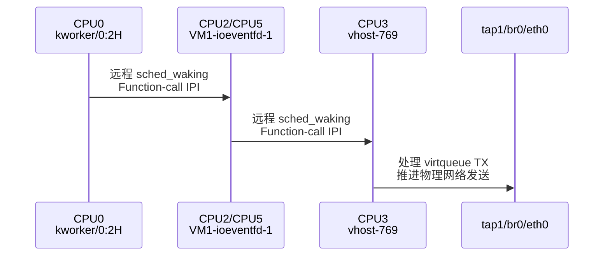
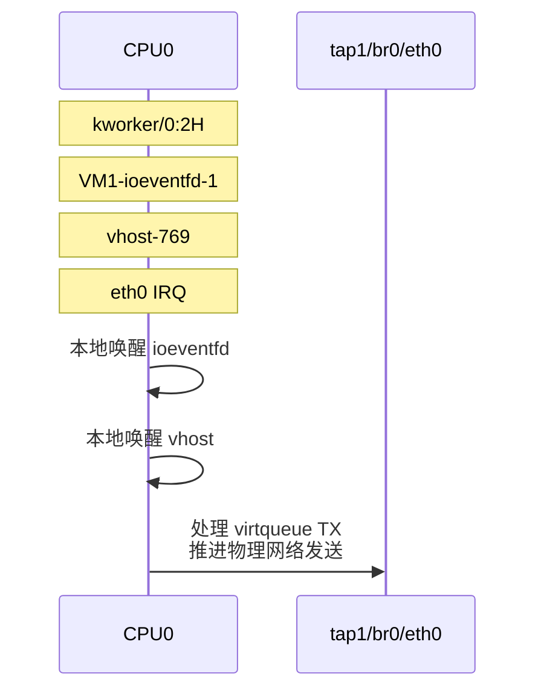

# 18 IPI 触发机制与 vhost 通知链跨核唤醒调查

> 本章节用于补充前述 Android Guest 外发网络上行吞吐异常调查。前述调查已经完成故障路径边界定位和网络后端亲和性验证；本章节进一步回答：跨核配置为何会显著降低吞吐、Linux 可见的 Function-call IPI 由谁触发，以及 vhost 模式下仍存在的剩余性能损失来自何处。

---

## 18.1 调查背景

前期路径 A/B 测试已经确认：

- Android → ServerVM 本地路径可达到 1.26～3.51 Gbit/s；
- 相同 Android CPU、相同测试参数继续转发到外部 PC 时，吞吐可能下降至 457～553 Mbit/s；
- Android → PC 低吞吐窗口中，`tap1 RX` 与 `eth0 TX` 基本同步，且接口 drop/error 未明显增长；
- 因此问题不是 virtio-net 或 TAP 存在固定 500 Mbit/s 上限，也不是 bridge 中途大量丢包，而是 Guest 外发流量继续进入物理 `eth0` 后出现处理能力下降和反压。

后续亲和性实验又确认：

- vhost 或 DSM TX 后端与 eth0 完成处理上下文跨核时，吞吐明显下降；
- vhost 或 DSM TX 后端与 eth0 完成处理上下文同核时，吞吐显著恢复；
- 无 vhost 模式下，将 DSM TX 线程与 eth0 IRQ 放到同一 CPU，可达到约 950 Mbit/s；
- 因此，CPU 亲和性失配不是一般相关因素，而是导致吞吐大幅变化的直接工程原因。

但仅凭“同核快、跨核慢”，仍不能解释具体内部机制。本阶段重点调查以下问题：

1. 跨核场景是否确实触发更多 IPI；
2. 高频 IPI 属于哪一种类型；
3. 哪些任务之间发生远程唤醒；
4. vhost 模式为什么仅绑定 vhost worker 和 eth0 IRQ 后仍可能未达到线速；
5. 将完整通知链同核后，IPI 和吞吐是否同步恢复。

---

## 18.2 调查对象与术语

### 18.2.1 vhost 模式的主要执行上下文

本次测试识别到以下任务：

| 对象 | 示例名称/TID | 作用 |
|---|---|---|
| 上游高优先级 workqueue | `kworker/0:2H` / TID 1542 | 唤醒 VM ioeventfd 处理线程 |
| VM ioeventfd 线程 | `VM1-ioeventfd-1` / TID 227 | 处理 VM1 的 ioeventfd 通知，并进一步唤醒 vhost |
| vhost worker | `vhost-769` / TID 1094 | 处理 virtqueue TX descriptor，并向 TAP 后端推进数据 |
| 物理网卡中断 | eth0 IRQ 131 | 处理 eth0 设备中断及后续网络完成路径 |

从线程名称和 DSM 中 `VIRTIO_NET_TXQ=1` 的定义看，`VM1-ioeventfd-1` 高度可能对应 VM1 的 queue/eventfd 1，即 virtio-net TX queue 通知线程。该映射仍应通过线程创建源码最终确认，但不影响本次基于实际任务唤醒关系得出的系统级结论。

### 18.2.2 IPI 统计含义

ARM64 ServerVM Linux 的 `/proc/interrupts` 中：

```text
IPI1: Function call interrupts
```

表示目标 CPU 收到并处理了 Linux SMP call-function 队列中的工作。该队列不仅可以承载普通 `smp_call_function*()` callback，也可能承载远程任务唤醒相关工作。

需要注意：

- `/proc/interrupts` 每个 CPU 列表示 **IPI 的接收/处理 CPU**；
- 它不直接记录 IPI 的发送 CPU；
- 一次 IPI 可以批量处理多个已入队 callback；
- 一次 `sched_waking` 也不一定必然新发送一次 IPI。

因此，本次调查同时使用 IPI 增量和 `sched:sched_waking` trace，分别观察目标 CPU 的 IPI 计数以及源任务到目标任务的实际唤醒关系。

---

## 18.3 使用的测试工具

### 18.3.1 `ipi_count_compare.sh`

该脚本用于比较两组测试窗口中 Linux 可见 IPI 的数量。

工作原理：

1. 在网络流量稳定后读取测试前 `/proc/interrupts`；
2. 读取 `eth0 tx_packets` 和 `tap1 rx_packets`；
3. 经过固定采集时间后再次读取上述数据；
4. 计算每种 IPI 在每个 CPU 上的增量；
5. 输出：
   - IPI 总增量；
   - IPI/s；
   - 每 10000 个 `eth0 TX packet` 对应的 IPI；
   - 每 10000 个 `tap1 RX packet` 对应的 IPI。

按报文归一化非常必要。高性能组通常处理更多报文，如果只比较 IPI 绝对数，可能误把“报文更多”当成“每包 IPI 更多”。

### 18.3.2 `capture_sched_waking.sh`

该脚本用于定位 Function-call IPI 对应的远程任务唤醒对象。

工作原理：

1. 等待 `eth0 TX` 达到设定 PPS；
2. 预热数秒，使 iperf3 进入稳定阶段；
3. 开启 `sched:sched_waking` tracepoint；
4. 从 trace 行前缀提取：
   - 发起唤醒的源 CPU；
   - 发起唤醒的源任务；
5. 从事件 payload 提取：
   - 被唤醒任务名称/TID；
   - `target_cpu`；
6. 判断 `source_cpu != target_cpu` 的事件为远程唤醒；
7. 在同一 1 秒窗口前后读取 `/proc/interrupts`；
8. 对比各 CPU 的远程唤醒数量与 Function-call IPI 增量。

脚本输出的核心文件包括：

```text
woken_task_summary.csv
remote_source_target_task_summary.csv
remote_source_target_cpu_summary.csv
function_call_ipi_delta.csv
result.txt
```

---

## 18.4 排除 RPS/RFS 作为高频 IPI 来源

对 ServerVM 三个相关接口检查：

```text
tap1/rx-0/rps_cpus = 00
br0/rx-0/rps_cpus  = 00
eth0/rx-0/rps_cpus = 00
```

`00` 表示这些 RX queue 未配置 RPS 目标 CPU。因此，当前测试中不能用“RPS 将 tap1 收到的报文转发到远端 CPU backlog”解释数万次每秒的 Function-call IPI。

由此可以排除：

```text
tap1 RPS
br0 RPS
eth0 RPS
基于上述 RPS 配置触发的远端 backlog 调度
```

后续调查重点转向远程任务唤醒和其他 SMP call-function callback。

---

## 18.5 IPI 数量对比

### 18.5.1 UDP：部分同核与跨核对比

早期“同核”场景仅将 vhost worker 和 eth0 IRQ 放在同一 CPU，尚未绑定 `VM1-ioeventfd-1`。

测试结果：

| 配置 | eth0 TX PPS | 按 1400 B payload 粗略折算 | Function-call IPI/packet |
|---|---:|---:|---:|
| vhost 与 eth0 IRQ 同核，ioeventfd 未绑定 | 约 81,169 | 约 909 Mbit/s | 约 0.999 |
| vhost 与 eth0 IRQ 跨核，ioeventfd 未绑定 | 约 47,991 | 约 537 Mbit/s | 约 1.916 |

跨核组每包 Function-call IPI 是部分同核组的约：

```text
1.916 / 0.999 ≈ 1.92 倍
```

这说明，仅将 vhost 和 eth0 IRQ 分开，就会新增接近一次/packet 的 Function-call IPI。

但部分同核组仍然存在约一次 IPI/packet，说明 vhost 之前还有一个未被纳入 affinity 管理的跨核通知环节。

### 18.5.2 跨核 UDP 与跨核 TCP 对比

相同跨核拓扑下：

| 协议 | Function-call IPI/packet |
|---|---:|
| UDP，1400 B datagram | 约 1.916 |
| TCP，`-l 1400` 小块写入 | 约 0.508 |

UDP 每个物理发送包对应的 Function-call IPI 密度约为 TCP 的：

```text
1.916 / 0.508 ≈ 3.77 倍
```

TCP 实际处理的 `eth0 tx_packets` 更多，但 IPI 更少，说明差异不是由 UDP 报文总量更大造成，而是 UDP 通知、descriptor 或完成处理的批量化程度更低，更容易按报文或极小批次触发跨 CPU 唤醒。

---

## 18.6 默认未绑定场景的完整 `sched_waking` 调查

### 18.6.1 测试配置

默认未绑定时：

```text
VM1-ioeventfd-1 affinity：0-5
vhost-769 affinity：      0-5
eth0 IRQ 131：            CPU0
```

1 秒稳定窗口内：

```text
eth0 TX packets：          41400
tap1 RX packets：          41410
远程 sched_waking：        78446
Function-call IPI：        79640
```

按每个 `eth0 TX packet` 归一化：

```text
远程唤醒/packet：
78446 / 41400 ≈ 1.895

Function-call IPI/packet：
79640 / 41400 ≈ 1.924
```

远程任务唤醒可以解释：

```text
78446 / 79640 ≈ 98.50%
```

的 Function-call IPI。

因此，未绑定场景中的高频 Function-call IPI 已基本确定主要来自远程任务唤醒，而不是未知的 TLB、RPS 或其他 callback。

### 18.6.2 主执行链

本次 trace 捕获到两条主要路径。

主路径：

```text
CPU0：kworker/0:2H
    │
    │ 远程唤醒 37077 次
    ▼
CPU2：VM1-ioeventfd-1
    │
    │ 远程唤醒 36981 次
    ▼
CPU3：vhost-769
```

较小的并行路径：

```text
CPU0：kworker/0:2H
    │
    │ 远程唤醒 1836 次
    ▼
CPU5：VM1-ioeventfd-1
    │
    │ 远程唤醒 1778 次
    ▼
CPU3：vhost-769
```

合并后：

```text
kworker/0:2H → VM1-ioeventfd-1：
37077 + 1836 = 38913 次

VM1-ioeventfd-1 → vhost-769：
36981 + 1778 = 38759 次
```

网络主链共发生：

```text
38913 + 38759 = 77672 次远程唤醒
```

占全部远程唤醒：

```text
77672 / 78446 ≈ 99.01%
```

占全部 Function-call IPI：

```text
77672 / 79640 ≈ 97.53%
```

因此可以确认，未绑定 UDP 场景中的 Function-call IPI 几乎全部由以下通知链产生：

```text
kworker/0:2H
    → VM1-ioeventfd-1
    → vhost-769
```

### 18.6.3 每包两级远程唤醒

按 41400 个 `eth0 TX packet` 计算：

```text
第一段远程唤醒：
38913 / 41400 ≈ 0.940 次/packet

第二段远程唤醒：
38759 / 41400 ≈ 0.936 次/packet

两段合计：
77672 / 41400 ≈ 1.876 次/packet
```

该结果与 Function-call IPI：

```text
79640 / 41400 ≈ 1.924 次/packet
```

高度吻合。

因此，默认未绑定状态下，1400 字节 UDP 路径几乎表现为：

```text
每个报文或极小批次：
一次 kworker → ioeventfd 跨核唤醒
+
一次 ioeventfd → vhost 跨核唤醒
```

---

## 18.7 通知链全同核干预实验

### 18.7.1 干预配置

将以下对象统一放到 CPU0：

```text
kworker/0:2H      → 本次执行本身位于 CPU0
VM1-ioeventfd-1  → CPU0
vhost-769        → CPU0
eth0 IRQ 131     → CPU0
```

其中：

```text
VM1-ioeventfd-1 TID = 227
vhost-769 TID       = 1094
```

绑定后确认：

```text
/proc/227/status： Cpus_allowed_list = 0
/proc/1094/status：Cpus_allowed_list = 0
eth0 IRQ requested/effective affinity = 0
```

### 18.7.2 绑核后的采集结果

1 秒稳定窗口内：

```text
eth0 TX packets：          85825
tap1 RX packets：          85839
远程 sched_waking：        467
Function-call IPI：        521
```

归一化后：

```text
远程唤醒/packet：
467 / 85825 ≈ 0.00544

Function-call IPI/packet：
521 / 85825 ≈ 0.00607
```

主要网络任务的唤醒仍然存在：

```text
kworker/0:2H：      46940 次，全部本地
VM1-ioeventfd-1：  46891 次，全部本地
vhost-769：         46192 次，全部本地
```

这说明绑定没有绕过或删除通知链：

```text
kworker
→ ioeventfd
→ vhost
```

仍正常执行。

发生变化的只是：

```text
未绑定：
CPU0 → CPU2/5 → CPU3

全链同核：
CPU0 → CPU0 → CPU0
```

即逻辑工作保持不变，但两级远程任务唤醒被转换为本地唤醒。

---

## 18.8 绑定前后的定量对比

| 指标 | 默认未绑定 | 全链同核 CPU0 | 变化 |
|---|---:|---:|---:|
| eth0 TX packets/s | 41,400 | 85,825 | 提高约 107.3% |
| 按 1400 B payload 粗略折算 | 约 464 Mbit/s | 约 961 Mbit/s | 恢复至线速水平 |
| 远程 sched_waking | 78,446 | 467 | 下降约 99.40% |
| Function-call IPI | 79,640 | 521 | 下降约 99.35% |
| 远程唤醒/packet | 1.895 | 0.00544 | 下降约 99.71% |
| Function-call IPI/packet | 1.924 | 0.00607 | 下降约 99.68% |
| 远程唤醒/10000 packet | 18,948.31 | 54.41 | 下降约 348 倍 |
| Function-call IPI/10000 packet | 19,236.71 | 60.70 | 下降约 317 倍 |

该结果同时满足三个条件：

1. 人为消除了通知链的跨 CPU 布局；
2. 远程唤醒和 Function-call IPI 几乎同步消失；
3. 网络 PPS 同步提高约 2.07 倍并恢复到线速水平。

这构成了强因果证据。

---

## 18.9 执行链示意

### 18.9.1 默认未绑定



### 18.9.2 全链同核



---

## 18.10 根因结论

基于路径隔离、IPI 计数、`sched_waking` 任务关系以及全链同核干预实验，当前可以形成以下系统级根因结论：

> vhost 模式下，Android virtio-net TX 通知在 ServerVM 中经过 `kworker/0:2H → VM1-ioeventfd-1 → vhost-*` 的三级执行链。默认调度状态下，`VM1-ioeventfd-1` 与 `vhost-*` 分布在不同 CPU，导致每个 UDP 报文或极小批次发生两次远程任务唤醒，并产生接近两次 Linux Function-call IPI。高频跨 CPU 通知使 virtqueue TX 处理和后续物理网络发送无法以线速推进，最终通过 virtqueue 和网络队列反压限制 Android sender。

> 将 `VM1-ioeventfd-1`、`vhost-*` 和 eth0 IRQ 与上游 `kworker/0:2H` 收敛到 CPU0 后，通知逻辑保持不变，但两级远程唤醒被转换为本地唤醒，Function-call IPI/packet 下降约 99.68%，eth0 TX PPS 提高约 2.07 倍并恢复至线速水平。因此，vhost 通知链跨核远程唤醒是当前大幅吞吐损失的主导系统级原因。

---

## 18.11 对此前 vhost 性能结论的修正

此前只绑定：

```text
vhost worker
+
eth0 IRQ
```

vhost 模式通常恢复至约 830～927 Mbit/s，但仍低于无 vhost 模式约 950～954 Mbit/s。

当时尚未识别 `VM1-ioeventfd-1`。现在可以解释：

```text
仅绑定 vhost + IRQ：
仍可能存在 ioeventfd → vhost 的跨核远程唤醒
```

因此，之前观察到的 vhost 与无 vhost 差距，至少有相当一部分并不是 vhost 内核数据处理本身固有较慢，而是 vhost 前级通知线程没有与 vhost worker 协同绑定。

全链同核后，1 秒窗口中的 eth0 TX PPS 已达到约 961 Mbit/s payload 等效水平。后续仍需通过 60 秒、600 秒完整测试量化 vhost 自身是否还存在少量固有开销。

---

## 18.12 为什么 CPU0 是当前最自然的收敛 CPU

CPU0 并不一定是硬件性能更强的 CPU。此前将 vhost 和 eth0 IRQ 同时绑定到 CPU5，也能明显改善吞吐。

但当前通知链的最上游任务是：

```text
kworker/0:2H
```

它在本次系统中运行于 CPU0。因此，将 `VM1-ioeventfd-1`、vhost 和 eth0 IRQ 收敛到 CPU0，可以同时消除：

```text
CPU0 kworker → ioeventfd
ioeventfd → vhost
```

两段远程唤醒。

如果产品希望使用其他网络 CPU，则还需要进一步修改上游 workqueue 的排队 CPU，而不能只移动 ioeventfd 和 vhost。

---

## 18.13 已坐实与未完成事项

### 18.13.1 已坐实

1. RPS 配置不是本次高频 IPI 的来源；
2. 默认未绑定 UDP 路径约产生 1.92 次 Function-call IPI/packet；
3. 其中约 97.5% 可以直接归属于 `kworker → ioeventfd → vhost` 两级远程唤醒链；
4. 全链同核后，主要任务仍按相同顺序执行，但全部变为本地唤醒；
5. 全链同核使 Function-call IPI/packet 下降约 99.68%；
6. 同时 eth0 TX PPS 提高约 2.07 倍并恢复至线速；
7. 因此，跨核远程通知链是大幅吞吐损失的主导系统级原因。

### 18.13.2 尚未完成

1. `kworker/0:2H` 执行的具体 work function 尚未定位；
2. `VM1-ioeventfd-1` 与 virtio-net TX queue 1 的创建代码映射尚未最终确认；
3. IPI handler 执行时间占总性能损失的比例尚未测量；
4. 尚未通过 600 秒长测确认全链同核后的长期稳定性；
5. TCP 标准吞吐和 TCP `-l 1400` 小块压力需要按相同全链同核配置重新验证；
6. vhost 本身在排除远程唤醒后是否还有少量固有开销，仍需进一步量化。

这些未完成项影响代码级最终描述的精度，但不影响当前亲和性修复方案的有效性。

---

## 18.14 建议解决方案

### 18.14.1 vhost 模式的最小工程修复

必须同时管理：

```text
VM1-ioeventfd-1
vhost-*
eth0 IRQ
```

在当前架构下建议统一绑定 CPU0：

```text
kworker/0:2H      → CPU0
VM1-ioeventfd-1  → CPU0
vhost-*          → CPU0
eth0 IRQ          → CPU0
```

不能再只绑定 vhost 和 eth0 IRQ。

### 18.14.2 无 vhost 模式

无 vhost 时主要 TX 后端为：

```text
vtnet-*:*\ tx
```

建议绑定：

```text
DSM TX线程 → CPU0
eth0 IRQ   → CPU0
```

同时确认无 vhost 模式是否仍经过 `VM1-ioeventfd-1`；如果通知直接唤醒 DSM TX 线程，则其远程唤醒层级通常比 vhost 模式少一级。

### 18.14.3 动态识别对象

以下标识均可能变化：

```text
VM1-ioeventfd-1 TID
vhost TID
eth0 IRQ号
```

因此应在以下生命周期后重新识别并应用 affinity：

```text
ServerVM启动
DSM启动或重启
vhost worker创建
Android Guest重启
STR恢复
eth0驱动重新初始化
```

eth0 IRQ 必须动态匹配网卡设备，不能写死为 131 或 134。

### 18.14.4 代码级长期改进

建议增加统一的网络后端 CPU 配置：

```text
net_backend_cpu=<cpu>
```

并用于：

1. 创建 `VM1-ioeventfd-1` 时直接设置 affinity；
2. vhost worker 创建后加入同一 cpuset；
3. eth0 IRQ affinity 配置；
4. STR/DSM 重启后重新应用；
5. 可选地合并 virtqueue kick，减少唤醒频率；
6. 定位 `kworker/0:2H` 的 work function，并评估是否可将该 work 投递到指定网络 CPU。

---

## 18.15 后续验证计划

### 18.15.1 长时间吞吐验证

全链同核后执行：

```text
UDP 60秒 × 3轮
UDP 600秒耐久
TCP标准吞吐
TCP -l 1400小块压力
```

测试工具统一使用 iperf3 3.17.1+。

### 18.15.2 稳定性观测

长测期间持续确认：

```text
VM1-ioeventfd-1 affinity
vhost affinity
eth0 IRQ requested/effective affinity
Function-call IPI/packet
remote sched_waking/packet
eth0 drop/error
```

预期不再出现与网络 PPS 同量级的远程唤醒和 Function-call IPI。

### 18.15.3 定位上游 work function

检查：

```text
workqueue_execute_start
workqueue_execute_end
```

tracepoint，识别 `kworker/0:2H` 在网络发送期间执行的具体 work function，从而把系统级根因进一步落实到源码函数。

---

## 18.16 阶段性结论

后续 IPI 调查已经建立完整证据链：

```text
默认未绑定
    ↓
kworker、ioeventfd、vhost 分布在不同CPU
    ↓
每包约两次远程任务唤醒
    ↓
每包约1.92次Function-call IPI
    ↓
eth0 TX约41400 pps，约464 Mbit/s payload等效

全链同核
    ↓
通知链逻辑保持不变，但全部为本地唤醒
    ↓
每包约0.006次Function-call IPI
    ↓
eth0 TX约85825 pps，约961 Mbit/s payload等效
```

因此可以确认：

> vhost 模式下 `kworker/0:2H → VM1-ioeventfd-1 → vhost-*` 通知链的跨 CPU 远程唤醒，是 Android Guest 小报文上行大幅降速的主导系统级原因。将整条通知链与 eth0 完成处理上下文收敛到同一 CPU，可消除绝大多数远程唤醒和 Function-call IPI，并使吞吐恢复至线速水平。
