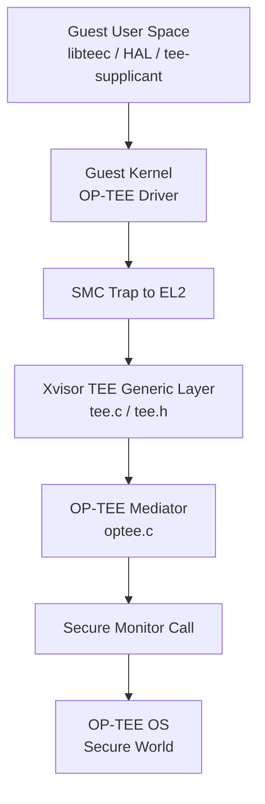
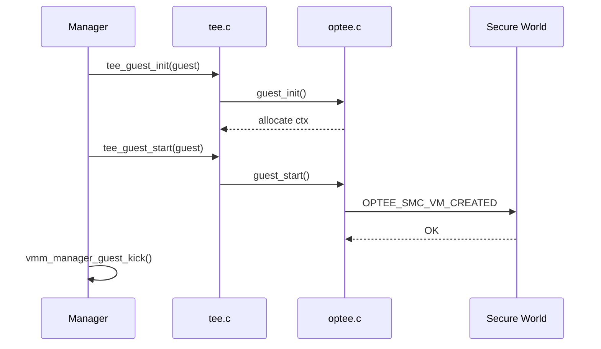
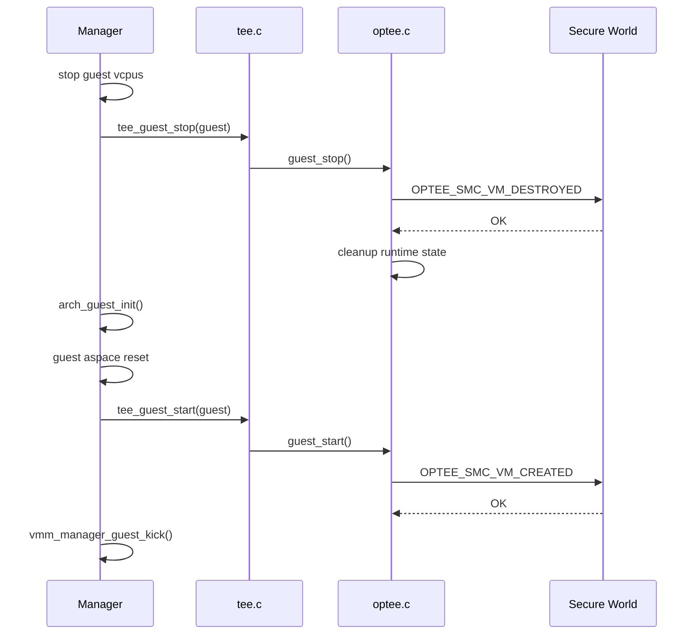
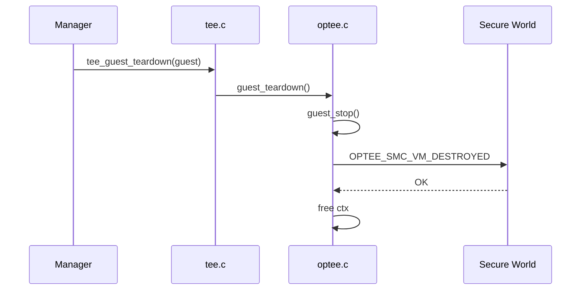
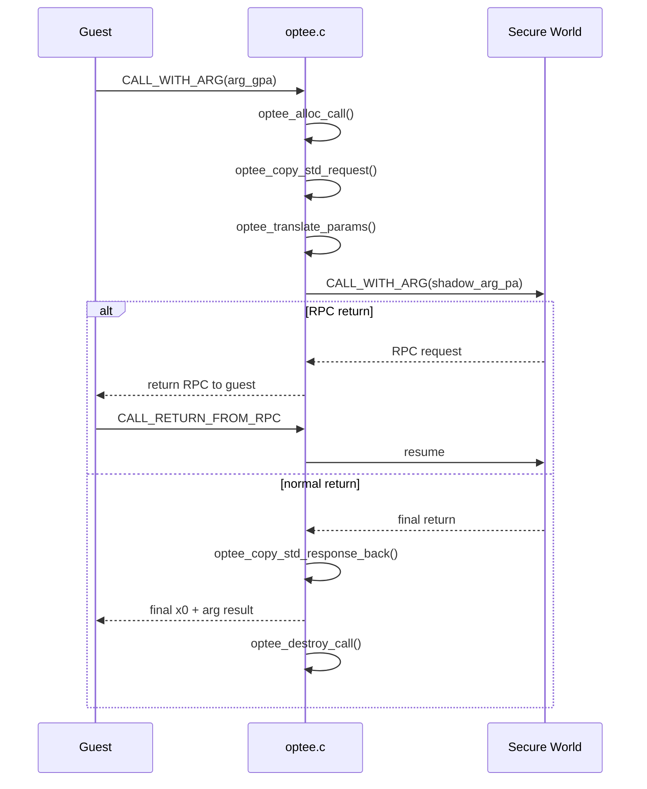

# Xvisor OP-TEE Mediator 设计说明书

## 1. 文档信息

- **文档名称**：Xvisor OP-TEE Mediator 设计说明书
- **适用版本**：当前动态共享内存（Dynamic SHM）/ 多虚拟机实现方案
- **适用平台**：ARM64 / Xvisor / OP-TEE OS 开启 Virtualization 能力
- **文档目的**：说明 Xvisor 中 OP-TEE Mediator 的设计目标、实现逻辑、关键数据结构、调用流程、生命周期管理、并发控制与边界条件，便于后续维护、评审和代码交接。

---

## 2. 背景与目标

### 2.1 背景

Xvisor 需要为 Guest 虚拟机提供 OP-TEE 能力，使 Guest 内核和用户态能够通过标准 OP-TEE 驱动与 Trusted OS 交互。

在单虚拟机、静态保留内存（static reserved SHM）场景下，透传实现相对简单；但在多虚拟机场景下，静态共享内存会带来以下问题：

1. 共享内存区域是全局的，不适合多个 Guest 同时使用。
2. Guest 间容易出现地址冲突、越界访问或状态污染。
3. 重启路径不是 `destroy + create`，仅依赖 Guest create/destroy 进行 VM 生命周期通知无法覆盖 reboot 场景。

因此，当前实现采用以下总体策略：

- **只向 Guest 暴露 Dynamic SHM**。
- **拒绝 Static Reserved SHM**。
- **支持 OP-TEE Virtualization**。
- **将 Guest 对象生命周期与 Guest 一次 boot 周期生命周期解耦**。

### 2.2 设计目标

本方案要满足以下目标：

1. 支持多个 Guest 同时接入 OP-TEE。
2. 支持 Linux / Android Guest。
3. 支持标准 OP-TEE fastcall / stdcall / RPC 流程。
4. 支持 Guest reboot，不要求 destroy + create。
5. 在动态共享内存场景下，避免并发共享内存页列表（pagelist）冲突。
6. 在当前平台“Guest 内存静态切分且运行期不变”的前提下，保证实现正确和可维护。

---

## 3. 实现边界与平台前提

当前实现依赖如下平台前提：

### 3.1 Guest 内存静态切分且运行期不变

Guest 内存通过设备树静态划分，启动后不会发生如下变化：

- balloon
- migration
- hotplug
- ownership transfer
- 动态 IPA→PA 重映射
- swap out / reclaim

这意味着：

- 一旦某个共享页被注册到 OP-TEE，其物理地址在共享期间保持稳定。
- Hypervisor 可以释放“本次调用临时构造的 shadow pagelist 元数据”，而不需要长期保留 pagelist 本身。
- 当前实现不需要实现一个复杂的长期页 pin 管理器。

> 若未来平台引入内存迁移、热插拔、气球内存、页归属切换等能力，则需要重新评估“注册 SHM 后长期稳定性”的假设，并补充长期 pin / tracking 机制。

### 3.2 仅支持 Dynamic SHM

当前 mediator 对 Guest 的能力暴露策略为：

- **支持**：Dynamic SHM
- **不支持**：Static Reserved SHM

实现上通过两处保证：

1. `EXCHANGE_CAPABILITIES` 返回值中去掉 `HAVE_RESERVED_SHM`。
2. `GET_SHM_CONFIG` 直接返回 `OPTEE_SMC_RETURN_ENOTAVAIL`。

### 3.3 仅支持 NONCONTIG TMEM

当前动态 SHM mediator 只支持 Guest 以 **NONCONTIG 页列表** 的形式描述临时共享内存。

不支持：

- Guest 直接提交 contiguous TMEM buffer 给 secure world。

---

## 4. 总体架构

### 4.1 分层视图



### 4.2 模块划分

当前方案涉及以下模块：

1. **`tee.c / tee.h`**：TEE mediator 通用框架
2. **`optee.c`**：OP-TEE mediator 专用实现
3. **`manager` 路径**：reset/kick/destroy 时机与 TEE 生命周期联动

### 4.3 设计思想

当前实现将生命周期拆为两层：

#### 层 1：Guest 对象生命周期
对应 Guest 对象本身的创建和释放：

- `guest_init()`
- `guest_teardown()`

#### 层 2：Guest 一次 boot 周期生命周期
对应 secure world 中 VM 上下文的创建和销毁：

- `guest_start()` → `VM_CREATED`
- `guest_stop()` → `VM_DESTROYED`

这是因为在 Xvisor 中，Guest reboot 的典型路径是：

```text
reset -> kick
```

而不是：

```text
destroy -> create
```

因此不能仅依赖 create/destroy 去通知 OP-TEE VM 生命周期。

---

## 5. 文件与接口关系

### 5.1 `tee.h`

定义 mediator 的统一接口，当前需要支持以下回调：

- `probe()`
- `guest_init()`
- `guest_start()`
- `guest_stop()`
- `guest_teardown()`
- `handle_call()`

### 5.2 `tee.c`

提供通用封装函数：

- `tee_guest_init()`
- `tee_guest_start()`
- `tee_guest_stop()`
- `tee_guest_teardown()`
- `tee_handle_call()`

manager 层只和这些通用接口交互，而不直接依赖 `optee.c` 的私有函数。

### 5.3 `optee.c`

实现 OP-TEE mediator 的专用逻辑，包括：

- 能力探测
- VM 生命周期通知
- SMC 分发
- 标准调用上下文管理
- Dynamic SHM 翻译
- RPC 流程中转

---

## 6. 核心数据结构

### 6.1 `struct optee_host_page`

表示 hypervisor 侧分配的一页或多页 Host 内存。

字段：

- `pa`：secure world 使用的物理地址
- `va`：EL2 自己访问的虚拟地址
- `sz`：大小

用途：

- Shadow arg page
- RPC arg page
- NONCONTIG shadow pagelist pages

---

### 6.2 `struct optee_shm_buf`

表示一次 NONCONTIG 页列表翻译后的临时对象。

字段：

- `cookie`
- `page_cnt`
- `pg_list_cnt`
- `pg_list`

说明：

- 当前实现中，它是 **per-call 临时对象**。
- 它不再按 `cookie` 做全局唯一跟踪。
- 生命周期仅覆盖一次调用。

---

### 6.3 `struct optee_shm_rpc`

表示 RPC 阶段使用的一块共享缓冲追踪对象。

字段：

- `cookie`
- `guest_cmd_gpa`
- `xvisor_arg_pg`

用途：

- Guest 与 secure world 之间交换 `optee_msg_arg`

---

### 6.4 `struct optee_std_call`

表示一次标准调用上下文。

关键字段：

- `guest_arg_gpa`
- `xvisor_arg_pg`
- `arg`
- `thread_id`
- `in_flight`
- `rpc_func`
- `rpc_buffer_type`
- `tmp_shm_bufs`
- `rpc_data_sb`
- `state`

说明：

- 一次标准调用在 secure world 与 normal world 之间可能多次往返。
- `optee_std_call` 在整个调用生命周期内保留，直到 secure world 最终返回。

---

### 6.5 `struct optee_ctx`

表示一个 Guest 对应的 OP-TEE mediator 上下文。

关键字段：

- `client_id`
- `vm_live`
- `max_calls`
- `max_shm_bufs`
- `max_shm_pages`
- `call_count`
- `shm_buf_count`
- `shm_page_count`
- `calls`
- `shm_rpcs`

说明：

- `client_id`：当前 Guest 在 secure world 中的 VM/client 编号
- `vm_live`：该 Guest 的 secure world VM context 是否已经创建
- `calls`：当前活动标准调用链表
- `shm_rpcs`：当前 RPC 缓冲区链表

---

## 7. 初始化与能力探测

### 7.1 `optee_probe()`

#### 作用
探测当前平台是否具备使用 OP-TEE mediator 的基础条件。

#### 逻辑
1. 调用 `OPTEE_SMC_CALLS_UID` 验证 secure world 是否为 OP-TEE。
2. 调用 `OPTEE_SMC_GET_THREAD_COUNT` 获取 secure world 支持的标准线程数。
3. 在 host context 下调用 `OPTEE_SMC_EXCHANGE_CAPABILITIES`。
4. 检查 secure world 是否同时支持：
   - `DYNAMIC_SHM`
   - `VIRTUALIZATION`

#### 输出
设置以下全局状态：

- `optee_max_threads`
- `optee_host_sec_caps`
- `optee_dyn_shm_supported`
- `optee_virt_supported`
- `optee_host_probe_done`

---

## 8. Guest 生命周期设计

### 8.1 设计原因

Xvisor 中 Guest reboot 的路径不是：

```text
create -> destroy -> create
```

而是：

```text
reset -> kick
```

因此，`guest_init / guest_teardown` 无法覆盖 reboot 场景下 secure world VM 生命周期的管理。

### 8.2 当前拆分模型

#### `optee_guest_init()`
职责：

- 分配 `optee_ctx`
- 初始化链表、锁、计数器
- 记录 `client_id`
- 设置 `vm_live = false`

不做：

- `VM_CREATED`

#### `optee_guest_start()`
职责：

- 若 `vm_live == false`，向 secure world 发送 `OPTEE_SMC_VM_CREATED`
- 成功后设置 `vm_live = true`

说明：

- 应在 Guest 真正运行前调用
- 保证 Guest 发出任何标准 SMC 前，secure world 已创建 VM 上下文

#### `optee_guest_stop()`
职责：

- 若 `vm_live == true`，向 secure world 发送 `OPTEE_SMC_VM_DESTROYED`
- 清理所有运行时对象（calls / shm_rpcs）
- 设置 `vm_live = false`

说明：

- 应在 reset 后、VCPU 已经停止后调用

#### `optee_guest_teardown()`
职责：

- 调用 `optee_guest_stop()`
- 释放 `ctx`

---

### 8.3 与 manager 路径的对应关系

#### 首次启动


#### 重启


#### 最终销毁


---

## 9. SMC 分发逻辑

### 9.1 `optee_handle_call()`

这是 OP-TEE mediator 的主入口，负责根据 `fid` 分发不同 SMC。

### 9.2 当前显式支持的 SMC

1. `OPTEE_SMC_CALLS_COUNT`
2. `OPTEE_SMC_CALLS_UID`
3. `OPTEE_SMC_CALLS_REVISION`
4. `OPTEE_SMC_CALL_GET_OS_UUID`
5. `OPTEE_SMC_CALL_GET_OS_REVISION`
6. `OPTEE_SMC_ENABLE_SHM_CACHE`
7. `OPTEE_SMC_DISABLE_SHM_CACHE`
8. `OPTEE_SMC_EXCHANGE_CAPABILITIES`
9. `OPTEE_SMC_GET_SHM_CONFIG`
10. `OPTEE_SMC_CALL_WITH_ARG`
11. `OPTEE_SMC_CALL_RETURN_FROM_RPC`

因此：

```c
OPTEE_MEDIATOR_SMC_COUNT = 11
```

---

## 10. Fastcall 透传

### 10.1 `optee_forward_x0_to_x3()`

职责：

- 对 fastcall 类 SMC 直接透传给 secure world
- 使用当前 `client_id` 作为 virtualization 上下文
- 将返回值写回 Guest x0~x3

适用场景：

- 不涉及复杂状态机
- 不涉及 SHM 参数重写

---

## 11. 能力协商

### 11.1 `optee_handle_exchange_caps()`

#### 作用

与 secure world 交换能力，并向 Guest 返回“经过裁剪后的能力集合”。

#### 逻辑

1. 读取 Guest 提供的 NS capabilities
2. 仅保留已知 NS cap 位
3. 转发给 secure world
4. 对 secure world 返回的 secure caps 做裁剪
5. 强制清掉：
   - `OPTEE_SMC_SEC_CAP_HAVE_RESERVED_SHM`
6. 要求必须有：
   - `OPTEE_SMC_SEC_CAP_DYNAMIC_SHM`

#### 结果
Guest 看到的是：

- 支持 dynamic SHM
- 不支持 static reserved SHM

---

## 12. GET_SHM_CONFIG 处理

### 12.1 `optee_handle_get_shm_config()`

当前实现直接返回：

```c
OPTEE_SMC_RETURN_ENOTAVAIL
```

设计意图：

- 明确禁止 Guest 走 static SHM
- 避免多个 Guest 共享一段全局保留内存

---

## 13. 标准调用流程

### 13.1 `optee_handle_std_call()`

这是 `CALL_WITH_ARG` 的入口。

整体流程如下：



### 13.2 关键步骤说明

#### 第 1 步：解析 `arg_gpa`
Guest 通过 `a1/a2` 传入 `optee_msg_arg` GPA。

使用：

- `optee_regpair_to_u64()`

#### 第 2 步：分配 `call`
调用 `optee_alloc_call()`。

可能的结果：

- 成功：创建 `optee_std_call`
- 达到线程上限：返回 `VMM_ENOSPC`
  - 向 Guest 返回 `OPTEE_SMC_RETURN_ETHREAD_LIMIT`
- 其他分配失败：
  - 向 Guest 返回 `OPTEE_SMC_RETURN_ENOMEM`

说明：

- 当前 `max_calls` 与 `GET_THREAD_COUNT` 对齐
- 行为与 Xen 风格一致：
  - 线程位不足 → `ETHREAD_LIMIT`
  - 真正内存分配失败 → `ENOMEM`

#### 第 3 步：复制请求
由 `optee_copy_std_request()` 完成。

#### 第 4 步：翻译参数
由 `optee_translate_params()` 完成。

若翻译失败：

- 设置：
  - `ret = TEEC_ERROR_COMMUNICATION`
  - `ret_origin = TEEC_ORIGIN_COMMS`
- 把结果写回 Guest
- 向 Guest 返回：
  - `OPTEE_SMC_RETURN_OK`

也就是说：

- SMC 协议层完成
- 但 TEE command 本身失败

#### 第 5 步：把 shadow arg page PA 写成寄存器对
由 `optee_u64_to_regpair()` 完成。

#### 第 6 步：进入 `optee_do_call_with_arg()`
真正向 secure world 发标准调用。

---

## 14. Dynamic SHM 翻译策略

### 14.1 只允许 RAM

以下路径统一要求 Guest 传入的地址属于 RAM：

- `optee_dbg_require_ram_region()`
- `optee_guest_pa_to_host_pa()`
- `optee_guest_read()`
- `optee_guest_write()`

拒绝条件：

- `!VMM_REGION_ISRAM`
- `VMM_REGION_ISDEVICE`
- `VMM_REGION_ISROM`

这样可以避免把设备寄存器、ROM 区域伪装成 shared memory。

---

### 14.2 `optee_translate_params()`

仅处理 TMEM 参数。

规则：

- 如果是 `TMEM_INPUT / OUTPUT / INOUT`
  - 若带 `NONCONTIG`
    - 调 `optee_translate_noncontig()`
  - 否则
    - 直接拒绝

因此，当前方案只支持：

- Dynamic SHM
- NONCONTIG 页列表形式

---

### 14.3 `optee_translate_noncontig()`

这是动态共享内存实现的核心。

#### 输入

- Guest 页列表地址
- `size`
- `shm_ref(cookie)`

#### 处理逻辑

1. 计算：
   - `offset`
   - `list_gpa`
   - `page_cnt`
   - `list_pages_needed`
2. 分配 `optee_shm_buf`
3. 为 shadow pagelist 分配 host pages
4. 读取 Guest 原始页列表
5. 对每个 Guest page 执行：
   - `gpa -> hpa`
   - 将 `hpa` 写入 shadow pagelist
6. 将 `p->u.tmem.buf_ptr` 改写为：
   - `shadow_pagelist_pa | offset`
7. 将该 `optee_shm_buf` 挂到：
   - `call->tmp_shm_bufs`

#### 设计关键点

当前实现中，临时 pagelist 是 **per-call** 资源，而不是全局按 cookie 唯一跟踪。

这解决了并发场景中的 duplicate cookie 问题：

- 不同线程可以同时使用相同 `shm_ref`
- 每次调用只保留自己的 pagelist
- 调用结束后统一释放

---

## 15. RPC 路径

### 15.1 基本原理

一次标准调用并不一定一次 SMC 完成，它可能被 secure world 中断为 RPC。

因此标准调用是一个“**可挂起 / 可恢复的状态机**”。

### 15.2 `optee_do_call_with_arg()`

职责：

1. 发起标准调用
2. 如果 secure world 返回 RPC：
   - 调 `optee_handle_rpc_return()`
   - 返回 Guest 处理 RPC
3. 如果是普通返回：
   - 复制结果回 Guest
   - 销毁 `call`

---

### 15.3 `optee_handle_rpc_return()`

secure world 返回 RPC 请求时执行。

#### 主要逻辑

1. 保存：
   - `thread_id`
   - `rpc_func`
2. 把 x0~x3 写回 Guest
3. 若 `rpc_func == RPC_FREE`
   - 根据 cookie 删除 `shm_rpc`
4. 若 `rpc_func == RPC_CMD`
   - 根据 cookie 找 `optee_shm_rpc`
   - 把 host RPC arg page 的内容复制给 Guest
   - 保存 `rpc_buffer_type`

---

### 15.4 `optee_handle_rpc()`

Guest 发 `CALL_RETURN_FROM_RPC` 时执行。

#### 步骤 1：按 `thread_id` 找回原始 `call`

- 找不到 → 返回 `OPTEE_SMC_RETURN_ERESUME`

#### 步骤 2：分 `rpc_func` 处理

##### `RPC_ALLOC`
1. 解析：
   - `ptr`
   - `cookie`
2. 检查：
   - 来自 RAM
   - 页对齐
3. 分配 `optee_shm_rpc`
4. 将 `sr->xvisor_arg_pg.pa` 写成 reg pair
5. resume secure world

##### `RPC_CMD`
1. 用 cookie 找到 `sr`
2. 把 Guest 的 command buffer 复制回 host RPC arg page
3. 如果当前处于 `OPTEE_CALL_STATE_XVISOR_RPC`
   - 说明上一轮是 hypervisor 内部注入的 free 命令
   - 清掉状态即可
4. 否则，如果返回参数中出现 NONCONTIG `TMEM_OUTPUT / INOUT`
   - 再执行一次 `optee_translate_noncontig()`
   - 结果放到 `call->rpc_data_sb`
5. 再次 resume secure world

---

## 16. 资源管理策略

### 16.1 `max_calls`

当前：

```c
ctx->max_calls = optee_max_threads ? optee_max_threads : 1U;
```

表示：

- Hypervisor 当前允许保留的标准调用上下文数量
- 与 secure world 的 thread count 对齐

当达到上限时：

- `optee_alloc_call()` 返回 `VMM_ENOSPC`
- `optee_handle_std_call()` 向 Guest 写回：
  - `OPTEE_SMC_RETURN_ETHREAD_LIMIT`

符合 Xen 风格。

---

### 16.2 `max_shm_bufs / max_shm_pages`

限制 Hypervisor 为 SHM 翻译消耗的资源上限：

- `max_shm_bufs`：临时 SHM 对象数量限制
- `max_shm_pages`：临时 SHM 总页数限制

当前主要保护对象：

- per-call temporary NONCONTIG shadow pagelist

---

### 16.3 临时 pagelist 的释放时机

临时 pagelist 只属于单次调用。

释放路径：

- `optee_destroy_call()`
  - `optee_free_call_tmp_shm()`

在当前平台“Guest 内存静态不变”的假设下，这样是安全的：

- secure world 注册共享内存时依赖的是稳定的物理页集合
- 不需要长期保留这份 pagelist 元数据

---

## 17. 并发与锁模型

### 17.1 `optee_smc_lock`

全局锁，用于串行化真正进入 secure world 的 SMC。

目的：

- 降低平台/firmware 对并发 SMC 的不确定性
- 简化 mediator 状态管理

### 17.2 `ctx->lock`

Guest 私有锁，保护：

- `calls`
- `shm_rpcs`
- `call_count`
- `shm_buf_count`
- `shm_page_count`

### 17.3 并发问题的修复历史

当前设计解决过两类典型问题：

#### 问题 1：线程位不足被错误映射成 `ENOMEM`

修复后：

- 线程位不足 → `ETHREAD_LIMIT`
- 真正分配失败 → `ENOMEM`

#### 问题 2：动态 SHM 在并发下因为 duplicate cookie 误判冲突

修复后：

- 临时 pagelist 改成 per-call
- 不再全局按 cookie 唯一跟踪

---

## 18. 主要函数清单与职责

### 18.1 初始化 / 生命周期

- `optee_probe()`：探测 OP-TEE 与 virtualization/dynamic SHM 能力
- `optee_guest_init()`：分配 `optee_ctx`
- `optee_guest_start()`：发送 `VM_CREATED`
- `optee_guest_stop()`：发送 `VM_DESTROYED` 并清运行态资源
- `optee_guest_teardown()`：最终释放 `ctx`

### 18.2 Host/Guest 内存辅助

- `optee_host_page_alloc()`：分配 host page
- `optee_host_page_free()`：释放 host page
- `optee_guest_pa_to_host_pa()`：Guest IPA → Host PA
- `optee_guest_read()`：从 Guest RAM 读
- `optee_guest_write()`：向 Guest RAM 写

### 18.3 标准调用上下文

- `optee_alloc_call()`：分配标准调用上下文
- `optee_put_call()`：把调用标记为等待 Guest 处理 RPC
- `optee_get_call_by_thread()`：按 thread_id 找回调用
- `optee_destroy_call()`：释放调用资源
- `optee_cleanup_runtime()`：清理运行态 calls / shm_rpcs

### 18.4 Dynamic SHM

- `optee_alloc_tmp_shm_buf()`：分配临时 pagelist 跟踪对象
- `optee_release_tmp_shm_buf_pages()`：释放 pagelist pages
- `optee_free_tmp_shm_buf()`：释放临时 SHM 对象
- `optee_free_call_tmp_shm()`：释放单个 call 的所有临时 SHM
- `optee_translate_noncontig()`：翻译 NONCONTIG 页列表
- `optee_translate_params()`：翻译 `optee_msg_arg` 参数

### 18.5 RPC

- `optee_alloc_shm_rpc()`：创建 RPC 共享缓冲跟踪对象
- `optee_free_shm_rpc()`：释放 RPC 跟踪对象
- `optee_rpc_copy_to_guest()`：把 RPC 请求复制给 Guest
- `optee_rpc_copy_from_guest()`：把 Guest 响应复制回 secure world buffer
- `optee_issue_rpc_cmd_free()`：注入 SHM_FREE 给 Guest
- `optee_handle_rpc_return()`：处理 secure world 返回的 RPC
- `optee_handle_rpc()`：处理 Guest 的 `CALL_RETURN_FROM_RPC`

### 18.6 SMC 分发

- `optee_forward_x0_to_x3()`：fastcall 透传
- `optee_handle_exchange_caps()`：能力协商
- `optee_handle_get_shm_config()`：拒绝 static SHM
- `optee_handle_std_call()`：标准调用入口
- `optee_handle_call()`：总分发入口

---

## 19. 当前实现的能力总结

### 19.1 已支持

- OP-TEE virtualization
- 多 Guest client_id 区分
- Dynamic SHM
- NONCONTIG TMEM 翻译
- RPC_ALLOC / RPC_CMD / RPC_FREE
- reboot 场景下的 `VM_DESTROYED -> VM_CREATED`
- 并发共享内存场景下 per-call pagelist
- Xen 风格 `ETHREAD_LIMIT`

### 19.2 不支持

- static reserved SHM 给 Guest
- Guest 直接传 contiguous TMEM
- Guest 运行期内存迁移 / 重映射 / 页归属变化

---

## 20. 设计要点总结

### 20.1 生命周期拆分是本方案的基础

`guest_init/teardown` 与 `guest_start/stop` 分离，是为了适配 Xvisor 的 `reset + kick` 生命周期。

### 20.2 Dynamic SHM only 是多虚拟机场景的核心策略

避免全局保留内存被多个 Guest 共享，减少隔离问题。

### 20.3 Per-call temporary pagelist 是并发修复关键

临时 NONCONTIG 页列表改为挂到 `call` 上，解决并发共享内存 duplicate cookie 冲突。

### 20.4 RAM-only policy 保证安全边界

Guest 共享给 secure world 的内存必须来自普通 RAM，不能是 DEVICE/ROM。

### 20.5 线程位不足返回 `ETHREAD_LIMIT`

与 Xen 的行为一致，避免把可等待的线程不足误报成 `ENOMEM`。

---

## 21. 后续可选优化方向

1. 若未来平台支持动态内存迁移/重映射，需要补做长期 pin / registered SHM tracking。
2. 若后续需要更细粒度的性能优化，可重新评估 `optee_smc_lock` 的粒度。
3. 若未来引入更多 mediator（如 FF-A），可将 regpair helper 上移到 ARM 通用 helper 层。
4. 若需要更严格资源控制，可在保持 `ETHREAD_LIMIT` 语义正确的前提下，重新审视 `max_calls` 与 local bookkeeping capacity 的关系。

---

## 22. 结论

当前 Xvisor OP-TEE mediator 采用“**Dynamic SHM + VM 生命周期拆分 + Per-call temporary pagelist**”的总体方案，在当前平台“Guest 内存静态切分且运行期不变”的前提下，可以正确支持：

- 多 Guest 接入 OP-TEE
- Linux / Android Guest
- reboot 场景下的 VM 生命周期通知
- Dynamic SHM 与 RPC
- 并发测试场景下的共享内存使用

该方案相对简洁，能满足当前需求，同时保留了后续继续扩展和收敛到更通用内存模型的空间。
