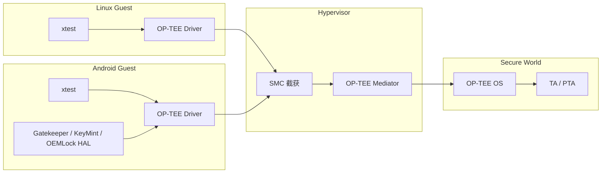

# OP-TEE 虚拟化测试报告

## 文档信息

| 项目 | 内容 |
|---|---|
| 文档名称 | OP-TEE 虚拟化测试报告 |
| 文档版本 | V1.0 |
| 编制日期 | 2026-08-28 |
| 编制人 | 待补充 |
| 测试平台 | 待补充 |
| 被测版本 | Hypervisor、OP-TEE OS、Linux Guest、Android Guest 版本待补充 |

> 说明：本报告依据当前已有测试内容编制。尚未提供的版本信息、测试命令、用例数量、执行时间、日志截图和实际结果均以“待补充”标识，测试执行完成后可直接替换。

---

## 1 测试概述

### 1.1 测试背景

本次测试面向 Hypervisor 环境下的 OP-TEE 虚拟化方案。Linux Guest 和 Android Guest 通过各自的 TEE Client 栈向 OP-TEE OS 发起安全服务请求，Hypervisor 中的 OP-TEE Mediator 负责截获 Guest SMC、处理调用上下文、完成地址和参数转换，并将请求转发至 Secure World。

测试重点是验证现有 OP-TEE 虚拟化调用链路在单 Guest、Android 安全 HAL 以及双 Guest 并发场景下的功能正确性和基本隔离能力。

### 1.2 测试目的

本次测试主要验证以下内容：

1. Linux Guest 中 OP-TEE 基础功能和标准测试用例能够正常执行；
2. Android Guest 中 OP-TEE 基础功能能够正常执行；
3. Android Gatekeeper、KeyMint 和 OEMLock HAL 能够通过虚拟化链路正常访问对应的 TEE 服务；
4. Linux Guest 与 Android Guest 同时执行 `xtest` 时，两个 Guest 均可正常完成测试；
5. 并发场景下不存在明显的调用串扰、Guest 异常、OP-TEE Panic、Hypervisor 异常或调用长期阻塞。

### 1.3 测试范围

本次测试范围如下：

| 测试对象 | 测试内容 |
|---|---|
| Linux Guest | 执行 OP-TEE `xtest` 测试集 |
| Android Guest | 执行 OP-TEE `xtest` 测试集 |
| Android Gatekeeper HAL | 执行现有 Gatekeeper HAL 测试用例 |
| Android KeyMint HAL | 执行现有 KeyMint HAL 测试用例 |
| Android OEMLock HAL | 执行现有 OEMLock HAL 测试用例 |
| 双 Guest 并发 | Linux Guest 与 Android Guest 同时执行 `xtest` |

### 1.4 本次未覆盖内容

本次报告不包含以下测试内容：

- 长时间耐久测试；
- 极限并发和资源耗尽测试；
- Guest 反复重启过程中的 OP-TEE 调用恢复测试；
- 非法 GPA、越界参数和异常共享内存等故障注入测试；
- OP-TEE 虚拟化性能开销和调用时延专项测试；
- HSM、RPMB 或其他平台安全设备的专项压力测试。

上述内容可在后续可靠性测试和专项测试阶段补充。

---

## 2 测试对象与调用链路

### 2.1 被测模块

本次测试涉及以下主要模块：

- Linux Guest TEE Client 栈；
- Android Guest TEE Client 栈；
- Android Gatekeeper、KeyMint 和 OEMLock HAL；
- Guest OP-TEE Driver；
- Guest TEE Supplicant；
- Hypervisor SMC 截获模块；
- OP-TEE Mediator；
- OP-TEE OS；
- 测试 TA、PTA 及 Android 安全服务 TA。

### 2.2 测试调用链路



---

## 3 测试环境

### 3.1 硬件环境

| 项目 | 配置信息 |
|---|---|
| 开发板/SoC | 待补充 |
| CPU | 待补充 |
| 物理内存 | 待补充 |
| 串口或调试终端 | 待补充 |
| 安全设备 | 待补充 |

### 3.2 软件环境

| 软件组件 | 版本或配置 |
|---|---|
| Hypervisor/HOS | 待补充 |
| OP-TEE Mediator | 待补充 |
| OP-TEE OS | 待补充 |
| Linux Guest Kernel | 待补充 |
| Android 版本 | 待补充 |
| Android Kernel | 待补充 |
| OP-TEE Client | 待补充 |
| OP-TEE Test | 待补充 |
| TEE Supplicant | 待补充 |
| Gatekeeper HAL | 待补充 |
| KeyMint HAL | 待补充 |
| OEMLock HAL | 待补充 |

### 3.3 Guest 配置

| Guest | vCPU 配置 | 内存配置 | OP-TEE 访问方式 |
|---|---:|---:|---|
| Linux Guest | 待补充 | 待补充 | 经 OP-TEE Mediator 访问 OP-TEE OS |
| Android Guest | 待补充 | 待补充 | 经 OP-TEE Mediator 访问 OP-TEE OS |

### 3.4 测试前置条件

测试执行前需确认：

1. Hypervisor、Linux Guest、Android Guest 和 OP-TEE OS 均正常启动；
2. Linux Guest 和 Android Guest 中 OP-TEE Driver 均探测成功；
3. 两个 Guest 中 TEE Supplicant 均已正常启动；
4. `xtest` 可执行文件及其所需 TA 已正确部署；
5. Android Gatekeeper、KeyMint 和 OEMLock HAL 服务均已启动；
6. 对应 HAL 测试用例已正确部署；
7. Hypervisor、OP-TEE OS 和两个 Guest 的日志均可独立采集；
8. 测试开始前不存在遗留的 `xtest` 或 HAL 测试进程。

---

## 4 测试方法与判定准则

### 4.1 测试方法

测试采用以下方式进行：

- Linux Guest 和 Android Guest 分别独立执行 `xtest`；
- Android Guest 分别执行 Gatekeeper、KeyMint 和 OEMLock HAL 现有测试用例；
- Linux Guest 和 Android Guest 同步启动 `xtest`，验证双 Guest 并发访问 OP-TEE；
- 收集 Guest、Hypervisor 和 OP-TEE OS 日志；
- 统计测试总数、通过数、失败数、跳过数和执行时长；
- 对失败用例记录用例编号、错误码和关键日志。

### 4.2 通用通过准则

单项测试满足以下条件时判定为通过：

1. 测试程序能够正常启动并完成执行；
2. 测试用例结果符合预期；
3. 无非预期失败用例；
4. Guest 未发生崩溃、重启、卡死或 watchdog；
5. Hypervisor 未发生异常、Panic 或死锁；
6. OP-TEE OS 未发生 Panic、异常终止或线程永久占用；
7. TEE Supplicant 未发生异常退出；
8. 测试结束后可继续正常执行新的 TEE 调用。

### 4.3 并发测试附加判定准则

双 Guest 并发 `xtest` 除满足通用准则外，还应满足：

1. Linux Guest 和 Android Guest 均能独立完成测试；
2. 一个 Guest 的测试不导致另一个 Guest 失败或长时间阻塞；
3. 两个 Guest 的返回数据、Session 和共享内存不存在串扰；
4. 并发结果与各 Guest 单独执行结果不存在非预期差异；
5. 并发结束后两个 Guest 均可再次正常发起 OP-TEE 调用。

---

## 5 Linux Guest `xtest` 测试

### 5.1 测试目的

验证 Linux Guest 中 TEE Client、TEE Supplicant、OP-TEE Driver、Hypervisor OP-TEE Mediator、OP-TEE OS 和测试 TA 之间的基础调用链路是否正常。

### 5.2 测试内容

在 Linux Guest 中执行现有 `xtest` 测试集，覆盖范围以当前集成的 OP-TEE Test 用例为准。测试重点关注：

- TEE Context 初始化；
- Session 打开和关闭；
- Command 调用；
- Value 和 memref 参数传递；
- 共享内存使用；
- TA/PTA 调用；
- TEE Supplicant 相关流程；
- 调用结果和错误码返回。

### 5.3 测试步骤

1. 启动 Linux Guest；
2. 确认 OP-TEE Driver 探测成功；
3. 确认 TEE Supplicant 正常运行；
4. 执行 `xtest`；
5. 等待全部测试执行完成；
6. 保存 `xtest` 完整输出；
7. 保存 Linux Guest、Hypervisor 和 OP-TEE OS 关键日志；
8. 统计用例结果并确认测试结束后系统仍可正常发起 TEE 调用。

### 5.4 执行命令

```bash
# 实际命令根据当前测试环境补充
xtest
```

### 5.5 测试数据

| 数据项 | 实际数据 |
|---|---|
| 测试开始时间 | 待补充 |
| 测试结束时间 | 待补充 |
| 执行时长 | 待补充 |
| 用例总数 | 待补充 |
| 通过数 | 待补充 |
| 失败数 | 待补充 |
| 跳过数 | 待补充 |
| 退出码 | 待补充 |
| 测试日志路径 | 待补充 |

### 5.6 测试结果

| 检查项 | 预期结果 | 实际结果 | 结论 |
|---|---|---|---|
| `xtest` 可正常启动 | 测试程序正常运行 | 待补充 | 通过/不通过 |
| 测试执行完成 | 无卡死或异常中断 | 待补充 | 通过/不通过 |
| 测试用例结果 | 无非预期失败 | 待补充 | 通过/不通过 |
| Linux Guest 状态 | 无崩溃、重启或 watchdog | 待补充 | 通过/不通过 |
| Hypervisor 状态 | 无异常或 Panic | 待补充 | 通过/不通过 |
| OP-TEE OS 状态 | 无 Panic 或异常终止 | 待补充 | 通过/不通过 |
| 后续调用 | 测试后可继续执行 TEE 调用 | 待补充 | 通过/不通过 |

### 5.7 日志或截图

> 在此处插入 Linux Guest `xtest` 执行结果截图或关键日志。

```text
待补充
```

### 5.8 测试结论

Linux Guest `xtest` 测试结果为 **待补充**。若全部预期用例通过，且测试期间 Linux Guest、Hypervisor 和 OP-TEE OS 均无异常，则可判定 Linux Guest 的 OP-TEE 虚拟化基础调用链路验证通过。

---

## 6 Android Guest `xtest` 测试

### 6.1 测试目的

验证 Android Guest 中 OP-TEE Client、TEE Supplicant、OP-TEE Driver、OP-TEE Mediator、OP-TEE OS 和测试 TA 之间的基础调用链路是否正常。

### 6.2 测试内容

在 Android Guest 中执行现有 `xtest` 测试集。测试范围以 Android 系统当前部署的测试用例为准，重点确认标准 TEE 调用、共享内存和 TA/PTA 调用能够在虚拟化环境下正常完成。

### 6.3 测试步骤

1. 启动 Android Guest；
2. 确认 Android 系统启动完成；
3. 确认 OP-TEE Driver 和 TEE Supplicant 正常；
4. 进入 Android Guest 调试终端；
5. 执行 `xtest`；
6. 等待测试完成并保存输出；
7. 收集 Android、Hypervisor 和 OP-TEE OS 日志；
8. 统计测试结果并确认测试后 Android 安全服务仍可正常使用。

### 6.4 执行命令

```bash
# 实际路径和命令根据当前 Android 环境补充
xtest
```

### 6.5 测试数据

| 数据项 | 实际数据 |
|---|---|
| 测试开始时间 | 待补充 |
| 测试结束时间 | 待补充 |
| 执行时长 | 待补充 |
| 用例总数 | 待补充 |
| 通过数 | 待补充 |
| 失败数 | 待补充 |
| 跳过数 | 待补充 |
| 退出码 | 待补充 |
| 测试日志路径 | 待补充 |

### 6.6 测试结果

| 检查项 | 预期结果 | 实际结果 | 结论 |
|---|---|---|---|
| `xtest` 可正常启动 | 测试程序正常运行 | 待补充 | 通过/不通过 |
| 测试执行完成 | 无卡死或异常中断 | 待补充 | 通过/不通过 |
| 测试用例结果 | 无非预期失败 | 待补充 | 通过/不通过 |
| Android Guest 状态 | 无崩溃、重启或 watchdog | 待补充 | 通过/不通过 |
| Hypervisor 状态 | 无异常或 Panic | 待补充 | 通过/不通过 |
| OP-TEE OS 状态 | 无 Panic 或异常终止 | 待补充 | 通过/不通过 |
| 后续 HAL 调用 | `xtest` 后安全 HAL 仍可调用 | 待补充 | 通过/不通过 |

### 6.7 日志或截图

> 在此处插入 Android Guest `xtest` 执行结果截图或关键日志。

```text
待补充
```

### 6.8 测试结论

Android Guest `xtest` 测试结果为 **待补充**。若全部预期用例通过，且 Android Guest、Hypervisor 和 OP-TEE OS 无异常，则可判定 Android Guest 的 OP-TEE 虚拟化基础调用链路验证通过。

---

## 7 Android Gatekeeper HAL 测试

### 7.1 测试目的

验证 Android Gatekeeper HAL 能够通过虚拟化后的 OP-TEE 调用链路访问对应的安全服务，并正确完成现有测试用例规定的功能。

### 7.2 测试内容

执行项目现有 Gatekeeper HAL 测试用例，具体用例名称和覆盖范围以当前测试集为准。重点验证：

- Gatekeeper HAL 服务可正常访问；
- HAL 能够建立 TEE 会话并调用对应 TA；
- 输入参数能够正确传入 Secure World；
- 返回码和输出数据能够正确返回 Android；
- 连续执行多个 Gatekeeper 用例时无异常；
- 测试完成后 Gatekeeper 服务仍可正常响应。

### 7.3 测试步骤

1. 确认 Android Guest 启动完成；
2. 确认 Gatekeeper HAL 服务状态正常；
3. 执行现有 Gatekeeper HAL 测试用例集；
4. 保存测试输出和用例结果；
5. 收集 Android、Hypervisor 和 OP-TEE OS 日志；
6. 对失败用例记录用例名称、返回码和关键日志。

### 7.4 执行命令

```bash
# 使用项目现有 Gatekeeper HAL 测试命令
待补充
```

### 7.5 测试数据

| 数据项 | 实际数据 |
|---|---|
| 测试用例集名称 | 待补充 |
| 测试开始时间 | 待补充 |
| 测试结束时间 | 待补充 |
| 执行时长 | 待补充 |
| 用例总数 | 待补充 |
| 通过数 | 待补充 |
| 失败数 | 待补充 |
| 跳过数 | 待补充 |
| 测试日志路径 | 待补充 |

### 7.6 测试结果

| 检查项 | 预期结果 | 实际结果 | 结论 |
|---|---|---|---|
| Gatekeeper HAL 服务 | 服务正常运行 | 待补充 | 通过/不通过 |
| 现有测试用例 | 无非预期失败 | 待补充 | 通过/不通过 |
| TEE 调用链路 | 调用和返回正常 | 待补充 | 通过/不通过 |
| Android Guest 状态 | 无崩溃或异常重启 | 待补充 | 通过/不通过 |
| OP-TEE OS 状态 | 无 Panic 或异常 | 待补充 | 通过/不通过 |

### 7.7 日志或截图

> 在此处插入 Gatekeeper HAL 测试结果截图或关键日志。

```text
待补充
```

### 7.8 测试结论

Gatekeeper HAL 测试结果为 **待补充**。若现有测试用例均达到预期，且 HAL 到 TEE 的调用和结果返回正常，则可判定 Gatekeeper HAL 在 OP-TEE 虚拟化环境下具备基本可用性。

---

## 8 Android KeyMint HAL 测试

### 8.1 测试目的

验证 Android KeyMint HAL 能够通过虚拟化后的 OP-TEE 调用链路访问对应的安全服务，并正确完成现有测试用例规定的功能。

### 8.2 测试内容

执行项目现有 KeyMint HAL 测试用例，具体用例名称和覆盖范围以当前测试集为准。重点验证：

- KeyMint HAL 服务可正常访问；
- HAL 能够建立 TEE 会话并调用对应 TA；
- KeyMint 请求参数能够正确传入 Secure World；
- Secure World 返回结果能够正确回写 Android；
- 连续执行现有用例时无 Session、共享内存或调用异常；
- 测试完成后 KeyMint 服务仍可正常响应。

### 8.3 测试步骤

1. 确认 Android Guest 启动完成；
2. 确认 KeyMint HAL 服务状态正常；
3. 执行现有 KeyMint HAL 测试用例集；
4. 保存测试输出和用例结果；
5. 收集 Android、Hypervisor 和 OP-TEE OS 日志；
6. 对失败用例记录用例名称、返回码和关键日志。

### 8.4 执行命令

```bash
# 使用项目现有 KeyMint HAL 测试命令
待补充
```

### 8.5 测试数据

| 数据项 | 实际数据 |
|---|---|
| 测试用例集名称 | 待补充 |
| 测试开始时间 | 待补充 |
| 测试结束时间 | 待补充 |
| 执行时长 | 待补充 |
| 用例总数 | 待补充 |
| 通过数 | 待补充 |
| 失败数 | 待补充 |
| 跳过数 | 待补充 |
| 测试日志路径 | 待补充 |

### 8.6 测试结果

| 检查项 | 预期结果 | 实际结果 | 结论 |
|---|---|---|---|
| KeyMint HAL 服务 | 服务正常运行 | 待补充 | 通过/不通过 |
| 现有测试用例 | 无非预期失败 | 待补充 | 通过/不通过 |
| TEE 调用链路 | 调用和返回正常 | 待补充 | 通过/不通过 |
| Android Guest 状态 | 无崩溃或异常重启 | 待补充 | 通过/不通过 |
| OP-TEE OS 状态 | 无 Panic 或异常 | 待补充 | 通过/不通过 |

### 8.7 日志或截图

> 在此处插入 KeyMint HAL 测试结果截图或关键日志。

```text
待补充
```

### 8.8 测试结论

KeyMint HAL 测试结果为 **待补充**。若现有测试用例均达到预期，且 KeyMint HAL 的调用和结果返回正常，则可判定 KeyMint HAL 在 OP-TEE 虚拟化环境下具备基本可用性。

---

## 9 Android OEMLock HAL 测试

### 9.1 测试目的

验证 Android OEMLock HAL 能够通过虚拟化后的 OP-TEE 调用链路访问对应的安全服务，并正确完成现有测试用例规定的功能。

### 9.2 测试内容

执行项目现有 OEMLock HAL 测试用例，具体用例名称和覆盖范围以当前测试集为准。重点验证：

- OEMLock HAL 服务可正常访问；
- HAL 能够建立 TEE 会话并调用对应 TA；
- 请求参数能够正确传入 Secure World；
- 状态和返回码能够正确返回 Android；
- 连续执行现有用例时无异常；
- 测试完成后 OEMLock 服务仍可正常响应。

### 9.3 测试步骤

1. 确认 Android Guest 启动完成；
2. 确认 OEMLock HAL 服务状态正常；
3. 执行现有 OEMLock HAL 测试用例集；
4. 保存测试输出和用例结果；
5. 收集 Android、Hypervisor 和 OP-TEE OS 日志；
6. 对失败用例记录用例名称、返回码和关键日志。

### 9.4 执行命令

```bash
# 使用项目现有 OEMLock HAL 测试命令
待补充
```

### 9.5 测试数据

| 数据项 | 实际数据 |
|---|---|
| 测试用例集名称 | 待补充 |
| 测试开始时间 | 待补充 |
| 测试结束时间 | 待补充 |
| 执行时长 | 待补充 |
| 用例总数 | 待补充 |
| 通过数 | 待补充 |
| 失败数 | 待补充 |
| 跳过数 | 待补充 |
| 测试日志路径 | 待补充 |

### 9.6 测试结果

| 检查项 | 预期结果 | 实际结果 | 结论 |
|---|---|---|---|
| OEMLock HAL 服务 | 服务正常运行 | 待补充 | 通过/不通过 |
| 现有测试用例 | 无非预期失败 | 待补充 | 通过/不通过 |
| TEE 调用链路 | 调用和返回正常 | 待补充 | 通过/不通过 |
| Android Guest 状态 | 无崩溃或异常重启 | 待补充 | 通过/不通过 |
| OP-TEE OS 状态 | 无 Panic 或异常 | 待补充 | 通过/不通过 |

### 9.7 日志或截图

> 在此处插入 OEMLock HAL 测试结果截图或关键日志。

```text
待补充
```

### 9.8 测试结论

OEMLock HAL 测试结果为 **待补充**。若现有测试用例均达到预期，且 OEMLock HAL 的调用和结果返回正常，则可判定 OEMLock HAL 在 OP-TEE 虚拟化环境下具备基本可用性。

---

## 10 双 Guest 并发 `xtest` 测试

### 10.1 测试目的

验证 Linux Guest 和 Android Guest 同时访问同一 OP-TEE OS 时，OP-TEE Mediator 能够正确区分和处理两个 Guest 的调用，两个 Guest 的 Session、调用上下文、共享内存和返回结果不存在明显串扰。

### 10.2 测试场景

Linux Guest 和 Android Guest 均完成启动后，在尽可能接近的时间点同时执行 `xtest`。测试期间分别保存两个 Guest 的 `xtest` 输出，并同步采集 Hypervisor 和 OP-TEE OS 日志。

```text
Linux Guest  ── xtest ──┐
                         ├── OP-TEE Mediator ── OP-TEE OS
Android Guest ─ xtest ──┘
```

### 10.3 测试步骤

1. 启动 Hypervisor、Linux Guest、Android Guest 和 OP-TEE OS；
2. 确认两个 Guest 的 OP-TEE Driver 和 TEE Supplicant 均正常；
3. 清理历史测试进程和日志；
4. 准备两个独立终端或并发启动脚本；
5. 在 Linux Guest 和 Android Guest 中同时启动 `xtest`；
6. 分别记录两个 Guest 的开始时间和结束时间；
7. 等待两个 Guest 的测试均完成；
8. 保存两个 Guest、Hypervisor 和 OP-TEE OS 日志；
9. 对比单 Guest 和并发场景下的结果；
10. 测试结束后，在两个 Guest 中分别再次发起一次 TEE 调用，确认调用链路仍然正常。

### 10.4 执行命令

Linux Guest：

```bash
xtest
```

Android Guest：

```bash
xtest
```

> 实际可执行文件路径、启动参数和同步启动方式根据测试环境补充。

### 10.5 并发测试数据

| 数据项 | Linux Guest | Android Guest |
|---|---:|---:|
| 开始时间 | 待补充 | 待补充 |
| 结束时间 | 待补充 | 待补充 |
| 执行时长 | 待补充 | 待补充 |
| 用例总数 | 待补充 | 待补充 |
| 通过数 | 待补充 | 待补充 |
| 失败数 | 待补充 | 待补充 |
| 跳过数 | 待补充 | 待补充 |
| 退出码 | 待补充 | 待补充 |
| 日志路径 | 待补充 | 待补充 |

### 10.6 单独执行与并发执行结果对比

| 对比项 | Linux Guest 单独执行 | Linux Guest 并发执行 | Android Guest 单独执行 | Android Guest 并发执行 |
|---|---:|---:|---:|---:|
| 用例总数 | 待补充 | 待补充 | 待补充 | 待补充 |
| 失败数 | 待补充 | 待补充 | 待补充 | 待补充 |
| 跳过数 | 待补充 | 待补充 | 待补充 | 待补充 |
| 执行时长 | 待补充 | 待补充 | 待补充 | 待补充 |
| 是否出现新增失败 | - | 待补充 | - | 待补充 |

### 10.7 虚拟化层观测结果

| 观测项 | 预期结果 | 实际结果 | 结论 |
|---|---|---|---|
| 两个 Guest SMC 可被正常处理 | 调用均可进入各自处理流程 | 待补充 | 通过/不通过 |
| Guest 调用上下文隔离 | 无 Call 或返回结果串扰 | 待补充 | 通过/不通过 |
| Session 隔离 | 无 Session 错配 | 待补充 | 通过/不通过 |
| 共享内存隔离 | 无地址错误或数据串扰 | 待补充 | 通过/不通过 |
| RPC 路由 | RPC 返回正确 Guest | 待补充 | 通过/不通过 |
| Hypervisor 状态 | 无死锁、异常或 Panic | 待补充 | 通过/不通过 |
| OP-TEE OS 状态 | 无 Panic、线程耗尽或永久阻塞 | 待补充 | 通过/不通过 |
| 测试后恢复 | 两个 Guest 均可继续调用 TEE | 待补充 | 通过/不通过 |

### 10.8 日志或截图

#### Linux Guest 并发 `xtest` 输出

```text
待补充
```

#### Android Guest 并发 `xtest` 输出

```text
待补充
```

#### Hypervisor/Mediator 关键日志

```text
待补充
```

#### OP-TEE OS 关键日志

```text
待补充
```

### 10.9 测试结论

双 Guest 并发 `xtest` 测试结果为 **待补充**。若两个 Guest 均可正常完成测试，且相较单独执行未出现非预期新增失败，同时 Hypervisor 和 OP-TEE OS 无异常，则可判定当前 OP-TEE 虚拟化方案具备基本的双 Guest 并发访问能力。

---

## 11 测试结果汇总

### 11.1 测试项汇总

| 编号 | 测试项 | 用例总数 | 通过 | 失败 | 跳过 | 结论 |
|---|---|---:|---:|---:|---:|---|
| TEE-001 | Linux Guest `xtest` | 待补充 | 待补充 | 待补充 | 待补充 | 待补充 |
| TEE-002 | Android Guest `xtest` | 待补充 | 待补充 | 待补充 | 待补充 | 待补充 |
| TEE-003 | Android Gatekeeper HAL 测试 | 待补充 | 待补充 | 待补充 | 待补充 | 待补充 |
| TEE-004 | Android KeyMint HAL 测试 | 待补充 | 待补充 | 待补充 | 待补充 | 待补充 |
| TEE-005 | Android OEMLock HAL 测试 | 待补充 | 待补充 | 待补充 | 待补充 | 待补充 |
| TEE-006 | 双 Guest 并发 `xtest` | 待补充 | 待补充 | 待补充 | 待补充 | 待补充 |

### 11.2 系统稳定性汇总

| 检查项 | 结果 |
|---|---|
| Linux Guest 是否发生崩溃、重启或卡死 | 待补充 |
| Android Guest 是否发生崩溃、重启或卡死 | 待补充 |
| Hypervisor 是否发生异常或 Panic | 待补充 |
| OP-TEE OS 是否发生 Panic | 待补充 |
| TEE Supplicant 是否异常退出 | 待补充 |
| 是否出现 SMC 长时间阻塞 | 待补充 |
| 是否出现 Guest 间结果串扰 | 待补充 |
| 测试后是否可继续发起 TEE 调用 | 待补充 |

### 11.3 失败用例汇总

若存在失败用例，在下表中记录：

| 序号 | 测试模块 | 用例名称/编号 | 失败现象 | 错误码 | 初步分析 | 处理状态 |
|---:|---|---|---|---|---|---|
| 1 | 待补充 | 待补充 | 待补充 | 待补充 | 待补充 | 待补充 |

无失败用例时填写：**无**。

---

## 12 问题与风险

### 12.1 已发现问题

| 编号 | 问题描述 | 影响范围 | 严重程度 | 当前状态 | 备注 |
|---|---|---|---|---|---|
| ISSUE-001 | 待补充 | 待补充 | 待补充 | 待补充 | 待补充 |

无已知问题时填写：**本轮测试未发现阻塞性问题**。

### 12.2 剩余风险

由于本轮测试主要验证现有功能用例和双 Guest 基础并发能力，仍存在以下未充分验证的风险：

1. 长时间连续调用是否存在 Call、Session 或共享内存资源泄漏；
2. 高并发情况下是否会出现 OP-TEE 线程耗尽或调用饥饿；
3. Guest 重启或异常退出时未完成调用是否能够完整清理；
4. 非法地址和异常参数是否能够被 Mediator 完整拦截；
5. 双 Guest 长期运行时调用时延是否持续增长；
6. Android HAL 与 `xtest` 同时运行时的并发行为尚未覆盖。

建议在后续阶段补充压力、耐久、重启恢复和异常输入测试。

---

## 13 测试结论

根据本报告所列测试范围，本轮测试覆盖：

- Linux Guest `xtest`；
- Android Guest `xtest`；
- Android Gatekeeper HAL 现有测试用例；
- Android KeyMint HAL 现有测试用例；
- Android OEMLock HAL 现有测试用例；
- Linux Guest 与 Android Guest 并发执行 `xtest`。

实际测试结论填写如下：

> Linux Guest `xtest` 测试结果为 **待补充**；Android Guest `xtest` 测试结果为 **待补充**；Gatekeeper、KeyMint 和 OEMLock HAL 测试结果分别为 **待补充**、**待补充** 和 **待补充**；双 Guest 并发 `xtest` 测试结果为 **待补充**。
>
> 若上述测试均通过，且测试过程中未出现 Guest 崩溃、Hypervisor 异常、OP-TEE OS Panic、调用串扰或长期阻塞，则可以认为当前 OP-TEE 虚拟化方案已满足 Linux Guest、Android Guest 安全 HAL 以及双 Guest 基础并发访问的功能要求，具备进入后续压力、耐久和异常恢复测试阶段的条件。

最终结论：**待测试数据补充后确定**。

---

## 附录 A 测试日志清单

| 序号 | 日志名称 | 来源 | 文件路径 |
|---:|---|---|---|
| 1 | Linux Guest 单独 `xtest` 日志 | Linux Guest | 待补充 |
| 2 | Android Guest 单独 `xtest` 日志 | Android Guest | 待补充 |
| 3 | Gatekeeper HAL 测试日志 | Android Guest | 待补充 |
| 4 | KeyMint HAL 测试日志 | Android Guest | 待补充 |
| 5 | OEMLock HAL 测试日志 | Android Guest | 待补充 |
| 6 | Linux Guest 并发 `xtest` 日志 | Linux Guest | 待补充 |
| 7 | Android Guest 并发 `xtest` 日志 | Android Guest | 待补充 |
| 8 | Hypervisor/Mediator 日志 | Hypervisor | 待补充 |
| 9 | OP-TEE OS 日志 | Secure World | 待补充 |

## 附录 B Android HAL 测试用例清单

### B.1 Gatekeeper HAL

| 用例编号 | 用例名称 | 预期结果 | 实际结果 | 结论 |
|---|---|---|---|---|
| 待补充 | 待补充 | 待补充 | 待补充 | 待补充 |

### B.2 KeyMint HAL

| 用例编号 | 用例名称 | 预期结果 | 实际结果 | 结论 |
|---|---|---|---|---|
| 待补充 | 待补充 | 待补充 | 待补充 | 待补充 |

### B.3 OEMLock HAL

| 用例编号 | 用例名称 | 预期结果 | 实际结果 | 结论 |
|---|---|---|---|---|
| 待补充 | 待补充 | 待补充 | 待补充 | 待补充 |

## 附录 C 截图索引

| 截图编号 | 截图内容 | 对应章节 |
|---|---|---|
| FIG-001 | Linux Guest `xtest` 结果 | 第 5 章 |
| FIG-002 | Android Guest `xtest` 结果 | 第 6 章 |
| FIG-003 | Gatekeeper HAL 测试结果 | 第 7 章 |
| FIG-004 | KeyMint HAL 测试结果 | 第 8 章 |
| FIG-005 | OEMLock HAL 测试结果 | 第 9 章 |
| FIG-006 | 双 Guest 并发 `xtest` 结果 | 第 10 章 |
| FIG-007 | Hypervisor/Mediator 并发处理日志 | 第 10 章 |
